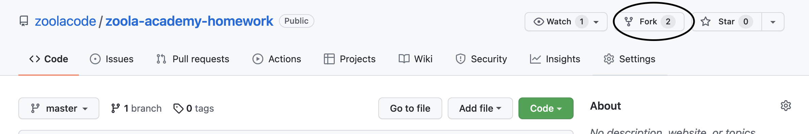

# Zoola Academy Homework Space

Hi Folks!

I hope you are enjoying this studying journey and feel excited about the future challenges we've prepared for you.
This repo is dedicated for you homeworks. 

Please, read the instructions below and submit your homework correctly, so we can review it.

### Instructions

Fork this repository by pressing the button `Fork` **(!) this is one time action**:

#### *Each time you want to submit your homework*:
**Important (!)** – you are now working with your own copy/fork of the repository! 
All commits NEED TO BE pushed into your own repo.

1. Make sure your version of the project is up-to-date by fetching the latest commits from `zoolacode:master` inside your copy of the project by pressing `Fetch and merge`:

2. Pull the changes if there are any into your local repo using `git pull`
3. Create a new local branch: name-surname-lecture-number
4. Create your directory and name it `Name-Surname` inside directory of the lecture you want to send homework for (for example - general/1_terminal/Ivan-Ivanov).
5. Work on your homework inside that repo, make some commits related to your homework and push your branch into your repo.
6. Create pull request.
7. Wait for your work to be approved/reviewed/commented by your lector.

Good Luck!