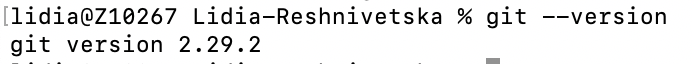
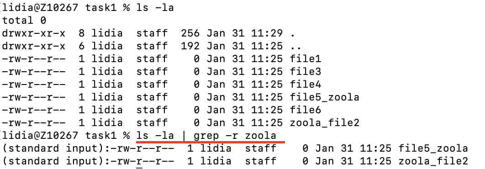
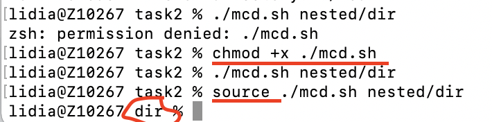
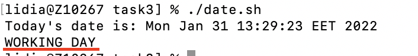
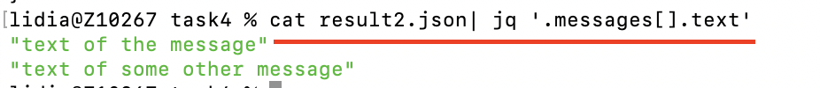

## 1. Terminal

### Tasks

#### Task 0

Checked version of the git:

#### Task 1

Parsing file names with name "zoola":

#### Task 2

Gave right accessing + starting script via source command:

### Task 3

Script will recognize current time ( WORKING DAY/WEEKEND )

### Task 4

Parsing json text only:

