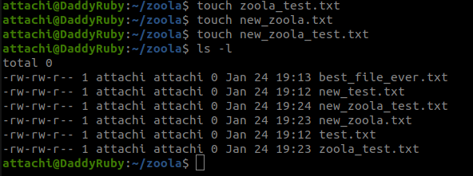
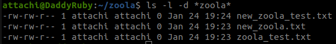
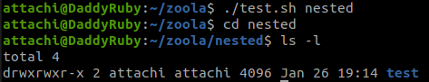
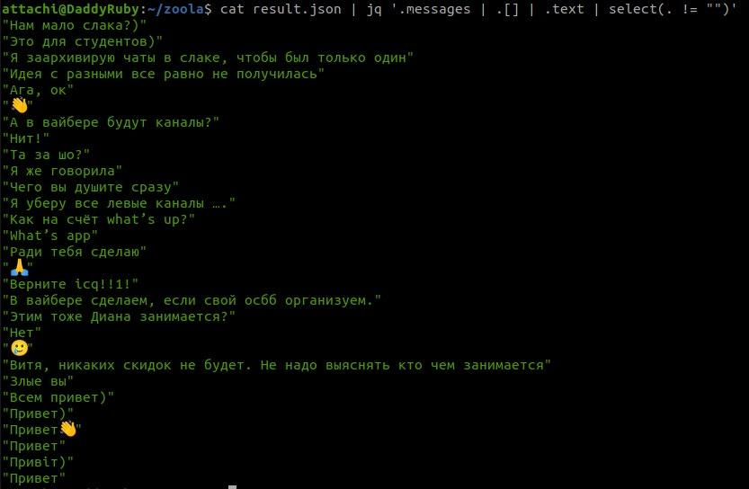

Task1

Task2

Directory changed for script, but not for terminal. Shell script is completely another
process and “cd” command was executed for it. To check how this works we can run
this code:

mkdir -p $1
cd $1
mkdir -p "test"

./test.sh nested

Script created directory “nested”, changed current directory and created “test”.

Task3

File test.sh

  day=$(date +%u)
  dayOfMonth=$( date +%d )
  if [ $day -lt 6 ];
  then
  echo "Looks like $dayOfMonth is a working day"
  else
  echo "Looks like $dayOfMonth is a weekend"
  fi

Task4

