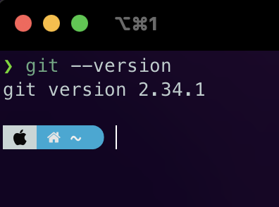

# homework 1



proof that i did task 0

## task 1

'ls -l | grep -i zoola'

## task 2
Shell scripts are run inside a subshell, and each subshell has its own concept of what the current directory is. The `cd` succeeds, but as soon as the subshell exits, you're back in the interactive shell and nothing ever changed there.
[This link helped me](https://stackoverflow.com/questions/255414/why-cant-i-change-directories-using-cd-in-a-script)
## task 3

```
#!/bin/bash
#first line is used to set bash interpreter. to know the path run 'which bash'

if [[ $(date +%u) -gt 5 ]]
  then
	echo "Looks like $(date +%d) is a weekend"
  else
	echo "Looks like $(date +%d) is a working day"
fi
```

## task 4

```

cat export.json | jq '.messages[] | {text}'

```
