#Homework Git Alena Vorokh
###Task 0: Setting up remote repo
>Create new repo  Text file Task-0:  Name: Alena  Surname: Vorokh

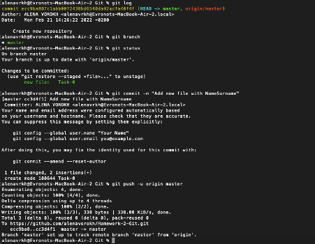

###Task 1: Solving conflicts 
1. First time – accept local changes instead of remote: 
> I made changes to a text file on my branch. Added Artem. In the meantime, remotely added Diana to the original file on the git and merged it. There was a conflict while trying to make a pull request. Remotely, I selected local changes and merged. Then I switched to the master locally and pulled off the changes. Artem was added to the file.

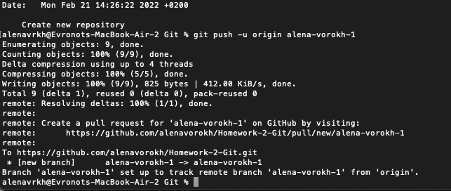

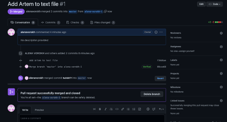
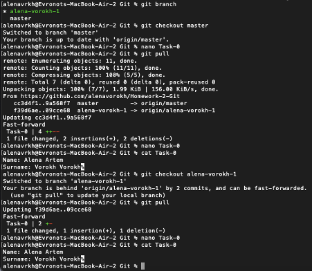 

2. Second time – accept remote changes instead of local:
> Remotely replaced Artyom with Diana in a text file. Locally deleted Artem and left only Alena. I pushed to my branch and there was a conflict in an attempt to make a pull request. Remotely, I selected remote changes and merged. After that, she switched to her branch remotely, pulled the changes and Alena and Diana were in the file.
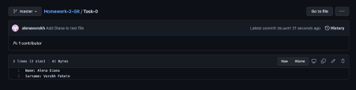
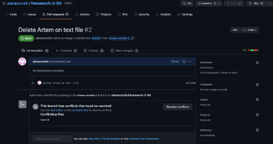

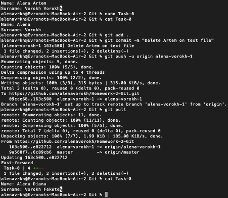

3. Third time – accept both.
> Remotely added Artyom to the file to Alena and Diana and merged. Deleted everyone locally, pushed and created a pull request. When the conflict was deleted, I left all the changes in the file and merged. After it became in the file there were empty 2 lines without people and 2 lines with Alena, Diana and Artem.
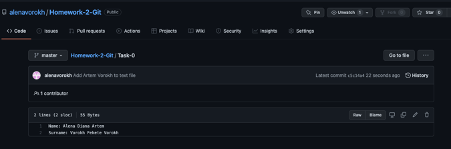

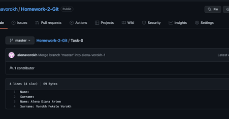
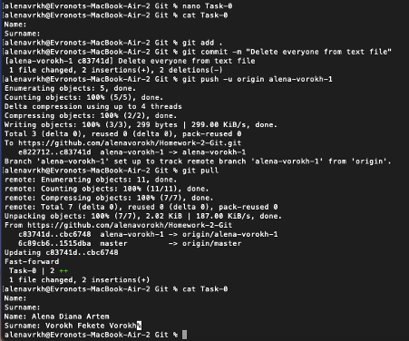

###Task 2: Merge vs Rebase
1. Merge
>First, I pulled all the changes to my branch. Then I added Kostya to a text file. I switched to the master, also pulled off all the changes and added Tanya to the text file, pushed it. I switched to my branch and merged the changes from the master branch. There was a conflict, I edited, leaving both changes and pushed.

2. Rebase
>I switched to the master branch, pulled all the changes, added Andrey to the text file and pushed. I switched to my branch and deleted Kostya from the text file. And since there were changes on the master, I made a git rebase and when opening the file, Kostya was no longer there, and Andrey was added. I pushed, created a pull request, and merged everything into the master branch.
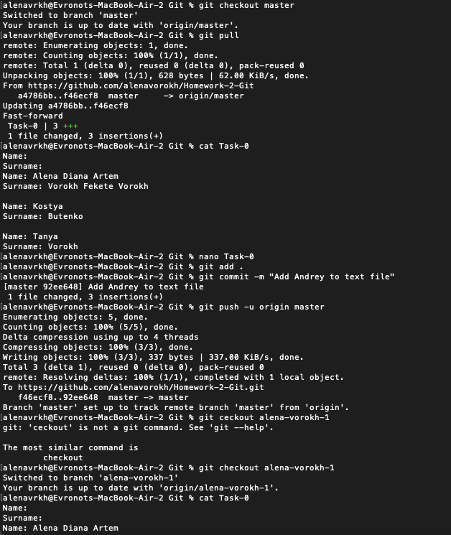

Git Merge

Merging is a common practice for developers using version control systems. 
Whether branches are created for testing, bug fixing, or other reasons, a merge commits changes elsewhere. 
A merge takes the contents of the source branch and merges them into the target branch. 
Only the target branch changes in this process. The history of the original branches remains unchanged.

Git Rebase

Rebase is another way to move changes from one branch to another. 
Rebase compresses all changes into one "patch". It then integrates the patch into the target branch.
Unlike a merge, a move rewrites history because it transfers completed work from one branch to another. 
Unwanted history is eliminated in the process.

1) I like the most rebase, because i like when my git log is more clear.
2) Git Rebase better to use when you want to save your history cleaner and avoid excess сommits. 

###Task 3: Use your imagination
>I used some interesting commands such as:  
"git checkout -" to switch between 2 branches, also we can use "Switch", not "Checkout"  
command "git diff --staged" shows all prepared changes (indexed). If you just type git diff, only the changes in the working directory will be shown.
And all the time while I was doing my homework, I had a lot of problems and mistakes.
And now I am concurrently creating .MD file that`s why I can not to use such command as "git checkout ." Reset all local changes. If you are sure that all your local changes can be reset, then you can use the dot symbol to reset at the same time. However, it is good practice to always use checkout --patch.
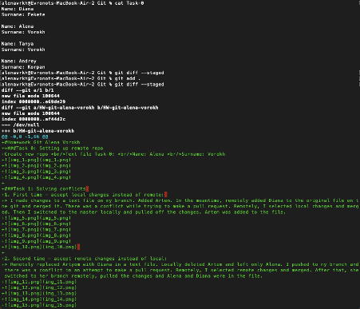
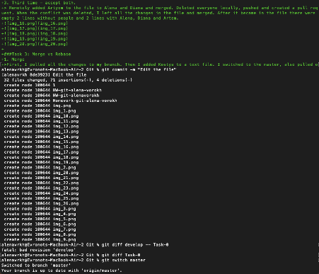

Link: https://github.com/alenavorokh/Homework-2-Git.git