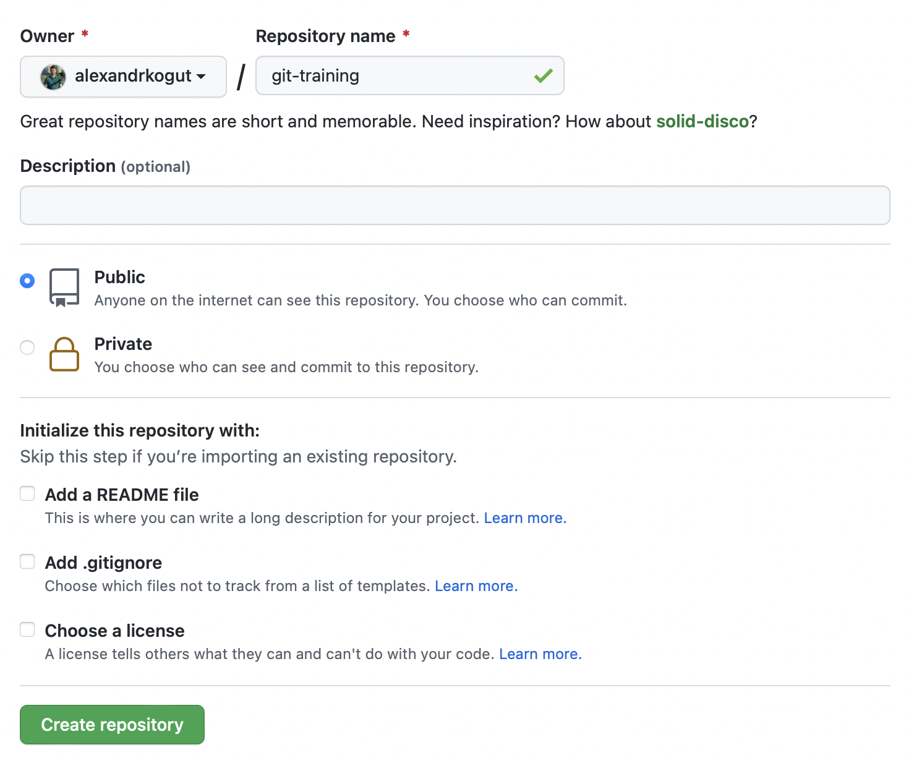
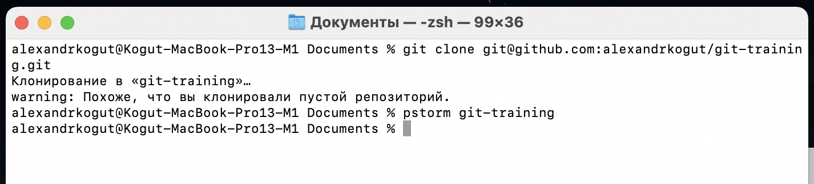
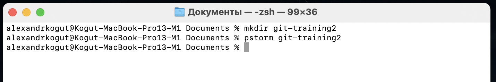
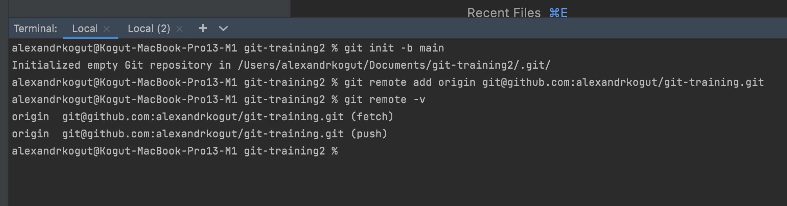
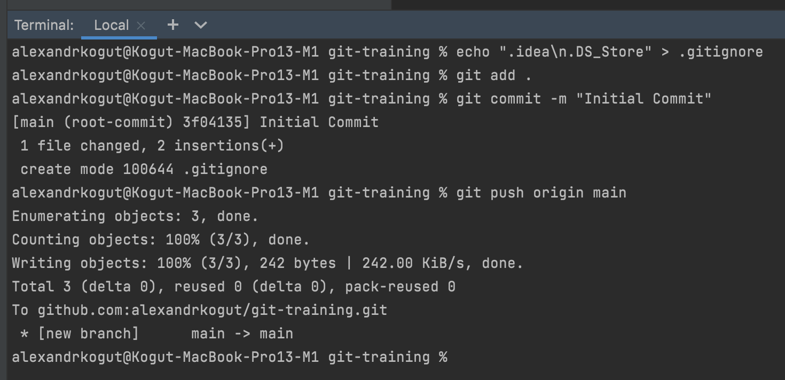
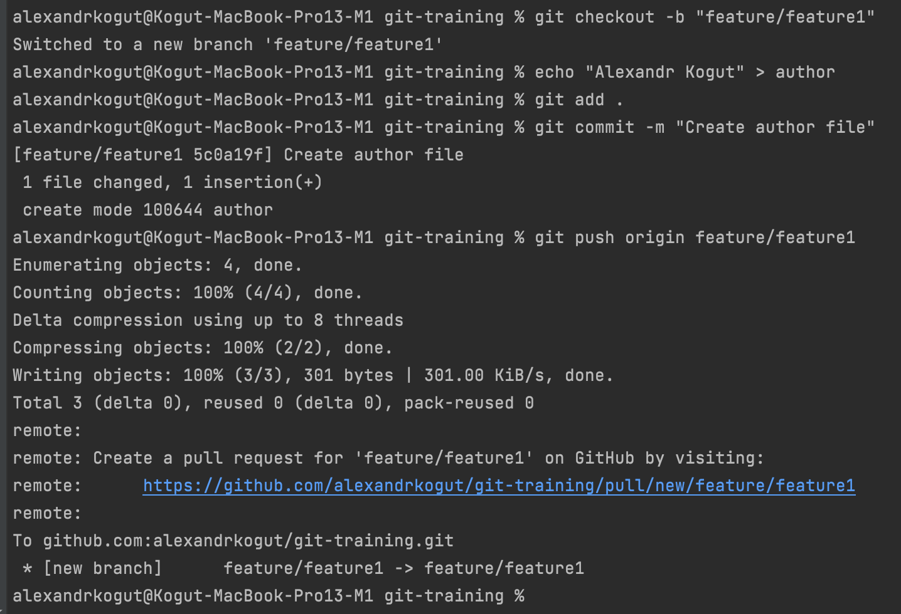
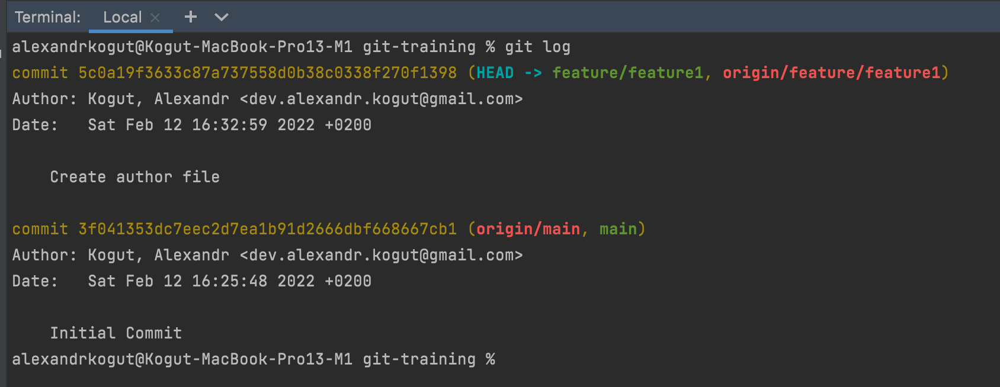

## Task 0

- Create empty repository

- Clone repository

- Create new dir

- Set up remote repository

- Create .gitignore

- Create author file

- See git log

My repository: [https://github.com/alexandrkogut/git-training](https://github.com/alexandrkogut/git-training)