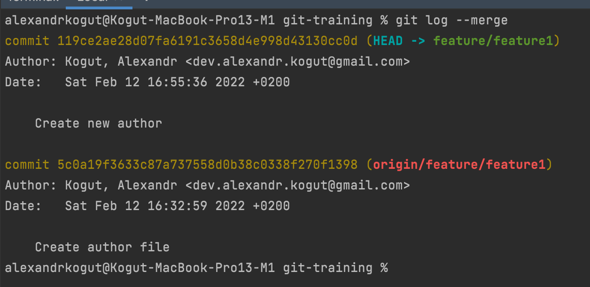

## Task 1

- Remove local branch and create new local branch with new author

    

- Create merge

    

- See log
    
    

- See file

    

- Create merge with accept local changes

    

- See log

    

- Remove local branch and create new local branch with new author

  

- Create merge with accept remote changes

  

- See log

  

- Remove local branch and create new local branch with new author

  

- Create merge with accept both changes

  

- See log

  

My repository: [https://github.com/alexandrkogut/git-training](https://github.com/alexandrkogut/git-training)