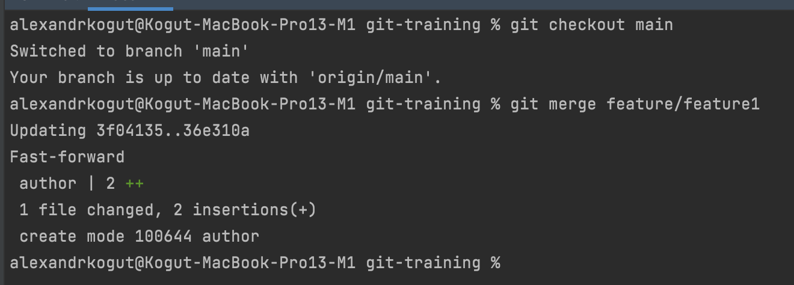
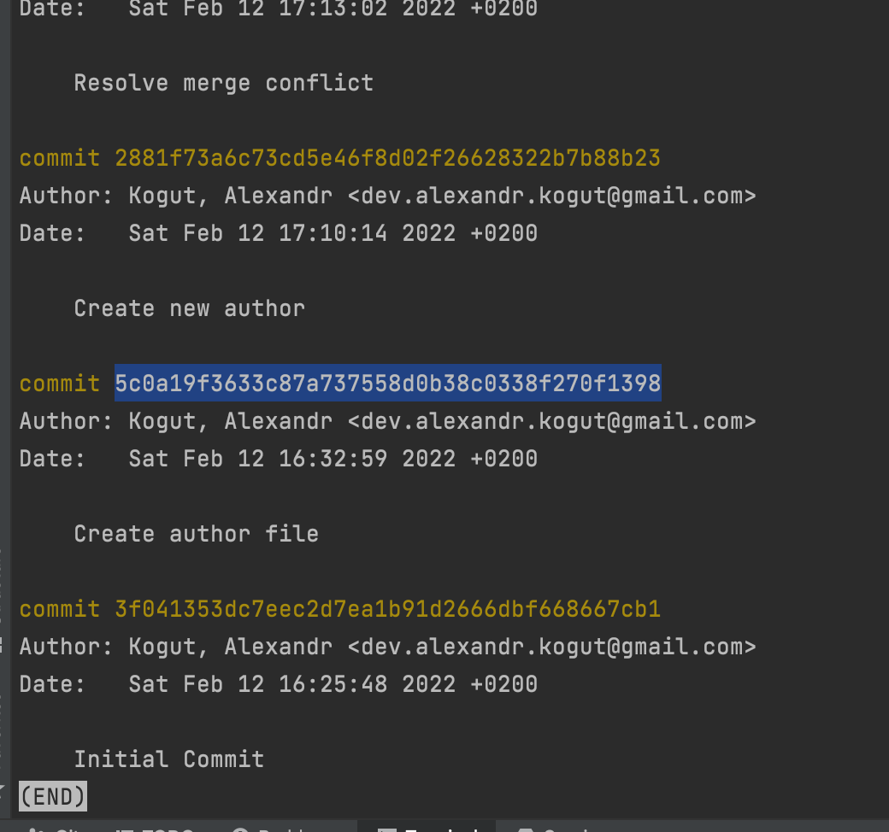
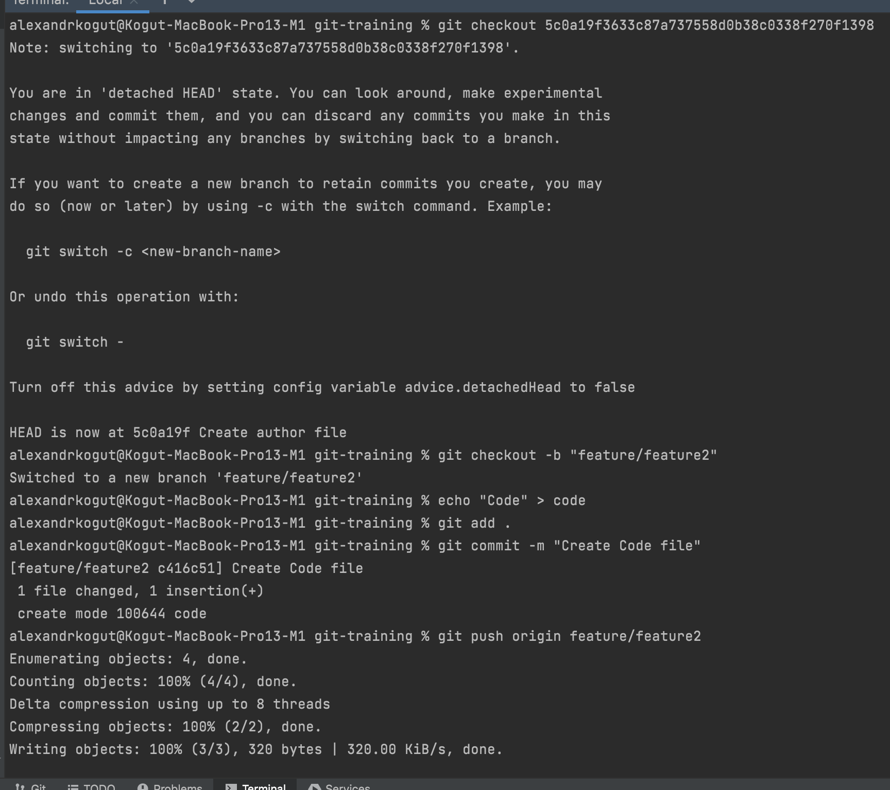
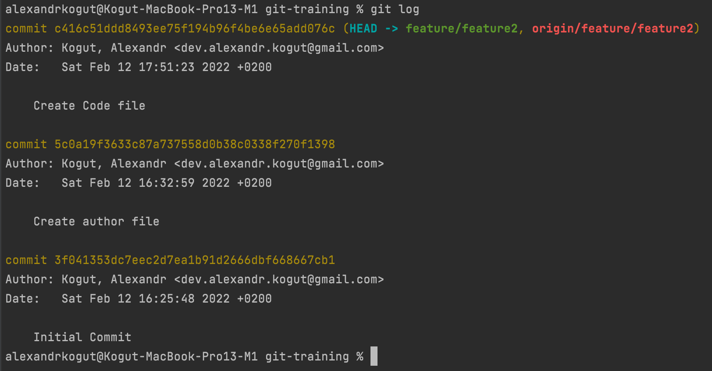

## Task 2

- Merge feature/feature1 to main branch

  

- Find second commit

  

- Checkout second commit, create new branch, create new file and new commit

  

- See git log

  

- Rebase feature2 branch from main

  

- See git log

  

My repository: [https://github.com/alexandrkogut/git-training](https://github.com/alexandrkogut/git-training)