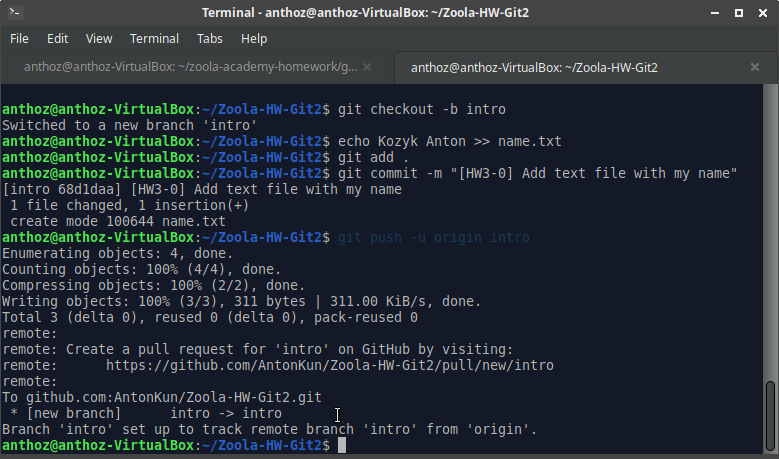

# Task 0: Setting up remote repo

To create new repo in github we can just click `new` right here.


...and follow further instructions.

To copy it to your PC use:
```
git clone <link to your repo>
```
Then we need to create new branch, create text file with author's name, commit it and push this branch.

```
git checkout -b intro
echo Kozyk Anton >> name.txt
git add .
git commit -m "[HW3-0] Add text file with my name"
git push -u origin intro
```



If you want to see your logs use `git log`:
```
$ git log
commit 68d1daaa4d79a0f41c9215e240a1d42e29cf1304 (HEAD -> intro, origin/intro)
Author: AntonKun <antonkozik4@gmail.com>
Date:   Tue Feb 8 14:29:47 2022 +0200

    [HW3-0] Add text file with my name

commit 8cd497133a106c6497ddf29bbf2ca4aea19208ed (origin/main, main)
Author: AntonKun <antonkozik4@gmail.com>
Date:   Tue Feb 8 14:24:43 2022 +0200

    first commit
```

Here you can find [my repo](https://github.com/AntonKun/Zoola-HW-Git2).