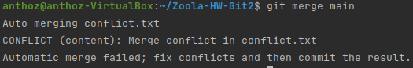
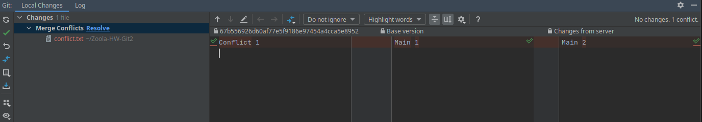
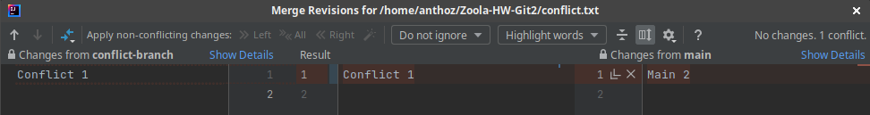
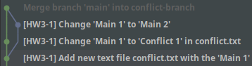
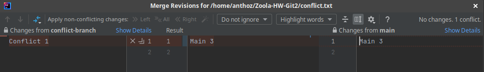
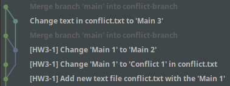
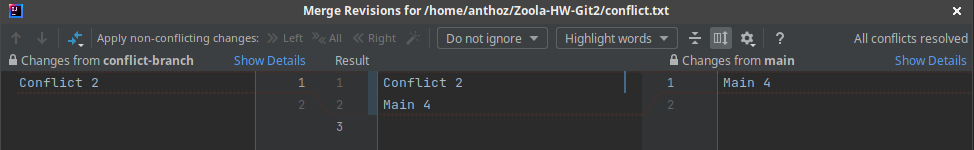
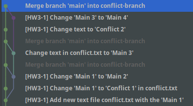

# Task 1: Solving conflicts

The task is to create conflicts.

So let's go. For this task I'll use IDEA.

## Step one. 
Create new file on the main branch and push it:
```bash
echo Main 1 >> conflict.txt
```

## Step 2
Switch to a new branch and edit created file.
F.e. let's change "Main 1" to "Conflict 1"
```
git checkout -b conflict-branch
nano conflict.txt 
```

## Step 3
Switch back to the main branch and edit the conflict.txt. Again...
I want to change "Main 1" to "Main 2".

Also don't forget to do commits at each step.

Done. Now, when we try to merge main branch into the conflict-branch we`ll have a conflict.



To solve it I'll use IDEA interface:


I want to accept local changes:


Everything is ok, wow!



Okay, but now I want to accept remote changes instead of local. The algorithm of actions is almost the same. Now we change the text in conflict.txt to "Main 3", commit and push it. Let's try to merge our branch and... We have a conflict.

This time just select the remote changes. And everything is ready!




But what if I want to accept both changes?
Go to conflict-branch, change text to "Conflict 2", and change "Main 3" to "Main 4" at main branch. 

Commit, push, you know...

And do something like that:




You're awesome!