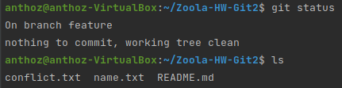
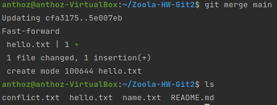
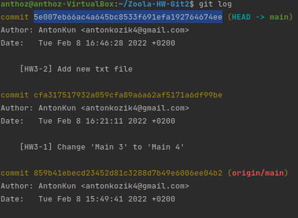
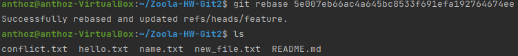
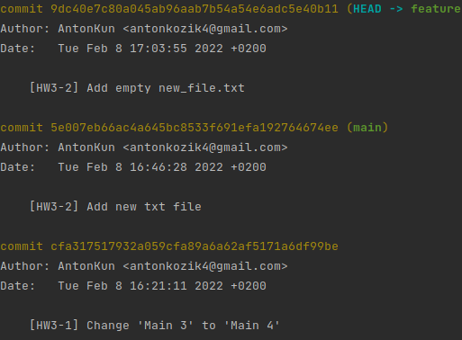

# Task 2: Merge vs Rebase

For this task let's create a new branch
```
git checkout -b feature
```

Then switch to main branch and create a new file
```
git switch main
echo Hello, World! >> hello.txt
```
Now we have this file at the main branch but don't have at our feature branch.


To get hello.txt to our feature we can use two commands:
* git merge
* git rebase

First of all, you need to understand that the git rebase command solves the same problem as the git merge command. Both commands are designed to incorporate changes from one branch into another, but do so in different ways.

## Merge

To merge our branches you can use next command
```
git merge main
```



...and out hello.txt is appeared.

This operation creates a new "merge commit" on the feature branch, linking the histories of both branches. 
The branch structure will look like this:


## Rebase

There is another way. Let's reset last commit with merge and try do `rebase`.
Copy hash of required commit. 



```
git rebase 5e007eb66ac4a645bc8533f691efa192764674ee
```

And hello.txt is appeared again.



Let's see what happened to the log



As a result, the entire feature branch appeared on top of the main main branch, including all new commits in the main branch.


The main advantage of rebase is a cleaner project history. 
First, this command eliminates unnecessary merge commits required for git merge. 
Secondly, as shown in the picture above, the rebase command creates a perfect linear history of the project - you can trace the functionality back to the very beginning of the project without any forks.

## Conclusions

Personally, I prefer the rebase command, as it makes the commit history more beautiful and concise, but at the same time I understand that its use is not always appropriate.

If you'd rather have a clean, linear history without unnecessary merge commits, use git rebase instead of git merge when pulling in changes from another branch.


But if you need to keep the full history of the project and avoid overwriting public commits, use the git merge command.