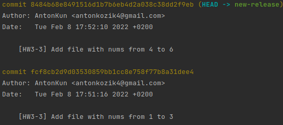
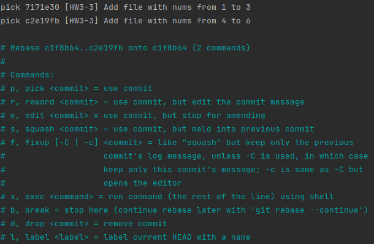
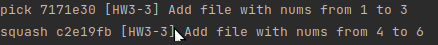
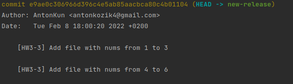

# Task 3: Use your imagination

It was interesting for me to learn how to merge several commits into one, so in this task I will show you how to do it.

I created new branch `new-release`
```
git checkout -b new-release
```
Did some commits



Now if I want to merge the last two commits I need to do
```
git rebase -i HEAD~3
```

In response to this, you will receive a "dialog" (file editing window) of the form:



In the "dialogue" in previous step, you need to replace `pick` with `squash` for the last committ. In the example above, it should look like this:



If everything is ok you will see next picture



If, for example, you want to merge commits from the fifth to the seventh, you need to use HEAD~7, and mark those commits that you want to merge as squash, and those that should remain untouched as pick.

I hope this was as interesting to you as it was to me.