# Task 1: Solving conflicts
## Use the same remote github repo from previous task. The task is to create conflicts. 3 times.

### Hello there! Missed me? 
Now we gonna learn how to solve conflicts. But firstly, we have to learn how to create them! Are you ready, Mr/Mrs. Evil?
So, most of the time you don't want to create conflicts, because conflicts are bad. 
If you're working on your pet project where there's only you, and if you're not too old to forget what were you doing 5 minutes ago, then you have probably never met them. But if you will, then this task will be really useful for ya. Also, when you're working in a team, there can be some unexpected situations. So, let's go! Are you ready kids?
### Creating a new Branch.
To make it more simple, I'm going to create a new branch `task-1-hw2-git`, cause, as you remember, I have a lack of imagination. But, it's comfortable, cause you won't get lost in your branches. 

## Step 1: Accept remote changes instead of local.
Yes, I know I did it in the wrong order, I only noticed it when I finished this task, so please Zoola, forgive me! 
After creating a new branch, I'm going to create a file called `namesFileForConflicts` in which I will save and change names.
I created it on the main branch(which is bad, but next two tasks I made properly)

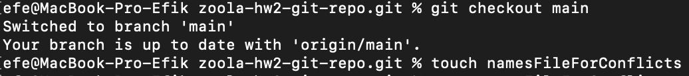

### I input `Efe` and `Mekhmet`. 

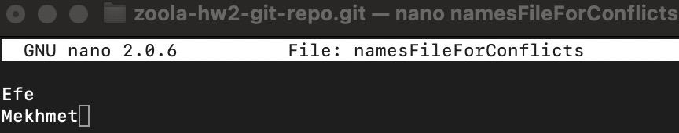

### And, of course, classic. I used `git add .` and `git commit -m`.  You might ask what I did next? Yes, you're right my dear, I pushed it!

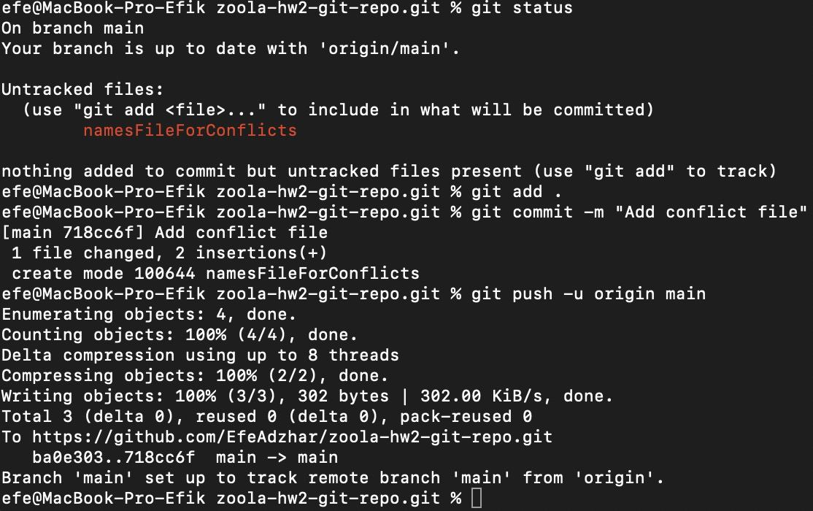

    efe@MacBook-Pro-Efik zoola-hw2-git-repo.git % git add .
    efe@MacBook-Pro-Efik zoola-hw2-git-repo.git % git commit -m "Add conflict file"     
        [main 718cc6f] Add conflict file
    1 file changed, 2 insertions(+)
    create mode 100644 namesFileForConflicts
    efe@MacBook-Pro-Efik zoola-hw2-git-repo.git % git push -u origin main
    Enumerating objects: 4, done.
    Counting objects: 100% (4/4), done.
    Delta compression using up to 8 threads
    Compressing objects: 100% (2/2), done.
    Writing objects: 100% (3/3), 302 bytes | 302.00 KiB/s, done.
    Total 3 (delta 0), reused 0 (delta 0), pack-reused 0
    To https://github.com/EfeAdzhar/zoola-hw2-git-repo.git
    ba0e303..718cc6f main -> main
    Branch 'main' set up to track remote branch 'main' from 'origin'.

### Here's the results: 

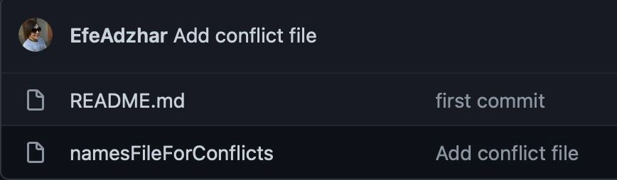

### After that I merged my `main` branch into `task-1-hw2-git`. 

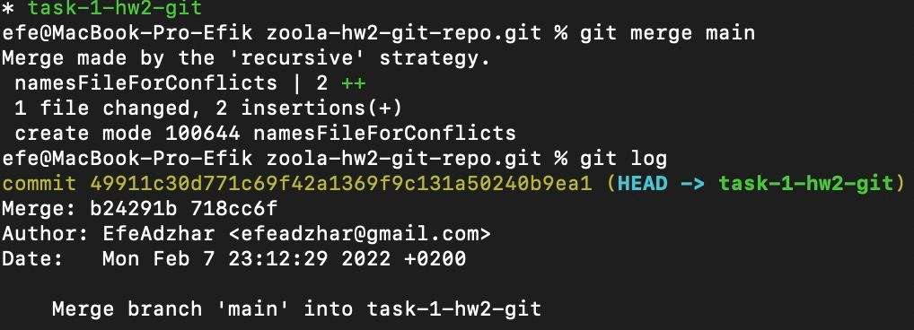

### Then i modified `namesFileForConflicts` by adding 'Oleg'. After that, I used `git push origin task-1-hw2-git`, so I created this branch remotely.

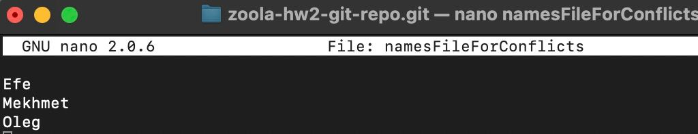

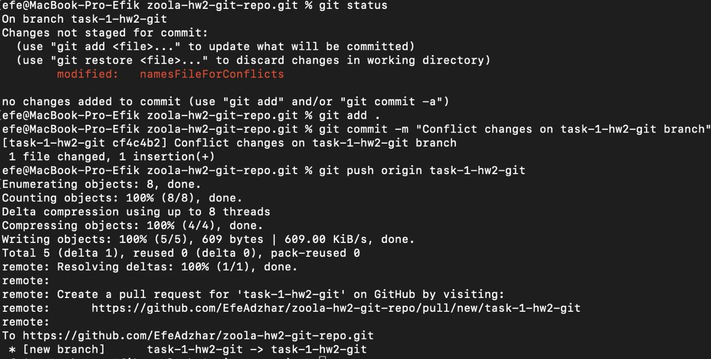

### To make conflict I switched locally on my main branch and changed `namesFileForConflicts`, committed & pushed to the `main` branch.
### Then I changed the file on `task-1-hw2-git` by deleting Oleg and adding `Adzhar`.

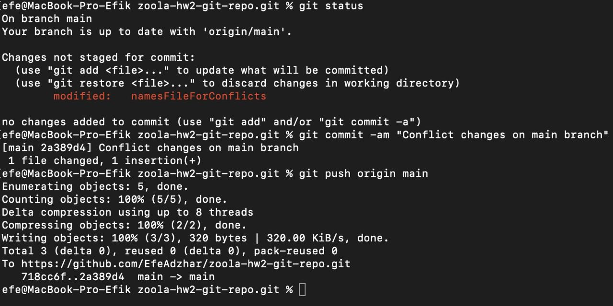

### And...voila! The conflict is just here. We can't merge task-1-hw2-git to main, cause we changed our file in the main branch and did not pull changes in our branch. Now we have different names in one sentence.

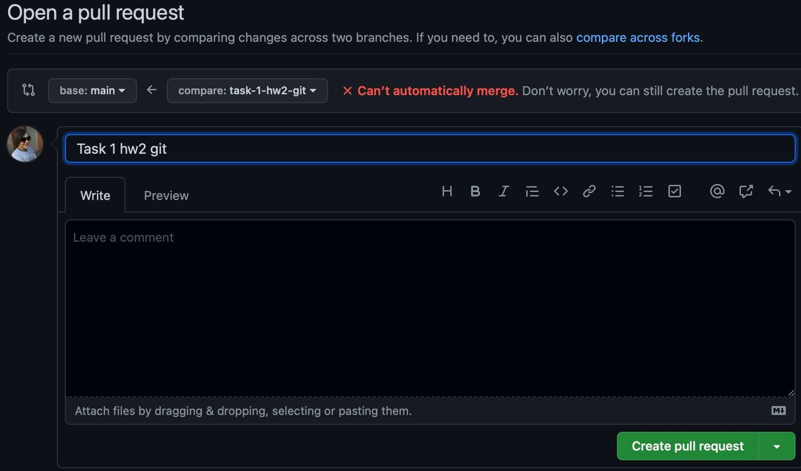

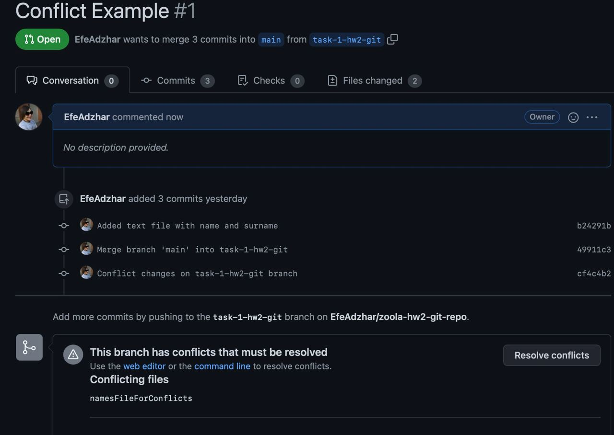

### You can fix it in Git, but our wise teacher said, that she's not recommending doing that, so we gonna fix it in `Terminal`.

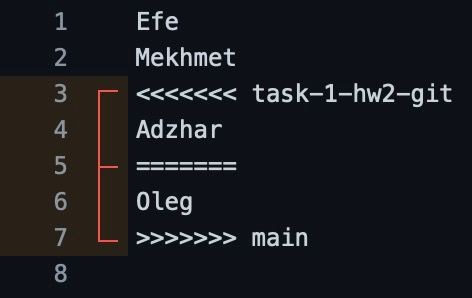

### P.S: Oh, hello, it's me - Efe. I used `Terminal` cause it's much easier for me than VSCode, idk why, but sometimes it lags and doesn't show the merge conflict panel. I did all I could, and I still trying to fix this problem. Thank you for understanding. 

#### Now, we just need to switch on branch `task-1-hw2-git` and use `git pull origin <branch>`. 

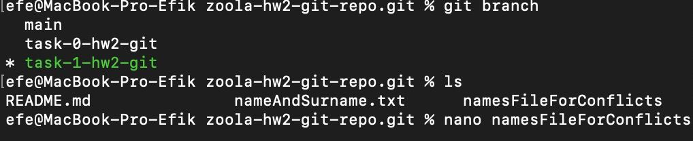

### And, the last move, we resolving our merge conflict by choosing `Oleg`. Don't know who he is, I hope he's a nice guy... 

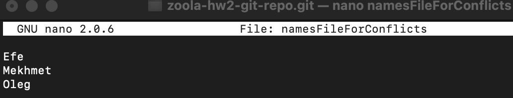

### Commit and push and you are done. Congrats, you can now merge your branch to main!

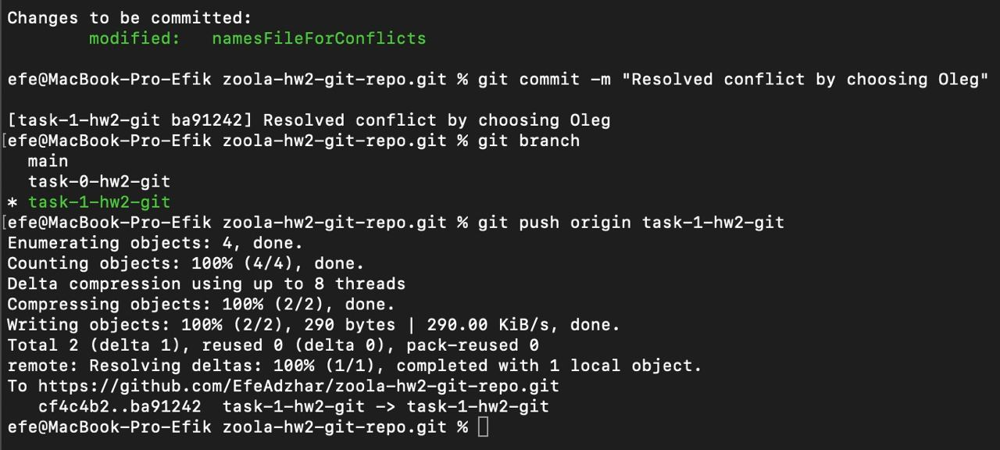

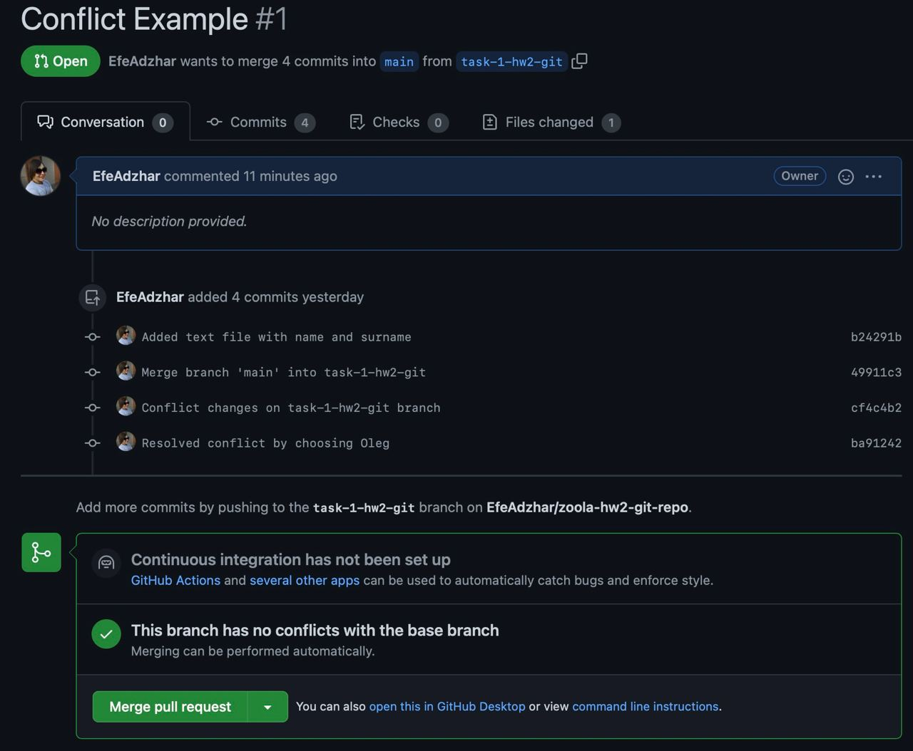

### This is how our branches look in VSCode:

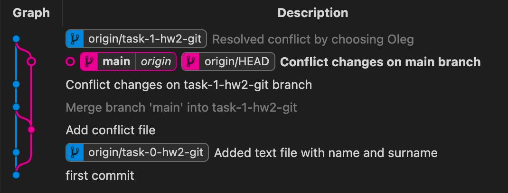

## Step 2: Accept local changes instead of remote.

### Changing `namesFileForConflicts` on remote `task-1-hw2-git` branch. Now it's `Igor`! 

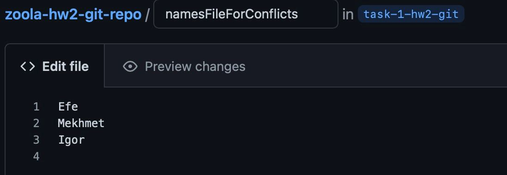

### Changing `namesFileForConflicts` on locall `task-1-hw2-git` branch. Now it's `Alex`! 

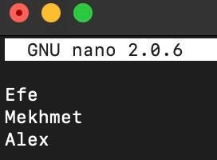

### And of course, we get the same error. Now, all we have to do is the same script, but this time, we have to choose our local buddy `Alex`!

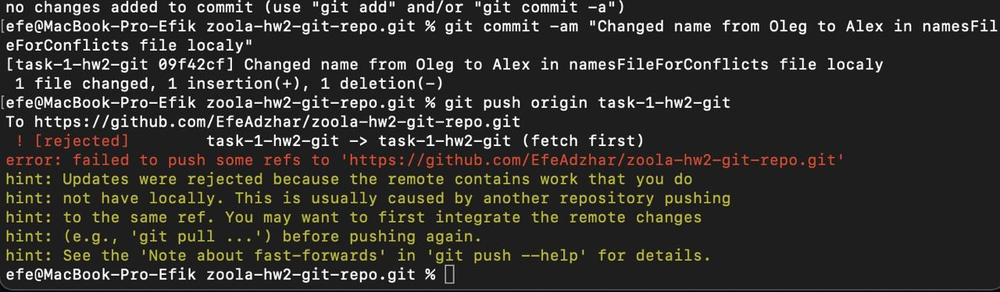
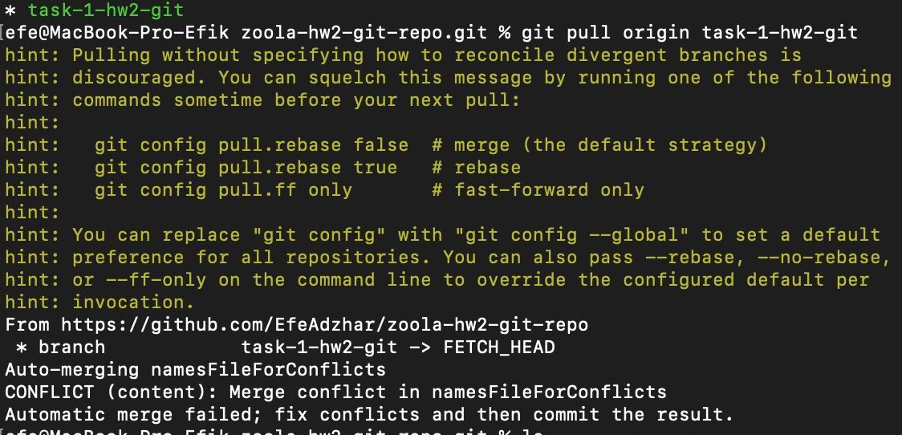

### Remember I said to try my best to show you how VSCode resolves to merge conflict, well, this is your lucky day!  :)

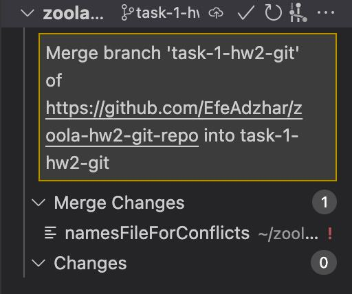
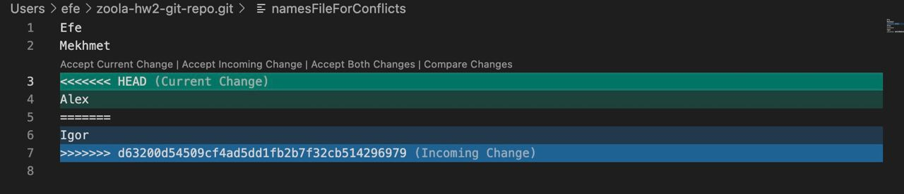

### After that, we choose `Accept Current Changes`, `git push origin task-1-hw2-git`and we are done here!
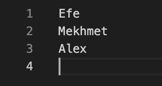
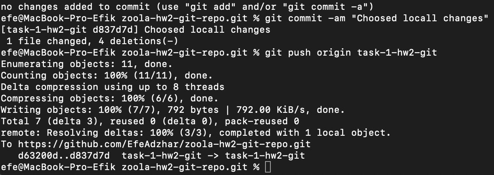

## Git Log 
    commit d837d7d49df1db164160a805cd03649e6a976436 (HEAD -> task-1-hw2-git, origin/task-1-hw2-git)
        Author: EfeAdzhar <efeadzhar@gmail.com>
    Date:   Tue Feb 8 01:19:43 2022 +0200

        Choosed locall changes

    commit 85efa5bee51e0beb3c5c72a4823a708c271bc7f4
    Merge: 09f42cf d63200d
    Author: EfeAdzhar <efeadzhar@gmail.com>
    Date:   Tue Feb 8 01:12:34 2022 +0200

        Merge branch 'task-1-hw2-git' of https://github.com/EfeAdzhar/zoola-hw2-git-repo into task-1-hw2-git

    commit 09f42cf666db124707ba77177d63c7432f64edf4
    Author: EfeAdzhar <efeadzhar@gmail.com>
    Date:   Tue Feb 8 00:29:56 2022 +0200

        Changed name from Oleg to Alex in namesFileForConflicts file localy

    commit d63200d54509cf4ad5dd1fb2b7f32cb514296979
        Author: Efe Adzhar <efeadzhar@gmail.com>
    Date:   Tue Feb 8 00:24:12 2022 +0200

        Changed  name from One to Igor in namesFileForConflicts file remotely.

    commit ba912425ac872e89874e244d176106b9f1559c9c
    Merge: cf4c4b2 2a389d4
    Author: EfeAdzhar <efeadzhar@gmail.com>
    Date:   Mon Feb 7 23:42:19 2022 +0200

     Resolved conflict by choosing Oleg

    commit 2a389d4e69ce043526d89214c2c9159764d42236 (origin/main, main)
    Author: EfeAdzhar <efeadzhar@gmail.com>
    Date:   Mon Feb 7 23:20:25 2022 +0200

        Conflict changes on main branch

    commit cf4c4b2e68d4b2e054aa03e845b46e912e69ef3e
    Author: EfeAdzhar <efeadzhar@gmail.com>
        Date:   Mon Feb 7 23:15:54 2022 +0200

        Conflict changes on task-1-hw2-git branch

    commit 49911c30d771c69f42a1369f9c131a50240b9ea1
    Merge: b24291b 718cc6f
    Author: EfeAdzhar <efeadzhar@gmail.com>
    Date:   Mon Feb 7 23:12:29 2022 +0200

  ## Step 3: Accept Both
##### P.S: Congrats for making it this far. Now you're thinking, this is the easiest part, we have already passed two steps. Well, guess what kido, I spend 6 hours just trying to find out why VSConde merge conflict panel doesn't appear and why my VSCode suddenly lost my remote repository. And because I tried to debug it, I made a few mistakes, so, don't worry if you see `Fix...` commit names, it's made on purpose so it would be easy to understand where I went wrong.

### Anyways, we are all human and we are all making mistakes, especially at 4 am. I'm really tired so let's get this over with.
 
### Changing remotely our `Alex` to `Adzhar`
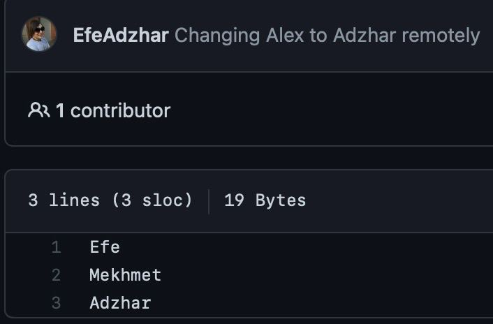

### Next, we have to change our file locally. Changing `Alex` to `Ergunovich`
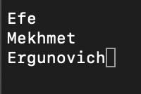

### Getting error is a good sign now...

### Making the same script: 
    1. git pull origin task-1-hw2-git
    2. nano `namesFileForConflicts`
    3. git commit -am <text>
    4. git push origin task-1-hw2-git

### Finally, see our results by refreshing our GitHub repo page.

## VSCode
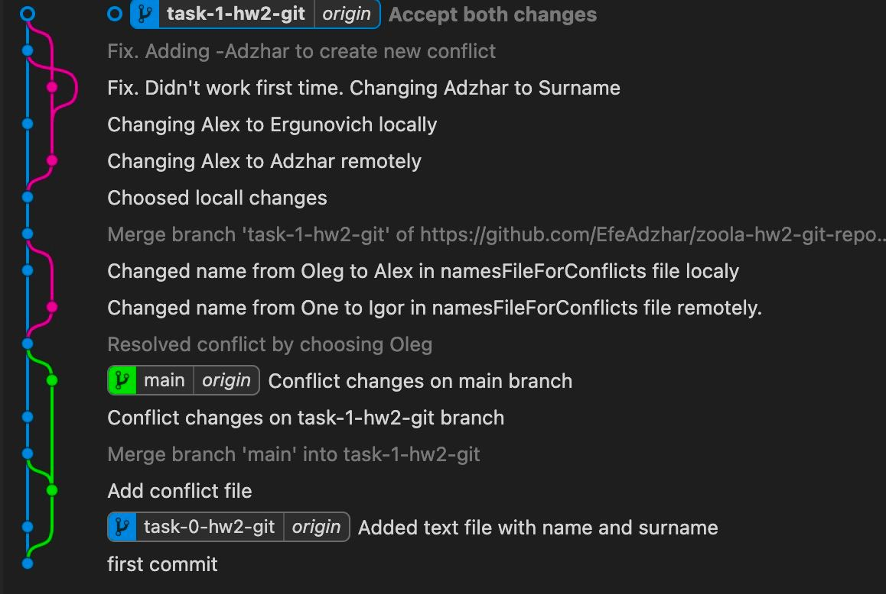

## Git Commands:
    git pull
    git push
    git status
    git checkout -b
    git reset
    git add .
    git commit -am
    git merge

## Conclusions:
    Conflicts are bad
    Use git pull, git merge or git fetch before pushing your changes.
    Making homework at night is not the best idea.

### Oh, almost forgot, here's a link: https://github.com/EfeAdzhar/zoola-hw2-git-repo/tree/task-1-hw2-git
