# Task 2
## Merge vs Rebase
### Hello there! Long time no see :)
#### Since ancient times, people have been tormented by "eternal" questions:
        What came first: the egg or the chicken?
        Where is the center of the universe?
        What is the sense of life?
        And of course, which is better? Merge or Rebase?
    
#### Unfortunately, I don’t have an answer to the first three questions, but we’ll deal with the fourth one today (at least we’ll try)

## Overview

#### The first thing to understand about `git rebase` and `git merge` is that they solve the same problem. Both commands are designed to integrate changes from one branch into another. They just do it in very different ways. But which one is better or more useful? Let's start from git merge.

# Step 1: Integrate changes from one branch into another branch using
## Option 1: Git Merge.
#### So, we have two branches: `main` and `task-2-hw2-git`. Now, let’s say that the new commits in the `main` are relevant to the `feature` that we are working on. As an example, I'll create a text in the `main` branch and pull it to my `task-2-hw2-git` branch locally and then create it with the same text by using our well-known git command `git push origin <branch name>`. After that, I'm gonna add the author of this text in my `main` branch, and for example, I wanna get these changes in my branch. To incorporate the new commits into my feature branch, I have two options: `merging` or `rebasing`.
#### But, first things first I'm gonna create my new branch locally: 
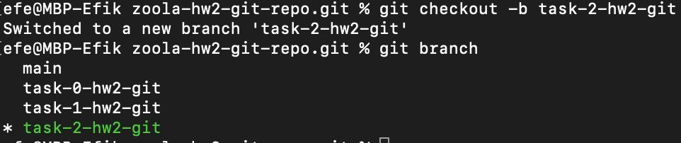

#### Then I'll create this text in my `main` branch: 
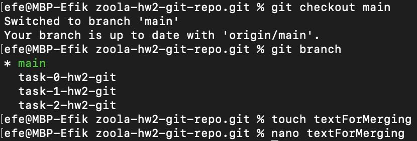
#### Write down our text:

#### And now... Push push push push:

        efe@MBP-Efik zoola-hw2-git-repo.git % git commit -am "Created file for merging"
        [main 55b0b3f] Created file for merging
        1 file changed, 1 insertion(+)
        create mode 100644 textForMerging
        efe@MBP-Efik zoola-hw2-git-repo.git % git push origin main
        Enumerating objects: 4, done.
        Counting objects: 100% (4/4), done.
        Delta compression using up to 8 threads
        Compressing objects: 100% (2/2), done.
        Writing objects: 100% (3/3), 355 bytes | 355.00 KiB/s, done.
        Total 3 (delta 0), reused 0 (delta 0), pack-reused 0
        To https://github.com/EfeAdzhar/zoola-hw2-git-repo.git
        2a389d4..55b0b3f main -> main

#### This is how our `git log` looks on the `main` branch:
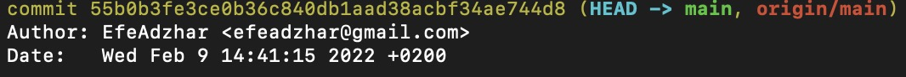

#### Switching to our new branch:
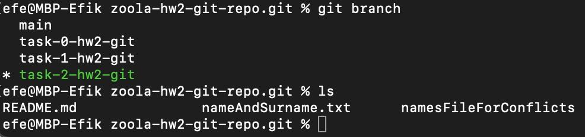

#### First, let's create our branch remotely:
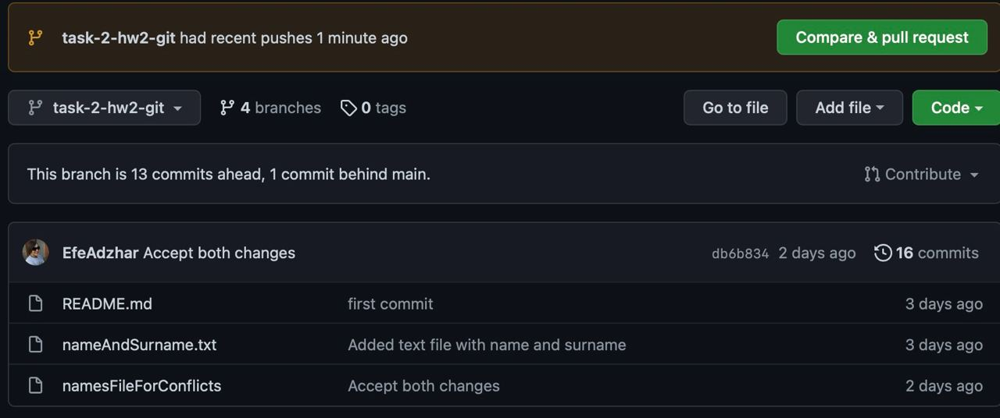

#### It even lets us merge it, which of course we are not gonna do, cause I don't wanna start over. So now, we want our `textForMerging` in our new branch. 
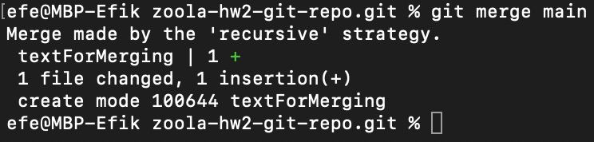

#### This is what our `git log` looks like on now `task-2-hw2-git`:
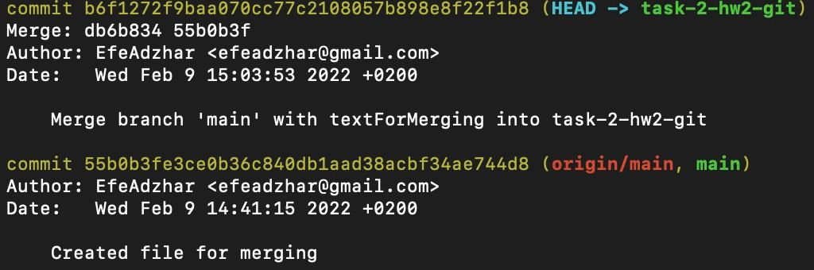

#### And now I'll push my merge commit to GitHub: 

        efe@MBP-Efik zoola-hw2-git-repo.git % git push origin task-2-hw2-git
        Enumerating objects: 4, done.
        Counting objects: 100% (4/4), done.
        Delta compression using up to 8 threads
        Compressing objects: 100% (2/2), done.
        Writing objects: 100% (2/2), 331 bytes | 331.00 KiB/s, done.
        Total 2 (delta 1), reused 0 (delta 0), pack-reused 0
        remote: Resolving deltas: 100% (1/1), completed with 1 local object.
        To https://github.com/EfeAdzhar/zoola-hw2-git-repo.git
        db6b834..b6f1272 task-2-hw2-git -> task-2-hw2-git

#### Surprise, it's here: 
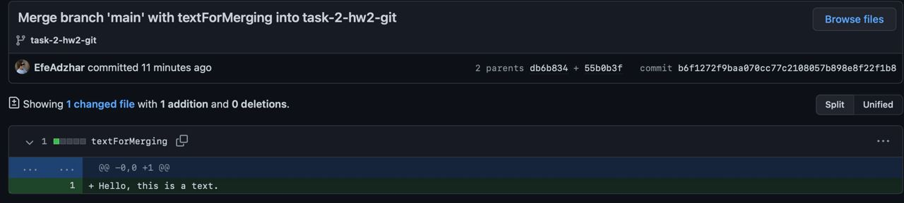

## Option 2: Git Rebase.
#### For the sake and clearness of our experiment I'll create a new branch for rebasing. Here's a plan:

I'll create a new branch `task-2-hw2-git.rebase`
Create the file and commit it as commit before rebase
Then I'll create it remotely.
After that, I'll rebase this branch to the main branch. (yeah, this time from the main branch, why not?)

#### Creating a new branch with a text file and committing it
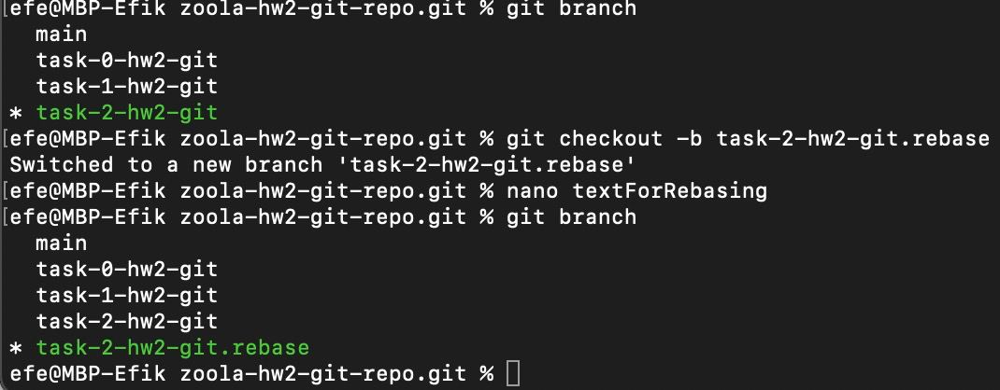

#### PUSH

        efe@MBP-Efik zoola-hw2-git-repo.git % git push origin task-2-hw2-git.rebase
        Enumerating objects: 4, done.
        Counting objects: 100% (4/4), done.
        Delta compression using up to 8 threads
        Compressing objects: 100% (2/2), done.
        Writing objects: 100% (3/3), 315 bytes | 315.00 KiB/s, done.
        Total 3 (delta 1), reused 0 (delta 0), pack-reused 0
        remote: Resolving deltas: 100% (1/1), completed with 1 local object.
        remote: 
        remote: Create a pull request for 'task-2-hw2-git.rebase' on GitHub by visiting:
        remote:   https://github.com/EfeAdzhar/zoola-hw2-git-repo/pull/new/task-2-hw2-git.rebase
        remote: 
        To https://github.com/EfeAdzhar/zoola-hw2-git-repo.git
        * [new branch]   task-2-hw2-git.rebase -> task-2-hw2-git.rebase

#### We did it bois and girls: 

#### We have our `main` branch and out `task-2-hw2-git.rebase`, we have a `textForRebasing` on that branch, and I wanna rebase it to `main`, let's do it!
#### As you can see, there's `no textForRebasing` on the `main` branch, let's rebase.
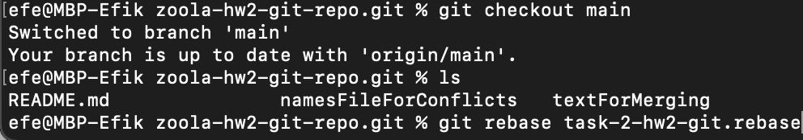

#### Git Log on `main` branch now. The same as on `task-2-hw2-git.rebase`. It seems like we committed it in `main`.
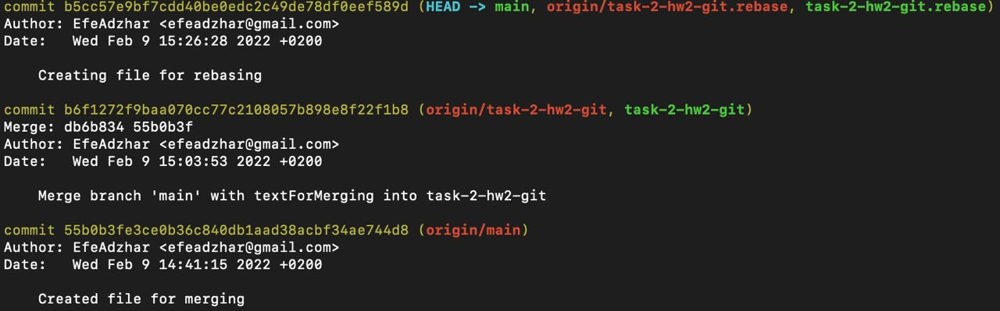

#### Let's try it second time:
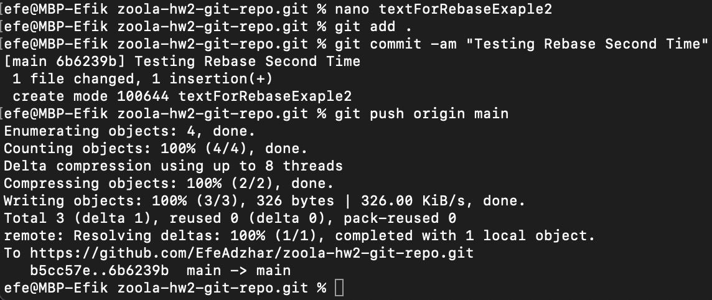

#### I created `textForRebasingExample2` on the `main` branch and now I'll checkout to `task-2-hw2-git.rebase` and make a second commit before rebasing and pushing it.

#### Checking `task-2-hw2-git.rebase branch`, creating a commit, and pushing it.
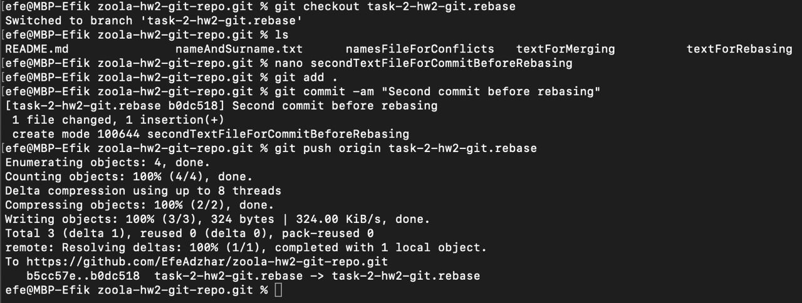

#### Here's our commit in `task-2-hw2-git.rebase`:
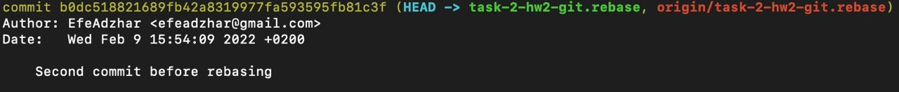

#### Now we're gonna rebase `main` to our branch to see, how it looks like:

#### As you can see, `main` commits are under of our new commit: 
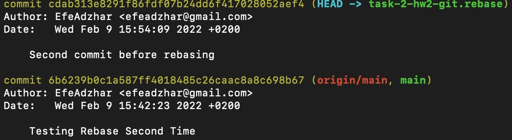

#### And now let's rebase `task-2-hw2-git.rebase` to `main`. I have a new commit on `task-2-hw2-git.rebase`:`Commit after rebasing`. Let's see what happens:
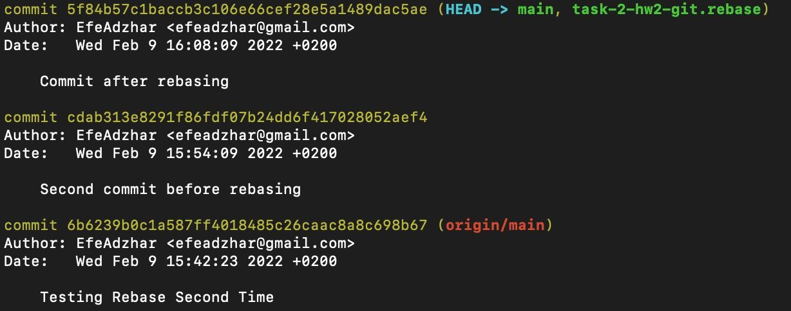

#### Here's a commit story of the main branch on GitHub:
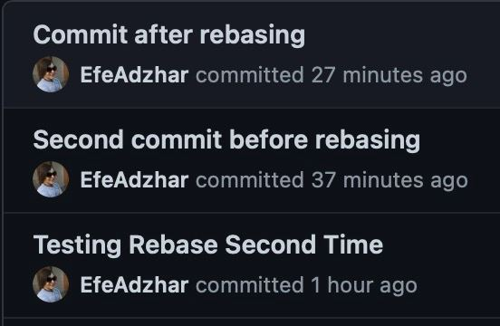

## And now a little theory and observation of the author
### Merging: 
#### Merging is likable because it’s a non-destructive operation. The existing branches are not changed in any way. And it shows in commit history so you won't get lost in your own manipulations with branches(as I did while working with git rebase).
#### On the other hand, this also means that your branch will be full of merge commit every time you need to incorporate upstream changes. If the main branch is very active, this can pollute your feature branch’s history quite a bit and it can make it hard for other developers to understand the history of the project. 

### Rebasing:
#### Rebase command moves your entire branch to begin on the tip of the main branch, effectively incorporating all of the new commits in main. As we saw it by rebasing main to our branch, the main commits were below our commits. And when we tried to rebase our branch to main, our commits were above main commits which created an illusion that we made it in one branch without creating new. That means rebasing re-writes the project history by creating brand new commits for each commit in the original branch.
#### The major benefit of rebasing and why some people prefer it more is that you get a much cleaner project history and more "beautiful", make it "easier" to navigate in the project and also it makes you feel like you're a pro, cause you made such a "beautiful" commit history. Like those guys who say that they're playing college ball, but it's probably at some cushy Ivy League school.
#### But, there are two trade-offs for this pristine commit history: safety and traceability. If you don’t follow "the Golden Rule of Rebasing", re-writing project history can be potentially catastrophic for your collaboration workflow. And, less importantly, rebasing loses the context provided by a merge commit—you can’t see when upstream changes were incorporated into the feature, which is a kinda payoff for beautifulness.
### The Golden Rule of Rebasing
#### Once you understand what rebasing is, the most important thing to learn is when not to do it. The golden rule of git rebase is to never use it on public branches. 

#### For example, think about what would happen if you rebased main onto your branch. The rebase moves all of the commits in main onto the tip of your commits. The problem is that this only happened in your repository. All of the other developers are still working with the original main. Since rebasing results in brand new commits, Git will think that your main branch’s history has diverged from everybody else’s.

#### The only way to synchronize the two main branches is to merge them back together, resulting in an extra merge commit and two sets of commits that contain the same changes (the original ones, and the ones from your rebased branch). Needless to say, this is a very confusing situation.

#### Remember when I rebased main to task-2-hw2-git.rebase? Do you know why nothing bad happened and why our branch commits were above the main commits? The answer is easy, it's because I didn't commit anything in my main branch after rebasing to my branch.

## Questions:
### 1: Which command did you like the most?
#### For me, I prefer to merge for safety and comfortability and it helps to see the history completely same as it happened.
### 2: In which cases it is better to use git merge and when git rebase?
#### Use merge in cases where you want a set of commits to be clearly grouped together in history.
#### Use rebase when you want to keep a linear commit history.

### GitHub Link: (https://github.com/EfeAdzhar/zoola-hw2-git-repo)