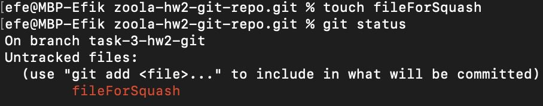
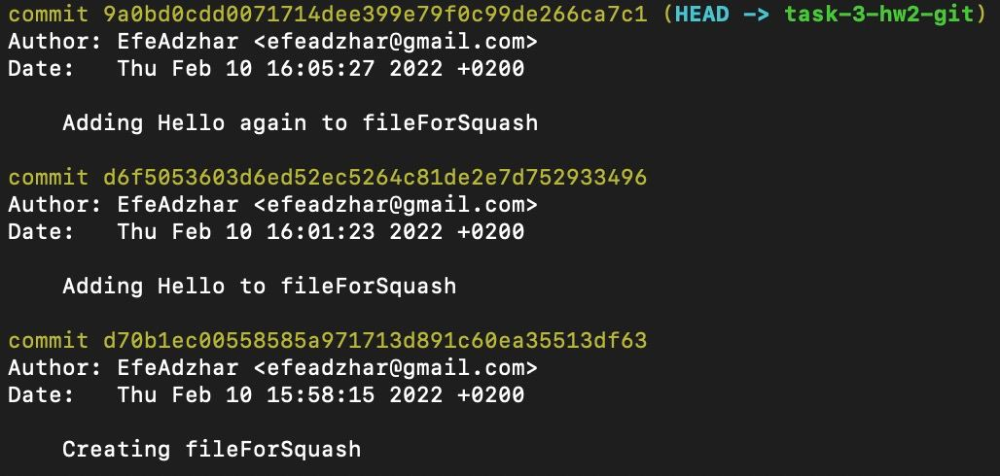
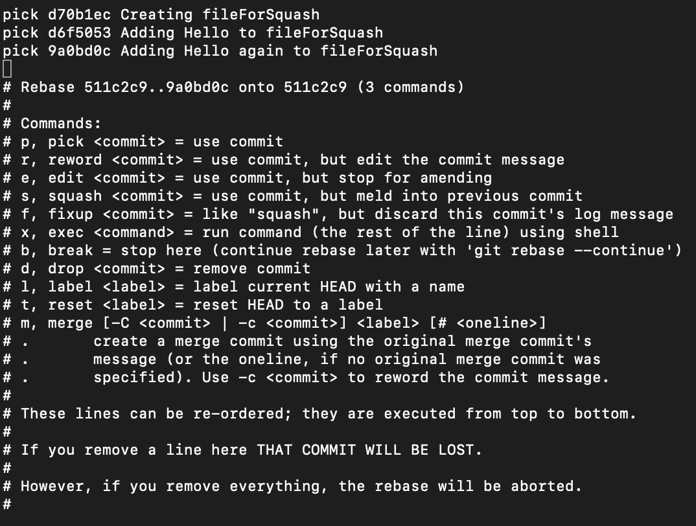
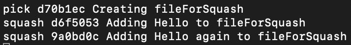
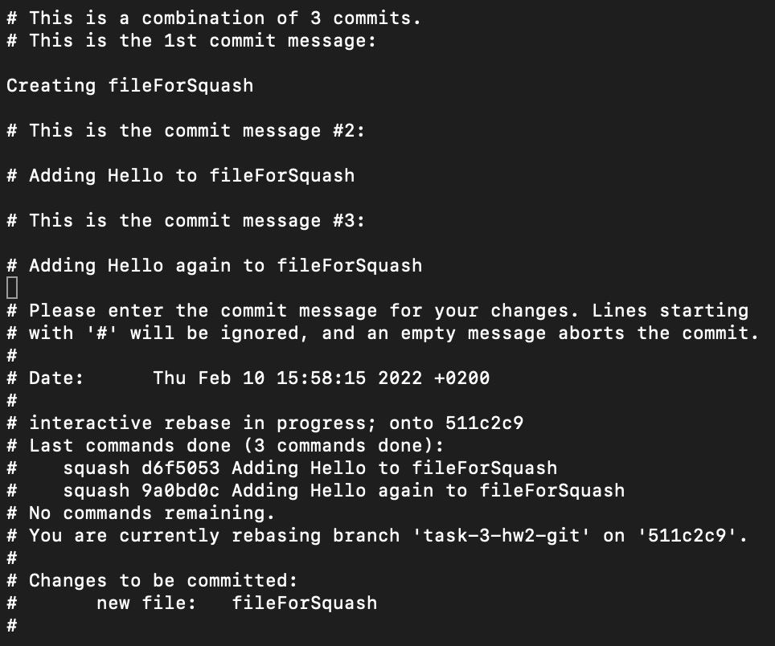
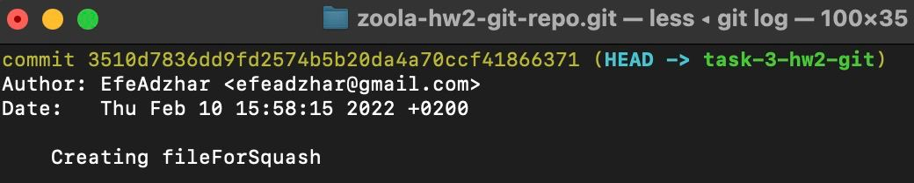
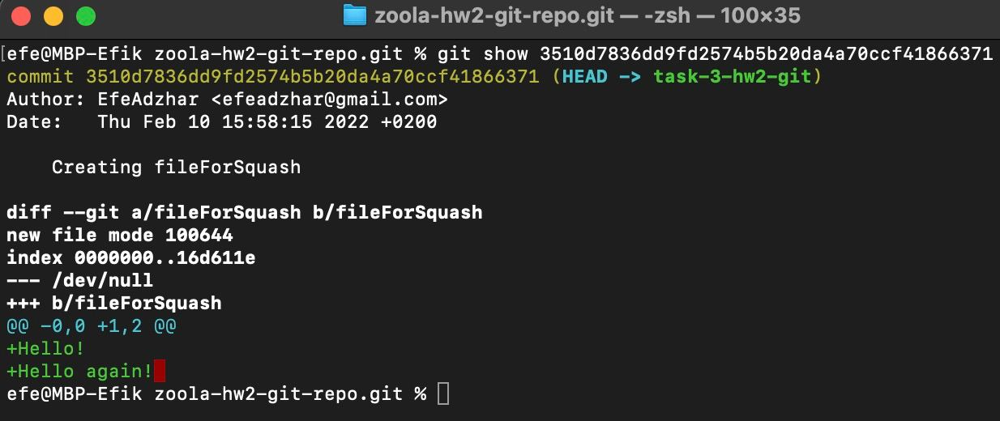

# Task 3: Use your imagination
## So...

#### I think it's even harder. But, we never give up!
#### In this task, I'll show you a magic trick I've found. And it's squash!
#### Well, I guess most of you are surprised and have no idea what this is. So, let's start, shall we?
## Squashing commits
#### The interactive move tool also allows you to turn multiple commits into a single commit. This makes it easier to keep track of Git history.

## Squash.
#### Creating new branch `task-3-hw2-git`
    efe@MBP-Efik zoola-hw2-git-repo.git % git checkout -b task-3-hw2-git
    Switched to a new branch 'task-3-hw2-git'
    efe@MBP-Efik zoola-hw2-git-repo.git % git branch
    main
    task-0-hw2-git
    task-1-hw2-git
    task-2-hw2-git
    task-2-hw2-git.rebase
    * task-3-hw2-git

#### Creating a file that we gonna commit and change. All we need to do is to make some commits and then squash them in one.

#### Commiting file: 
    efe@MBP-Efik zoola-hw2-git-repo.git % git add .
    efe@MBP-Efik zoola-hw2-git-repo.git % git commit -m "Creating fileForSquash"
    [task-3-hw2-git d70b1ec] Creating fileForSquash
    1 file changed, 0 insertions(+), 0 deletions(-)
    create mode 100644 fileForSquash

#### Commiting second time:
    efe@MBP-Efik zoola-hw2-git-repo.git % git commit -m "Adding Hello to fileForSquash"
    [task-3-hw2-git d6f5053] Adding Hello to fileForSquash
    1 file changed, 1 insertion(+)

#### And last but not least, third commit:
    efe@MBP-Efik zoola-hw2-git-repo.git % git commit -m "Adding Hello again to fileForSquash"
    [task-3-hw2-git 9a0bd0c] Adding Hello again to fileForSquash
    1 file changed, 1 insertion(+)

#### Here's our commit story: 

#### Now it's time to rewrite it, I don't need that many commits over the one file, so I'll squash them together in one.
##### `-i` mean interactive
##### `HEAD~3` means the story of the last 3 `commits`
    efe@MBP-Efik zoola-hw2-git-repo.git % git rebase -i HEAD~3

#### Hint: If you want to squash your commits with your root commit, you'll get an error. You can't squish root commit with the command we used. Use `git rebase -i --root` and you're good to go!

#### And here we are! 

#### I don't wanna detail what I did with one file. Maybe I forgot about the `git revert <commit>` command and now I just wanna squash `Adding Hello to fileForSquash` & `Adding Hello again to fileForSquash` in `Creating fileForSquash`. In a nutshell, I wanna squash the third and second commit into the first one. Let's do it!

#### Now we just need to change `pick` to `squash`:

#### Press `control + X` to exit,  then press `y` to confirm and `Enter` to exit. And look what we have. It says to name commit of combined 2. But I'll just keep the name of the first one `Creating fileForSquish`:

#### We did it. Now we just need to be sure that everything is correct. Let's use `git log` to check it out:

#### Nice, it's working! `IT'S ALIVE!`
#### Now let's see what's inside this commit by using `git show <commit>` command: 

#### #### Now just push it to our remote repository so everyone can see this beauty and that's it :)
    efe@MBP-Efik zoola-hw2-git-repo.git % git push -u origin task-3-hw2-git
    Enumerating objects: 4, done.
    Counting objects: 100% (4/4), done.
    Delta compression using up to 8 threads
    Compressing objects: 100% (2/2), done.
    Writing objects: 100% (3/3), 305 bytes | 305.00 KiB/s, done.
    Total 3 (delta 1), reused 0 (delta 0), pack-reused 0
    remote: Resolving deltas: 100% (1/1), completed with 1 local object.
    remote: 
    remote: Create a pull request for 'task-3-hw2-git' on GitHub by visiting:
    remote:   https://github.com/EfeAdzhar/zoola-hw2-git-repo/pull/new/task-3-hw2-git
    remote: 
    To https://github.com/EfeAdzhar/zoola-hw2-git-repo.git
    * [new branch]   task-3-hw2-git -> task-3-hw2-git
    Branch 'task-3-hw2-git' set up to track remote branch 'task-3-hw2-git' from 'origin'.

## Used git commands:
    git commit -m
    git status
    git checkout -b
    git branch
    git add .
    git push -u origin
    git rebase -i HEAD~
    git show <commit>

## GitHub Link: 
#### You mean this? Sure
##### (https://github.com/EfeAdzhar/zoola-hw2-git-repo/tree/task-3-hw2-git)