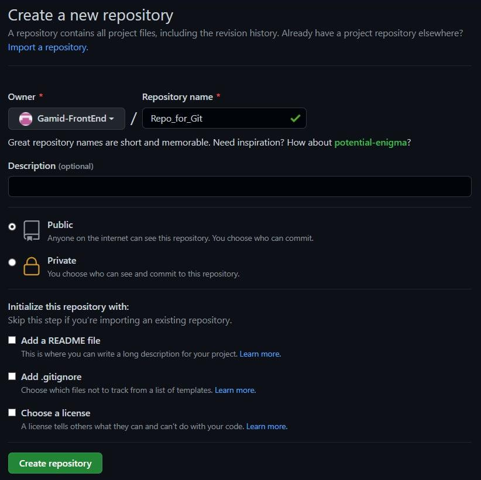

# Task 0
## Creating new public repo
We have created a new repo named `Repo_for_Git`.  


## Setting up remote and local repo
We have already set up a remote repo and now we need to clone it on our computer. We can do this by clicking green `Code` dropdown button and selecting one of the clone options provided: `HTTPS` or `SSH`, and run `git clone <link>`.

## Create new branch
To create and switch to new branch we can run `git checkout -b <branch name>`.

## Commit changes in text file
To `commit` changes, we must move our file(s) to staging area by `git add .` or `git add --all` and so on.
After we staged our files we can commit them by using `git commit -m <message>`.

```
$ git add .

$ git commit -m 'added first text message to file'
	[git_branch d87774b] added first text message to file
 	1 file changed, 1 insertion(+), 1 deletion(-)
```

## Push your branch
To `push` our changes we can use `git push -u origin <branch name>`.

```
$ git push -u origin git_branch
Перечисление объектов: 8, готово.
Подсчет объектов: 100% (8/8), готово.
Сжатие объектов: 100% (4/4), готово.
Запись объектов: 100% (7/7), 613 байтов | 613.00 КиБ/с, готово.
Всего 7 (изменения 0), повторно использовано 0 (изменения 0)
remote: 
remote: Create a pull request for 'git_branch' on GitHub by visiting:
remote:      https://github.com/Gamid-FrontEnd/Repo_for_Git/pull/new/git_branch
remote: 
To github.com:Gamid-FrontEnd/Repo_for_Git.git
 * [new branch]      git_branch -> git_branch
Ветка «git_branch» отслеживает внешнюю ветку «git_branch» из «origin».
```

## Show the git logs

```
$ git log
commit d87774b168b372caa47df902ff549dc31e3fda49 (HEAD -> git_branch, origin/git_branch)
Author: Gamid <g1a6m0i9d@gmail.com>
Date:   Sun Feb 6 21:03:43 2022 +0200

    added first text message to file
```

## Link to our repo
[Repo_for_Git](https://github.com/Gamid-FrontEnd/Repo_for_Git).
