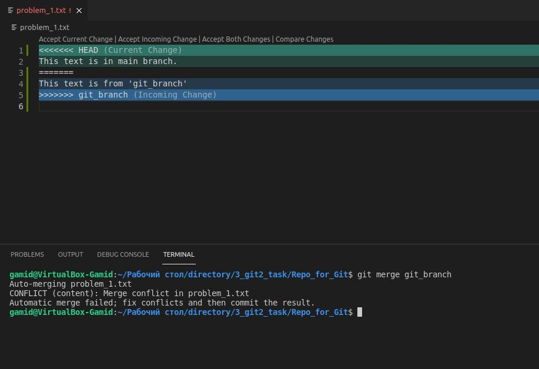
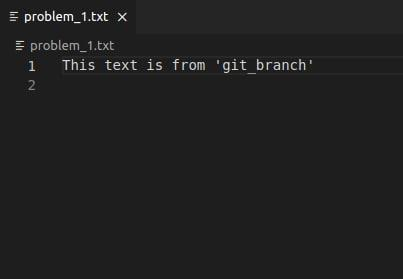
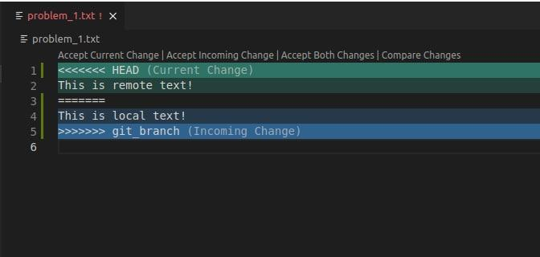
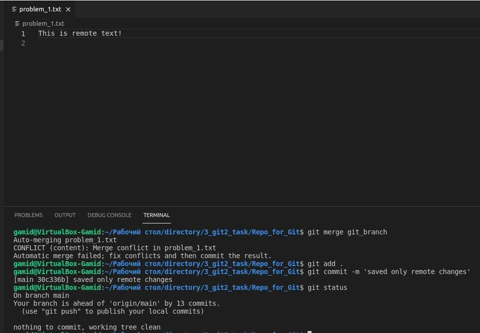
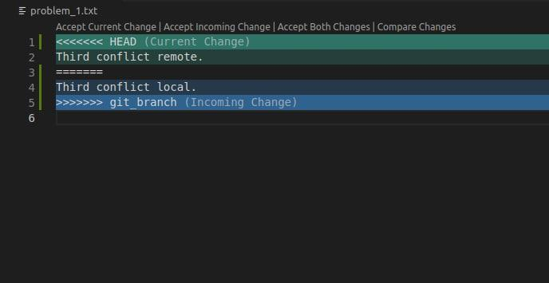
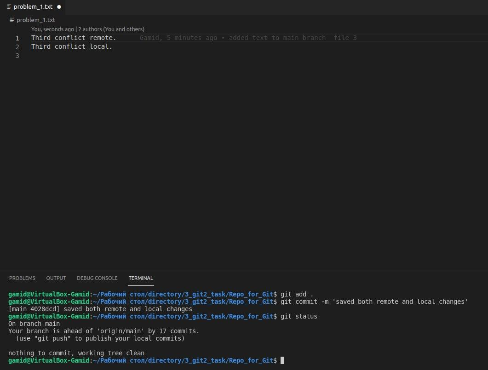

# Task 1
## First conflict - accept local changes instead of remote
Here is our first conflict.   
  

```
git merge git_branch
Auto-merging problem_1.txt
CONFLICT (content): Merge conflict in problem_1.txt
Automatic merge failed; fix conflicts and then commit the result.
```

We need to save local changes. To do this we will remove remote changes and leave only the necessary one.  
  


## Second conflict - accept remote changes instead of local
Here is our second conflict.  
  

```
git merge git_branch
Auto-merging problem_1.txt
CONFLICT (content): Merge conflict in problem_1.txt
Automatic merge failed; fix conflicts and then commit the result.
```

We need to save remote changes. To do this we will remove local changes and leave only the necessary one.  
  

## Thirs conflict - accept both
Here is our second conflict.  
  

```
git merge git_branch 
Auto-merging problem_1.txt
CONFLICT (content): Merge conflict in problem_1.txt
Automatic merge failed; fix conflicts and then commit the result.
```

We need to save both changes. We will not remove anything, we will just put local and remote changes in the order we need.  
  
