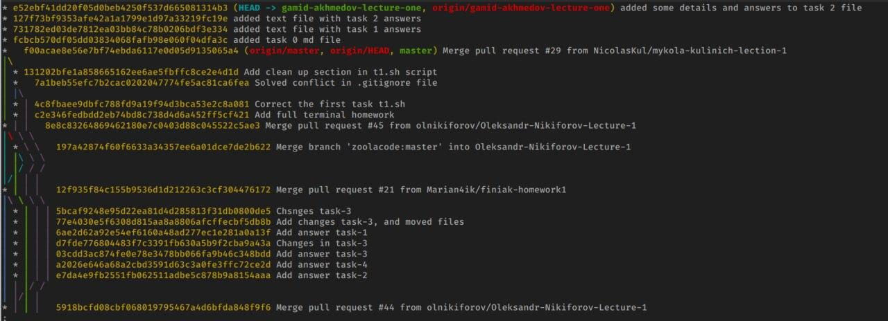

# Task 3
## Make log pretty
Order and beauty are of great importance during work. They allow you to quickly navigate the file and, thereby, speed up the work process.  
```
git log --pretty=oneline --graph --decorate --all
```
This `git` allows you to organize the `log`.  
  
Just like this :fire:

## Rename your branch
If at some point you realize that the name of the branch does not correspond to its content, you can easily change its name. Use:  
```
git branch -m <old_name> <new_name>
```
Example:  
```
git branch -m old_branch_for_some_text front_slide_branch
```
