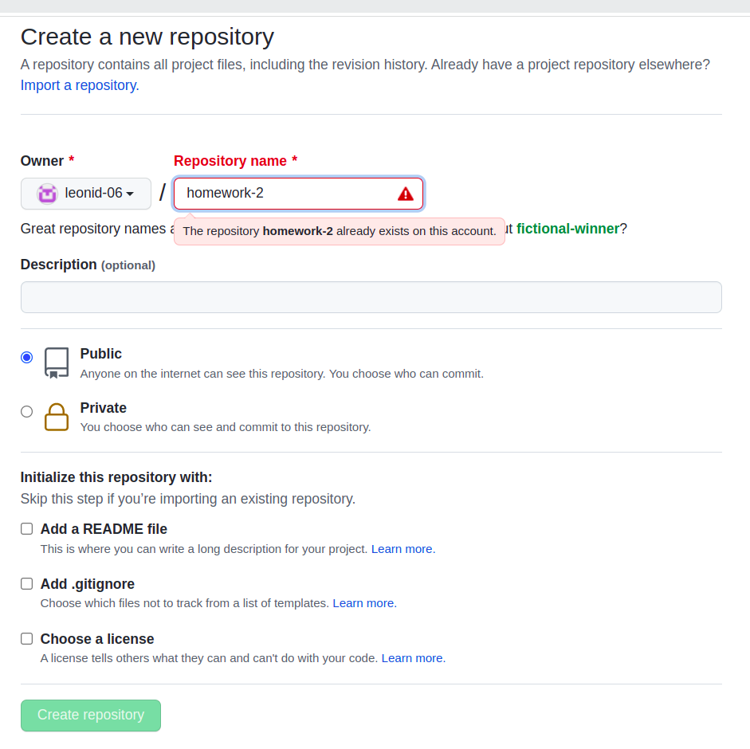
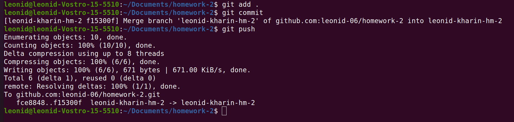

# task 1
1. to create a repository, I went to the github website and clicked on the new repository button

2. in order to set up the local repository I used the following commands
    echo "# homework-2" >> README.md
    git init
    git add README.md
    git commit -m "first commit"
    git remote add origin git@github.com:leonid-06/homework-2.git
    git push -u origin master
3. to create a new branch use the command 
    git branch leonid-kharin-hm-2
4. to write the first and last name to a new file, use the following command
    git checkout leonid-kharin-hm-2
    echo "Leonid Kharin" >> file.txt
5. to commit use the following command
    git add file.txt
    git commit -m "create name file"
6. to push your branch you need to run the following commands
    git push --set-upstream origin leonid-kharin-hm-2
7. write commands to create a file .gitignore
    touch .gitignore
I will not add it because it is empty
8. 
9. [link to repository](https://github.com/leonid-06/homework-2)
