# task 1
1. ___First time – accept local changes instead of remote___
    
    
    1. On my local machine I changed the file.txt (added local-1) then make commit it but didn't Push. 
    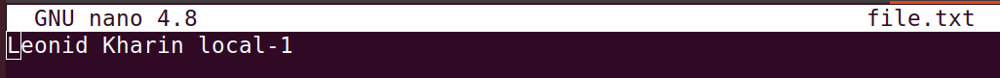
    2. While on the remote repository I also made changes to the file.txt and make commit too.
    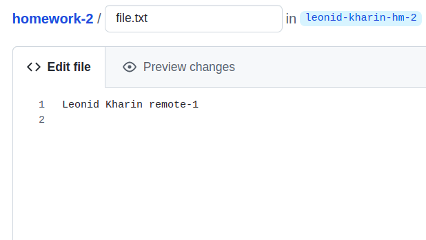
    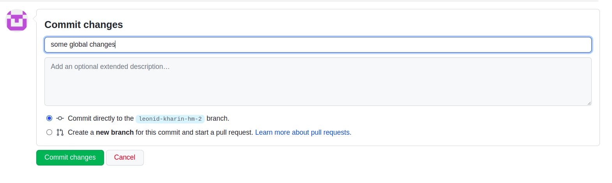
    3. When I wanted to make push from a local folder, I didn't succeed because there was a regested error that says that I do not have the latest master.
    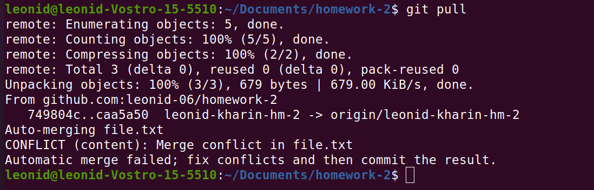
    4. I made a Pull and along with this the terminal showed me an error conflict. Then I opened the file.txt and selected local changes.
    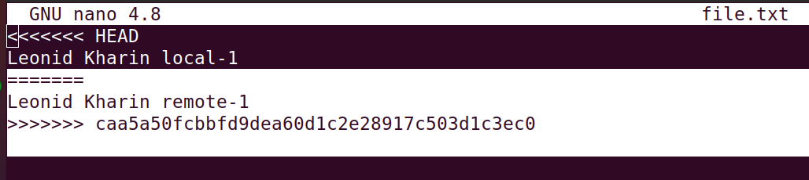
    5. After that I made a commit thus resolving the conflict.
    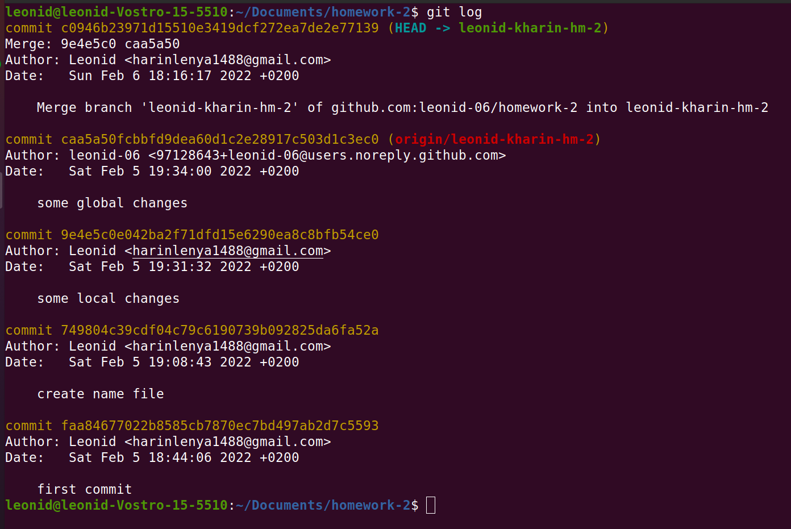

    
    
2. ___Second time – accept remote changes instead of local___
    This task is done in the same way as the first one, except for a few screenshots, namely __diff__
    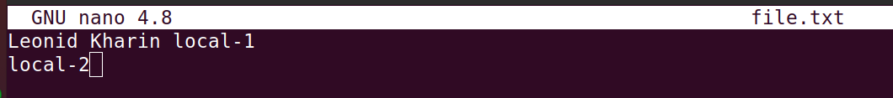
    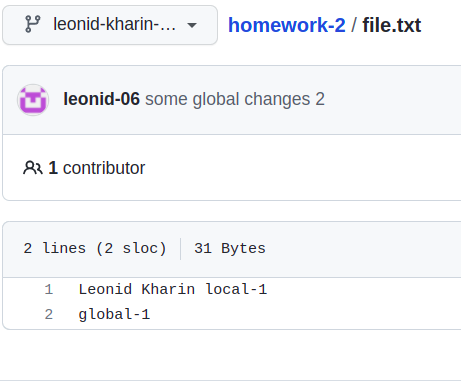
    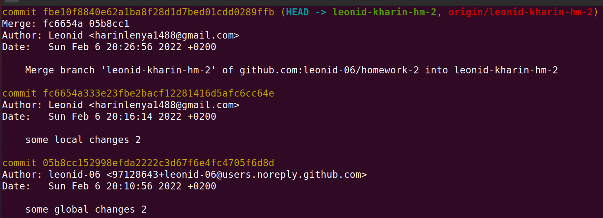
    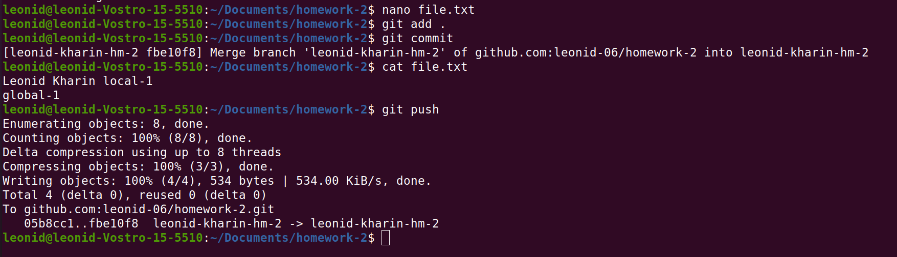
    __diff__
    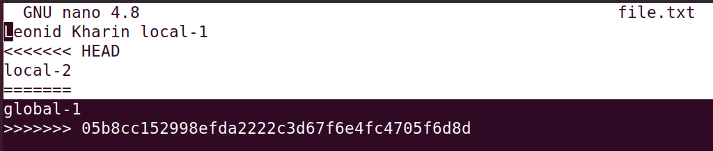
3. __Third time – accept both__
    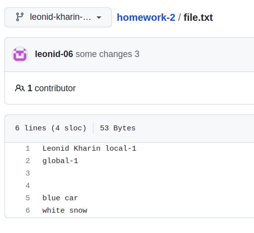
    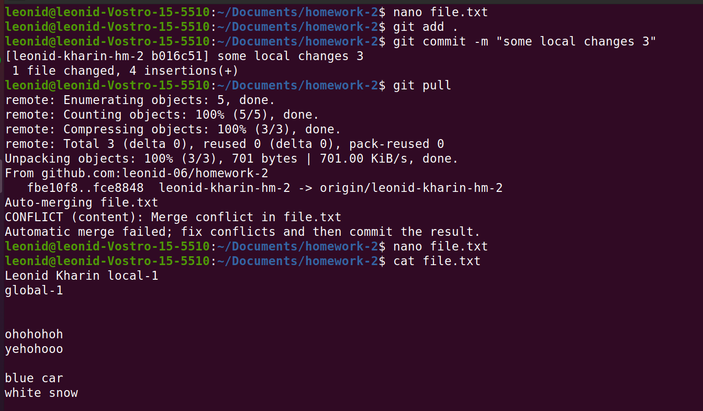
    
    