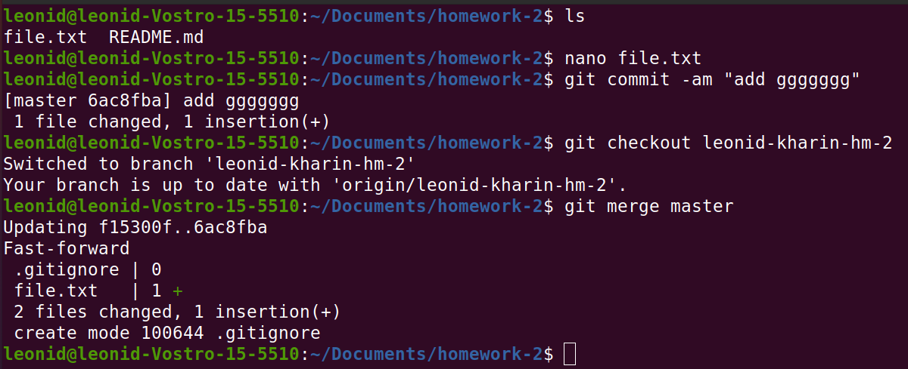

# Task 2: Merge vs Rebase
Integrate changes from one branch into another branch using: merge and rebase
1. merge 

2. rebase

3. Conclusions
    Both commands are for the same thing and taking time to find out which of them is better does not seem to me the most rational waste of time compared to, for example, writing code.

    3.1 __merge__
    if you make a merge from a master into a feature, then a new commit is created in the feature branch, the history of commits is saved. This operation creates a new "merge commit" on the feature branch, linking the histories of both branches. Merge is a great non-destructive operation. Existing branches are not changed in any way But if too often it is to include upstream changes in a feature branch, then it can become clogged, which is a main minus.

    3.2 __rebase__
    This will put the entire feature branch on top of the master branch, including all new commits on the master branch. If rebase is used on commits instead of the merge command, this command rewrites the project history, creating new commits for each commit on the original branch. The main advantage of rebase is a cleaner project history. First, this command eliminates unnecessary merge commits required for git merge. Secondly, the rebase team creates an ideal linear history of the project - you can track the functionality to the very beginning of the project without any forks.
