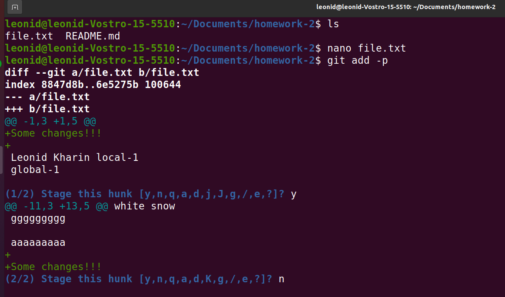

# task 3
__git add -p__
When you use this command instead of immediately adding all committed changes, the system asks what to do with each of them. This way you can choose what exactly you want to commit.
