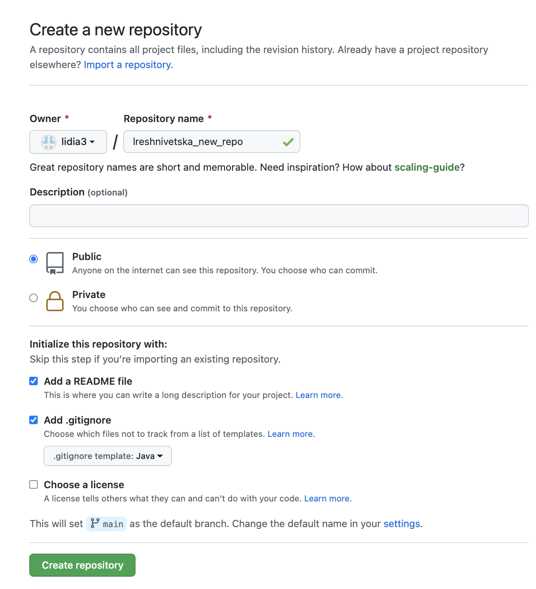
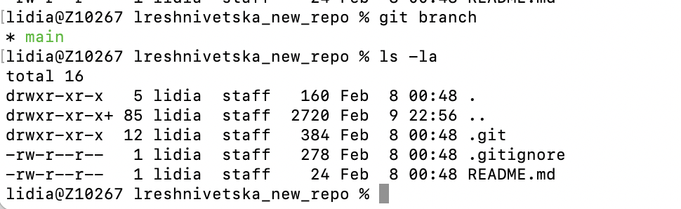
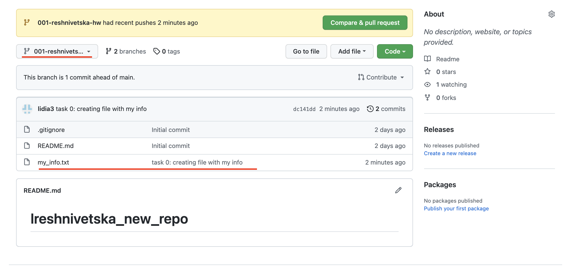
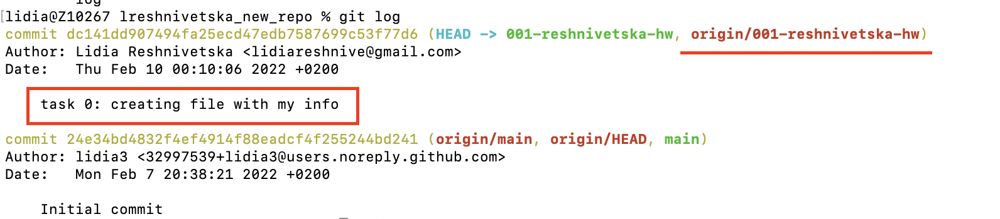

### Task 0

1. My new repo: https://github.com/lidia3/lreshnivetska_new_repo/

2. Creation of remote version:

3. For creating new branch I have used command: **git checkout -b 001-reshnivetska-hw**

4. For creating file I have used command: **vi my_info.txt** with my name & surname

5. .gitignore file:

6. Pushed new branch:

7. Git logs of completed work:

