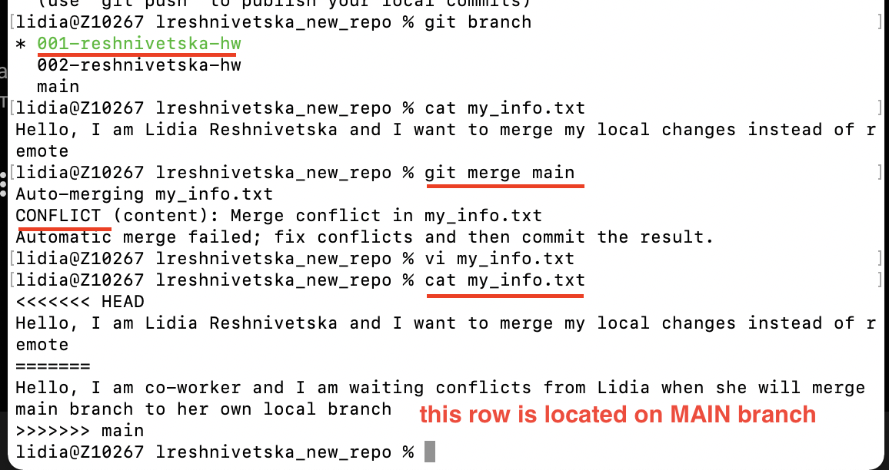
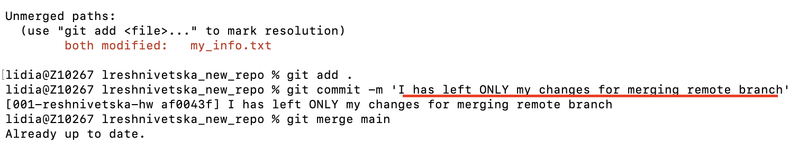
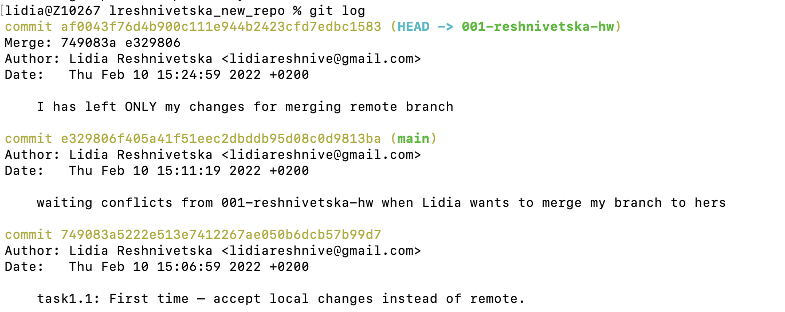
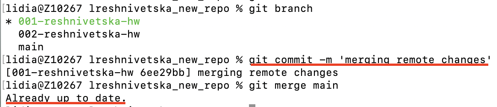
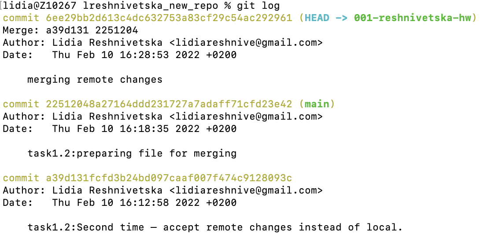
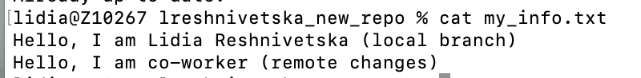
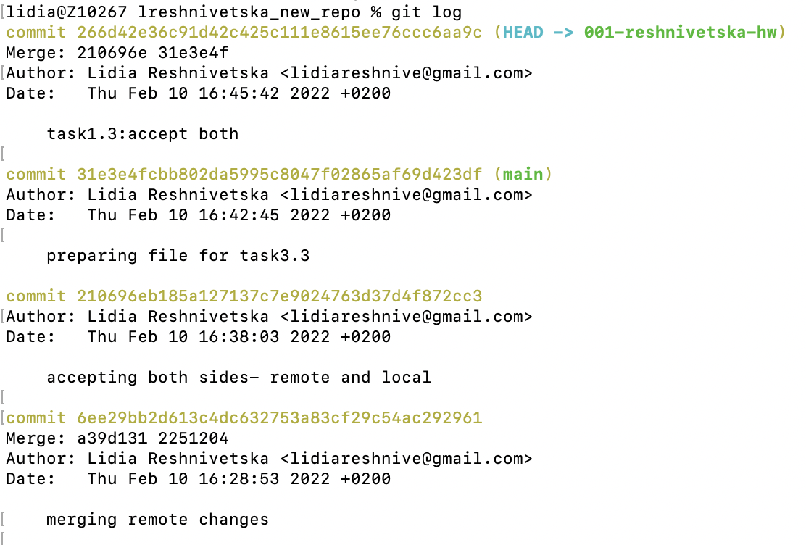

### Task 1

Use the same remote github repo from previous task. The task is to create conflicts. 3 times.

1. First time – accept local changes instead of remote.

**Conclusion**: I have left only my changes (branch: 001-reshnivetska-hw) instead of changes which are on main branch

2. Second time – accept remote changes instead of local.

**Conclusion**: I accepted only changes from main branch on branch: 001-reshnivetska-hw

3. Third time – accept both.

**Conclusion**: I accepted both conflicts, I edited marks like:
HEAD ======= etc

Thats why we see my name and co-worker`s name in file.
