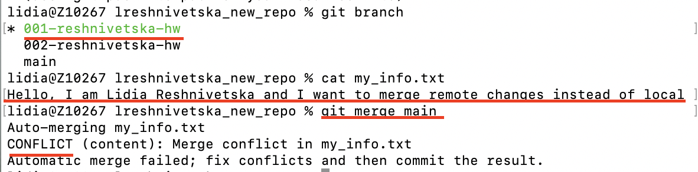

### Task 1

Use the same remote github repo from previous task. The task is to create conflicts. 3 times.

1. First time – accept local changes instead of remote.

Merging main branch on my local branch:

After conflict I left only my changes:

Logs:

**Conclusion**: I have left only my changes (branch: 001-reshnivetska-hw) instead of changes which are on main branch

2. Second time – accept remote changes instead of local.

Conflict between main and local branches:

I left only remote changes (from main branch):

Logs:

**Conclusion**: I accepted only changes from main branch on branch: 001-reshnivetska-hw

3. Third time – accept both.

Changes for both branches:

Logs:

**Conclusion**: I accepted both conflicts, I edited marks like:
HEAD ======= etc

Thats why we see my name and co-worker`s name in file.
