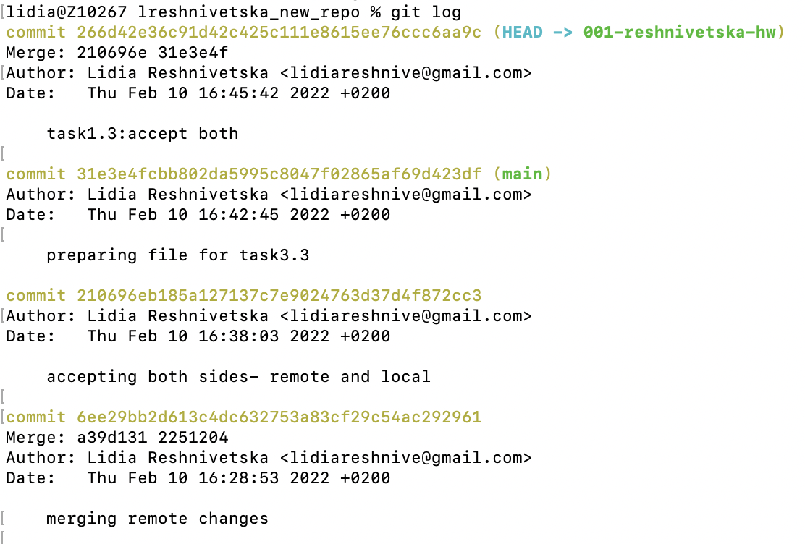
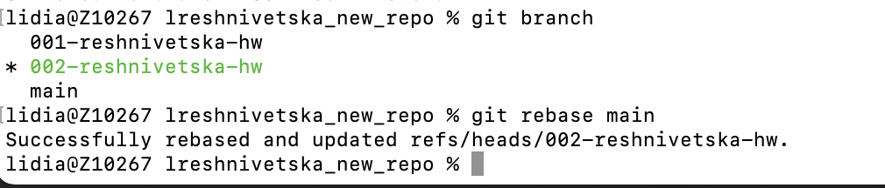
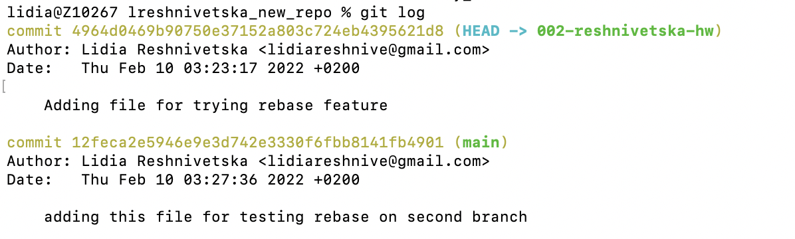
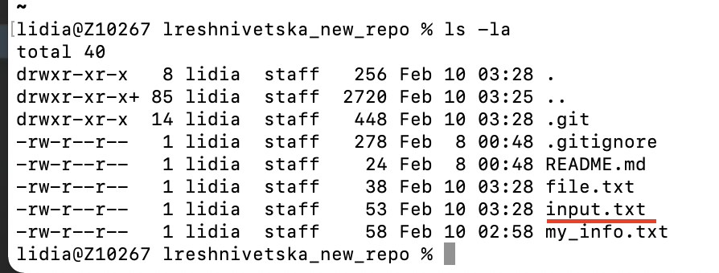

### Task 2

Integrate changes from one branch into another branch using:

1. git merge

Merge I tried on 001-reshnivetska-hw:

2. git rebase

Result within rebase on 002-reshnivetska-hw and main branches:

Logs:

As a result input file synced from main branch to 002-reshnivetska-hw

**1. Which command did you like the most?**

As for me I choose git merge, cause it is easier to detect commits which are automatically created during the merge.  

**2. In which cases it is better to use git merge and when git rebase?**

If you're working alone or on a small team, use rebase. If you're working with a big team, use merge.

Git rebase compresses all the changes into a single “patch.” Then it integrates the patch onto the target branch. Unlike merging, rebasing flattens history. It transfers the completed work from one branch to another. In the process, unwanted history is eliminated.
