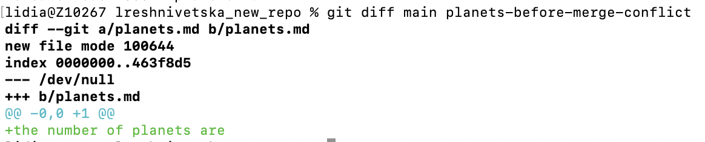
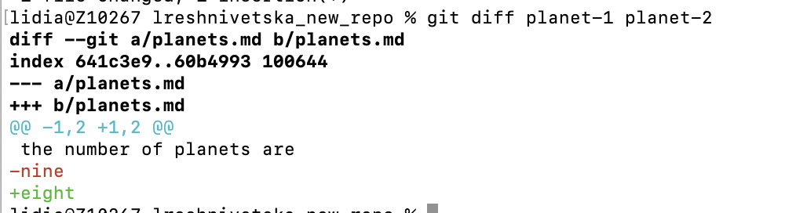
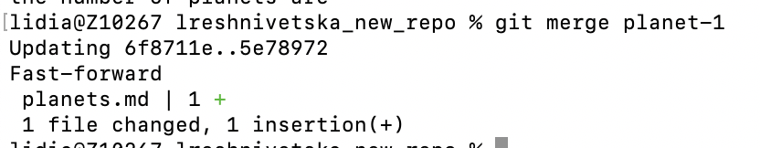
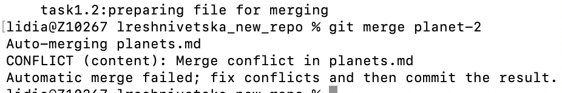
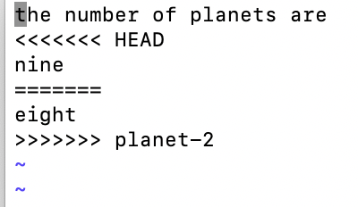
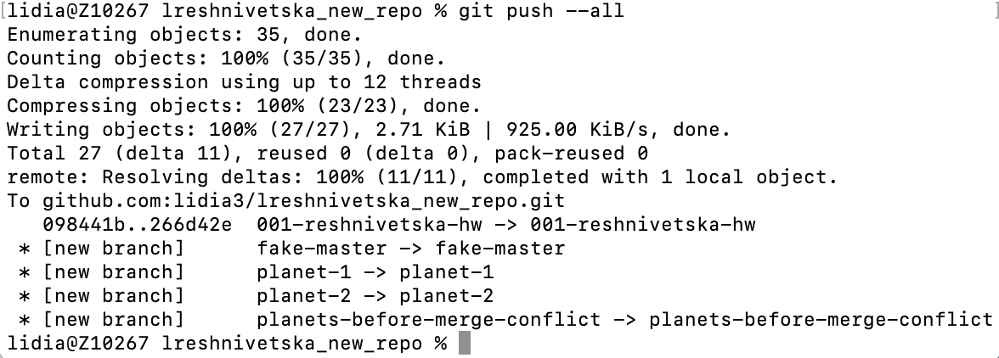
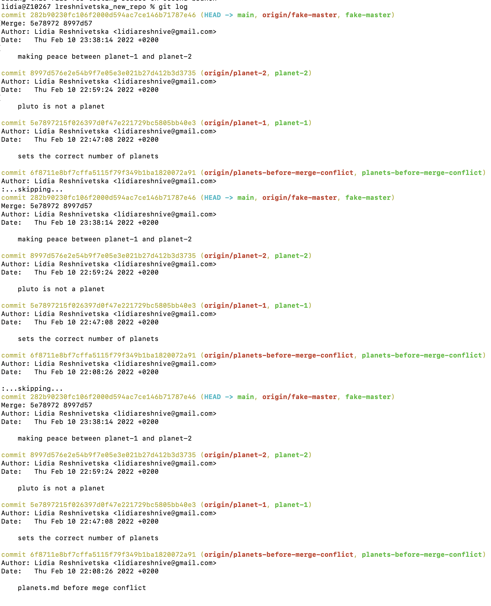

### Task3

1. Create a file called planets.md
2. Make conflicting edits to the file on two different branches
3. Merge the changes on a fake “master” branches

First of all I have created new branch like: $ git checkout -b planets-before-merge-conflict

Then I`ve created file planets.md in this branch:
"the number of planets are"

After such editings we should commit it like this:
$ git add .
$ git commit -m"planets.md before merge conflict"

diff helped me to detect difference on branches:

### Second task: create two working branches:

let it be:

$ git branch planet-1

$ git branch planet-2

### Task 3: Make a change on planet-1
Open planets.md and add “nine” on line 2, so the text looks like: "the number of planets are

nine"

Then commit:

$ git add .
$ git commit -m"sets the correct number of planets"

### Task 4: $ git checkout planet-2

Opened planets.md and added “eight” on line 2, so the text looks like:

"the number of planets are

eight"

$ git add .
$ git commit -m"pluto is not a planet."

### Task 5: Compared my edits

### Task 6: Created a fake “master” branch

 git checkout -b fake-master

 ### Task 7:Started merging the work into the fake “master” branch

 merge with planet-1 was successfully, BUT with planet-2 is not, because CONFLICT has happened due to the same string: "nine/eight"

### Task 8: Used a text editor to look at the merge conflict

Opened planets.md in a text editor.  Git has marked the merge conflicts in the file:

The conflict is marked with “conflict markers”. It begins with <<<<<<< HEAD and ends with >>>>>>> planet-2. The changes that came from HEAD (the current branch) are before the ======= and the changes that came from planet-2 are after the =======

### Final task: Pushed all of my branches to github and merged fake-master to main branch!

git push all:

Logs of completed work:

