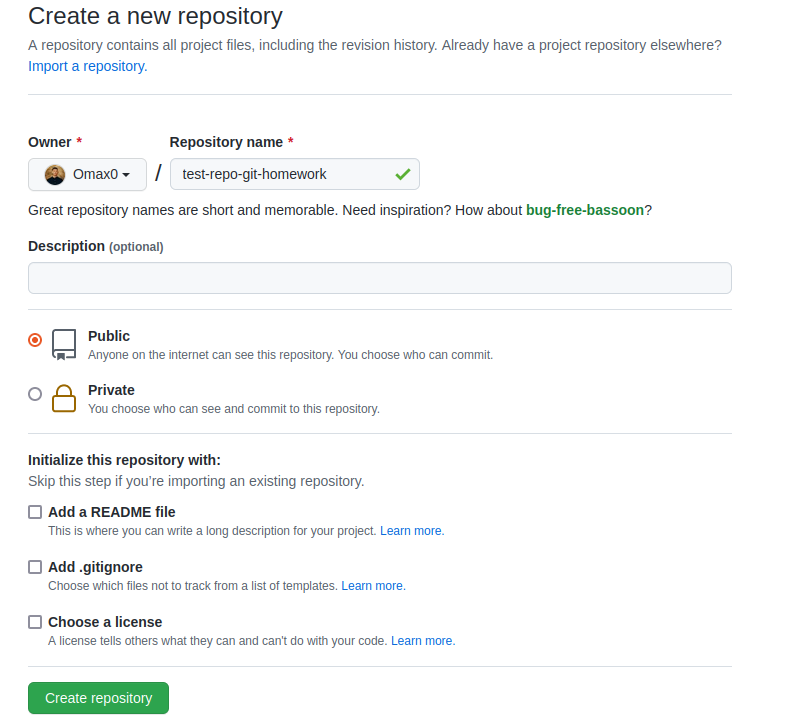
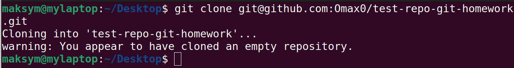
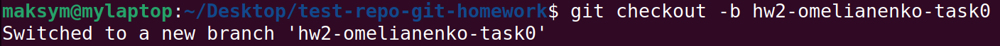
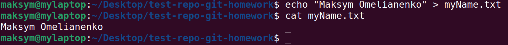
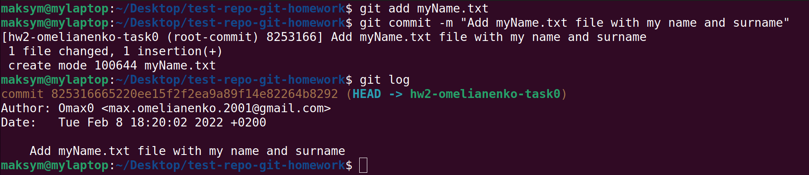
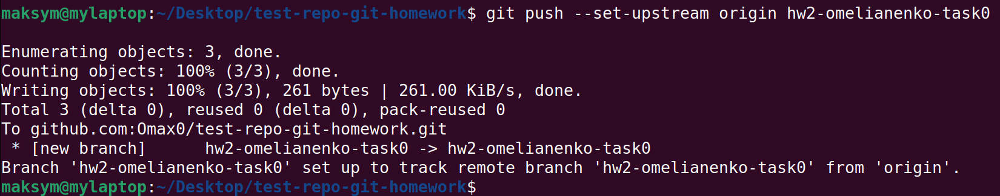
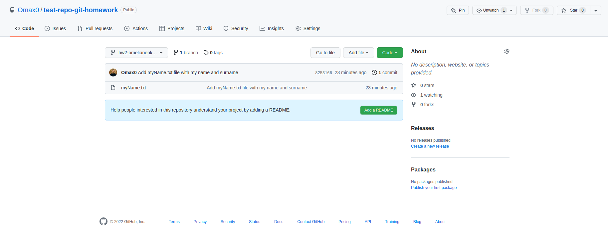

# Task 0: Setting up remote repo

Description: for creating new public repo in GitHub we should just click on "New repository",
then choose appropriate parameters and click "Create repository".

Then we clone this repository using `git clone <repository>` and set it up remote and local in this way.

Next, we create a branch using `git checkout -b <name>`.
We can also use `git branch <name>` and `git checkout <name>` and do the same,
but we'll waste more time.

After that we create a text file with name and surname,
add it to update what will be committed using `git add <name>` or `git add .` to add all of the files.
Then we commit our changes by typing `git commit -m <message>`.
Alternatively, we can use `git commit -am <message>` to do the same faster.

Finally, we can push our branch using `git push --set-upstream origin hw2-omelianenko-task0`
to push the current branch and set the remote as upstream.

Conclusions: creating, setting up, and pushing the repository is basic git action.
It isn't a hard process, so I hope this instruction will be useful for everyone.
Link to test repo: https://github.com/Omax0/test-repo-git-homework
