Description: the task is to create conflicts. So, first of all, we create a random file 
(in my case it's the list of names). After that, we commit it using `git add <name>`
to include in what will be committed and `git commit -m <message>` to commit it. 

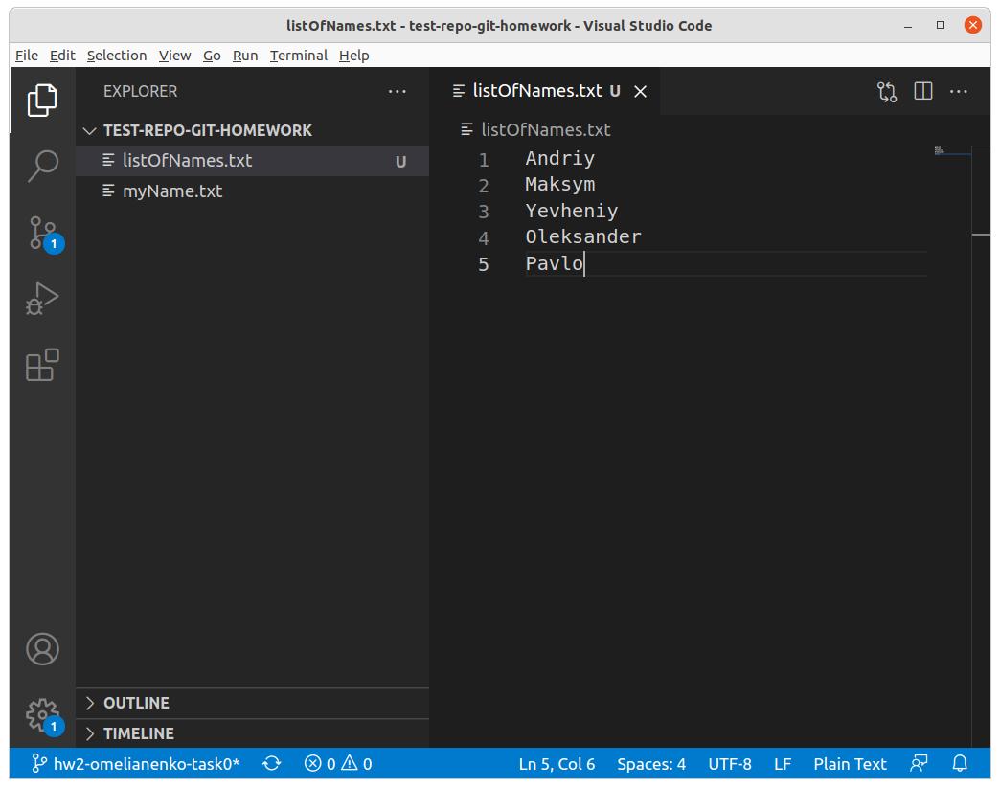
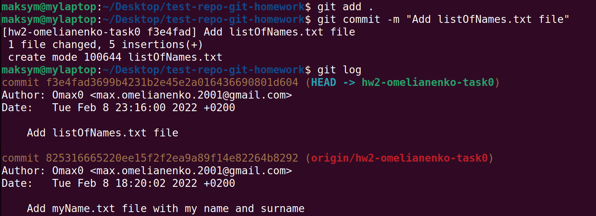

Then we create new local and remote branches using `git checkout -b <name>`.

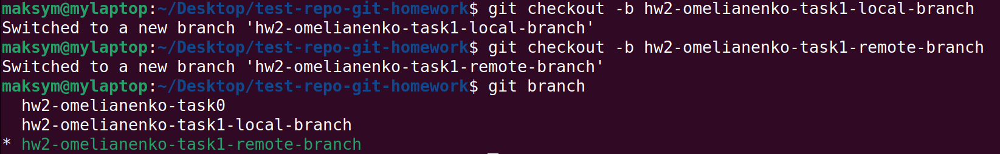

Now, let's add some names to the list on the remote branch, commit it and push using:

```
git add .
git commit -m <message>
git push --set-upstream origin <branch>
```
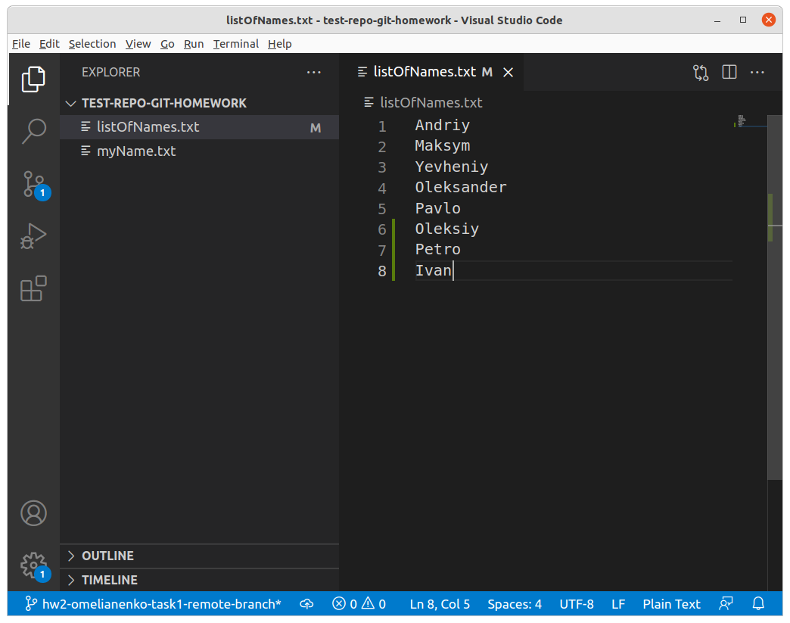
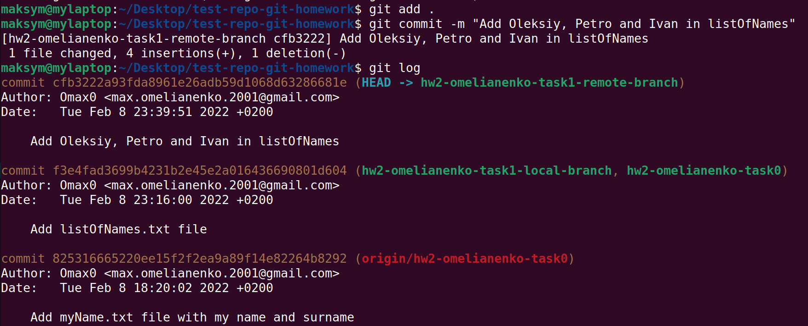
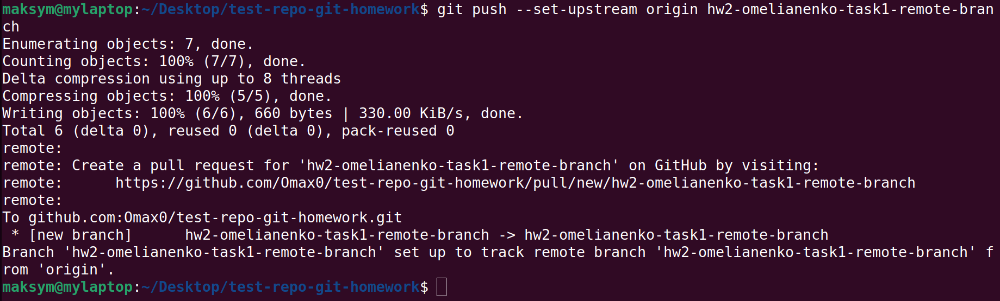

Then we add other names to the list on the local branch, commit it and try to pull using
previous commands and `git pull origin <name>` to pull branch. But we have a conflict,
which should be resolved before we can merge the remote branch into local.

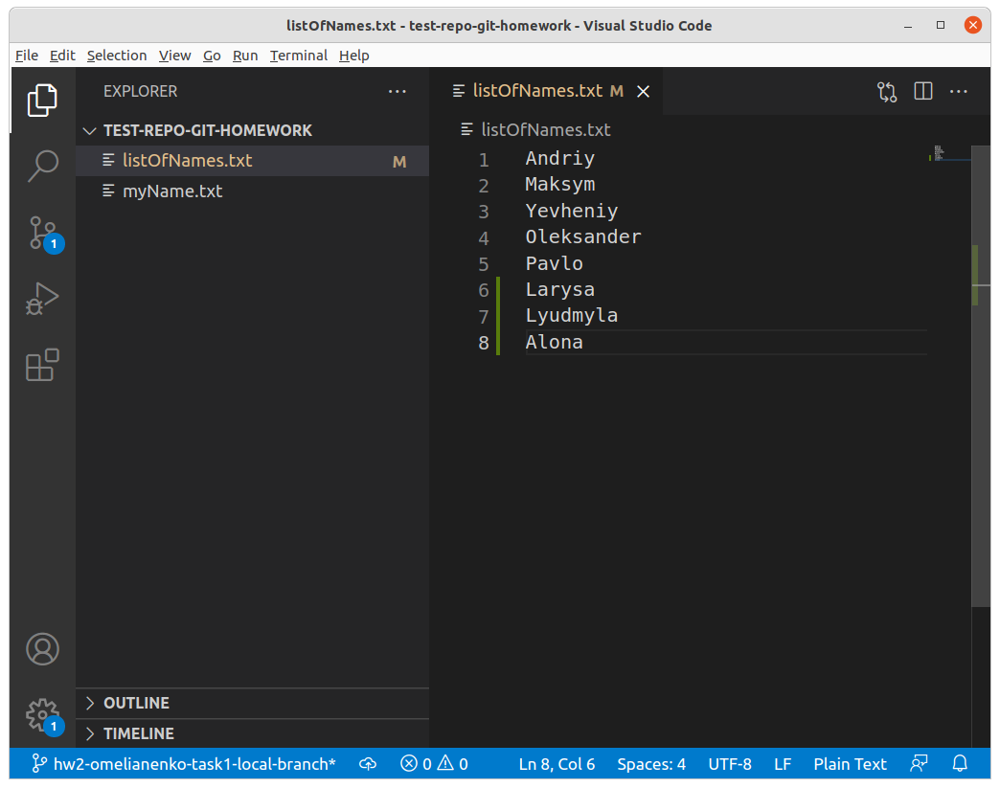
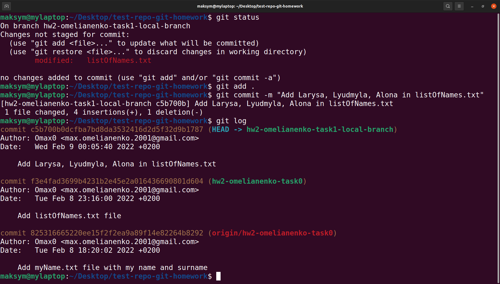
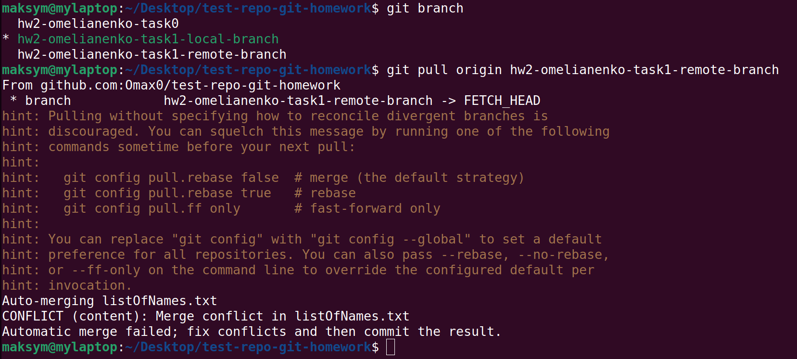

So, to resolve this conflict in Visual Studio Code, for example, and accept local changes 
we should just click on "Accept current change", commit it, push the change to the remote and
pull change into the remote branch using:

```
git add .
git commit -m <message>
git push
git pull origin <name>
```

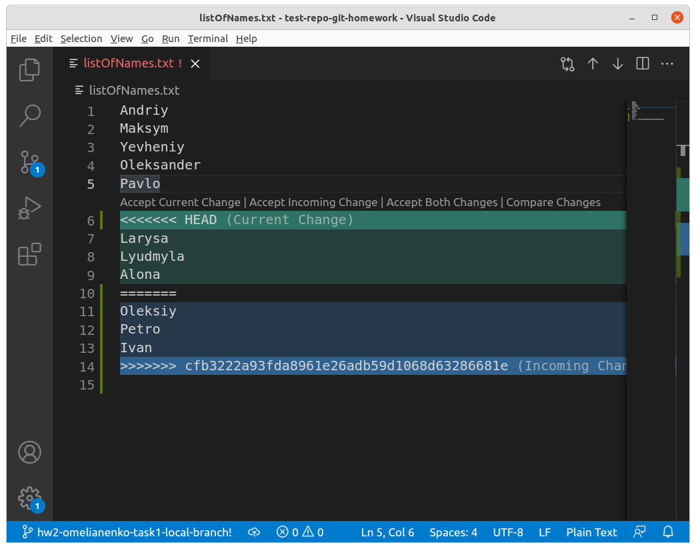
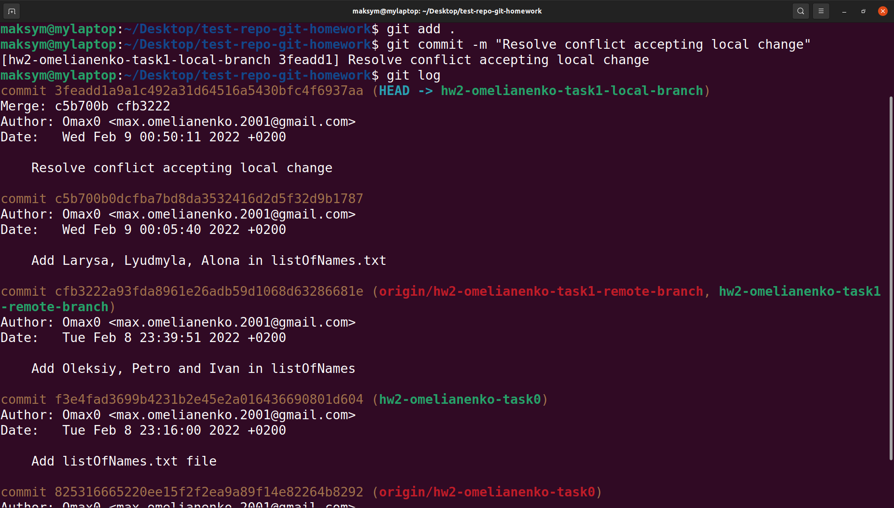
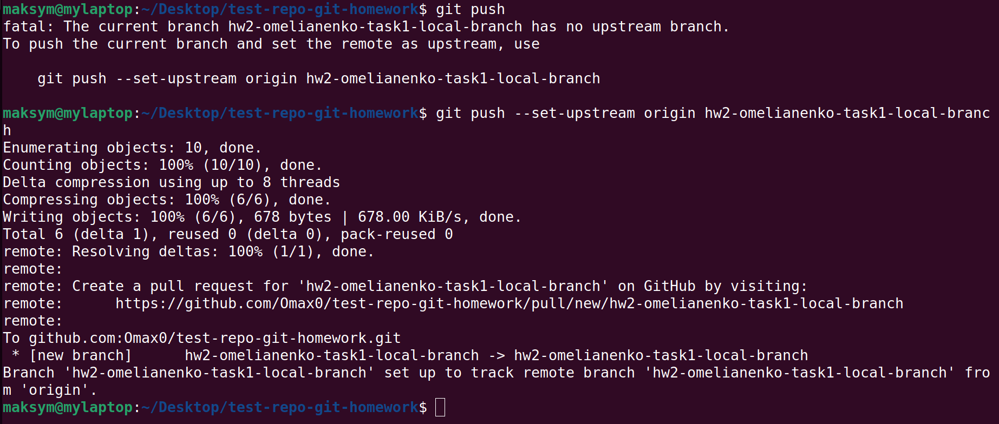
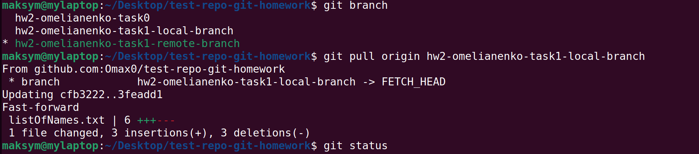

After that when we check the pull request, the pull request will still be open and
we'll no longer see any merge conflicts.

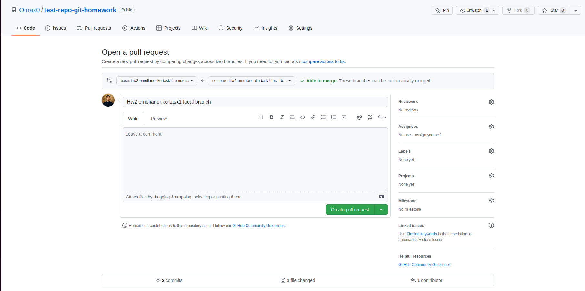

If we want to accept remote change instead of local we should do the same,
but this time we'll click on "Accept incoming change" and we don't need to pull again.

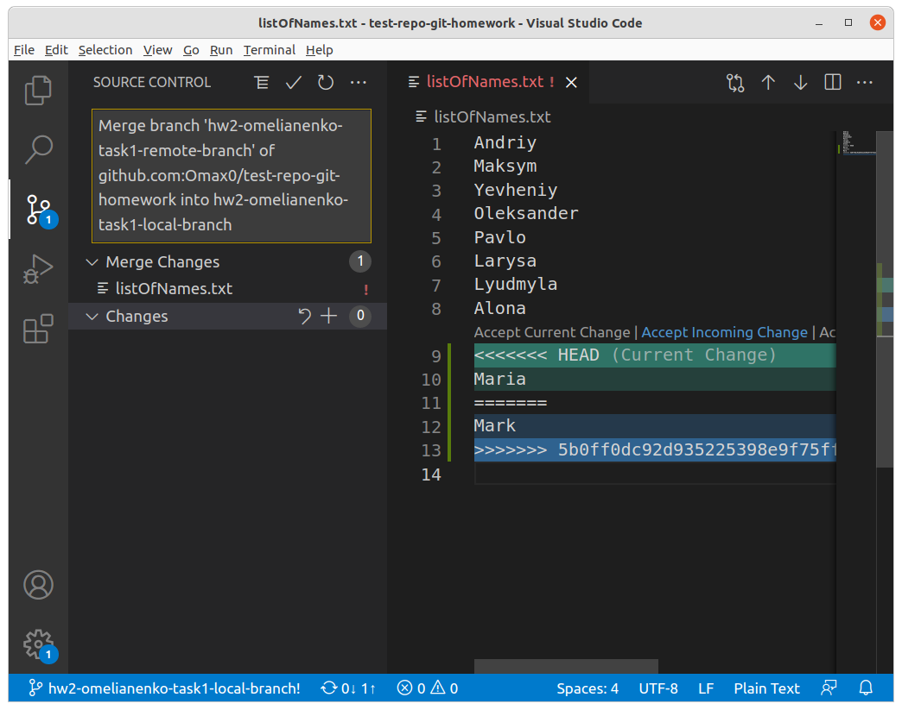
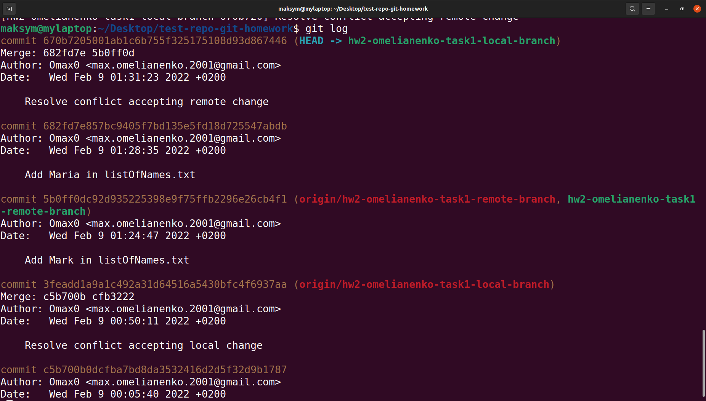
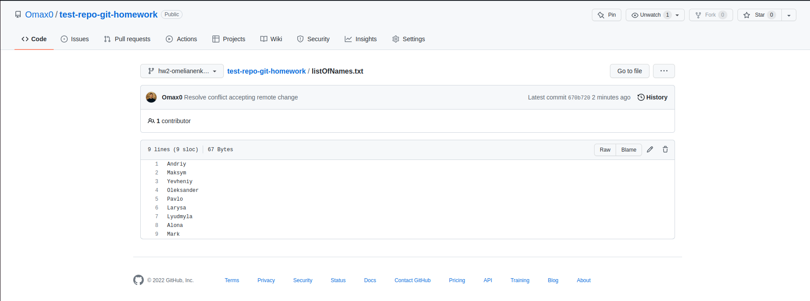

And if we want to accept both of the changes, we can do all the same,
but click on "Accept both changes".


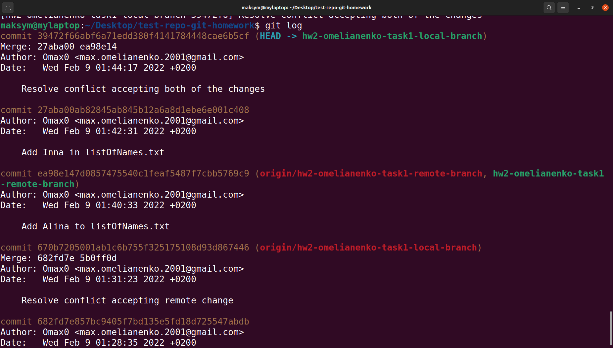
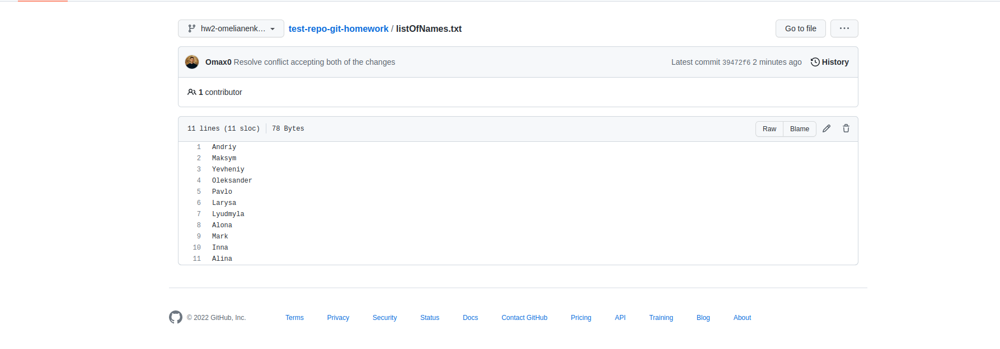

Conclusions: we can also resolve conflicts in another way, for example rewriting files, but I think this method is the most convenient.
