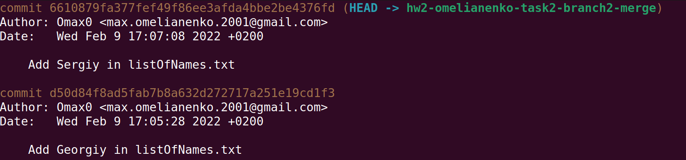
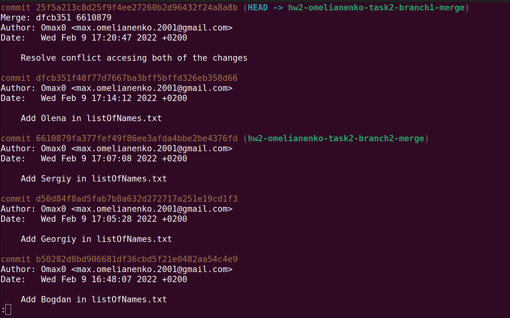
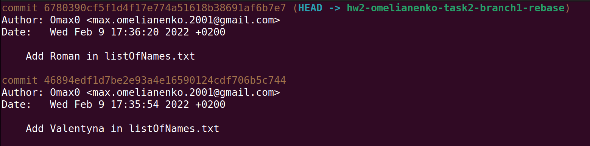
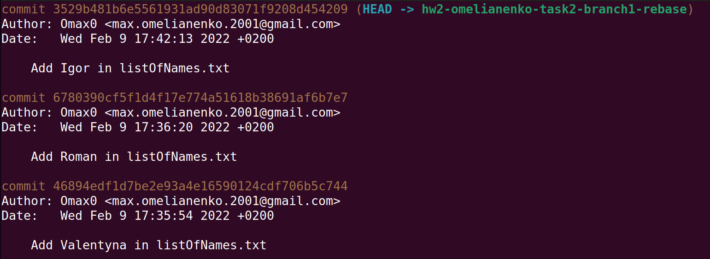
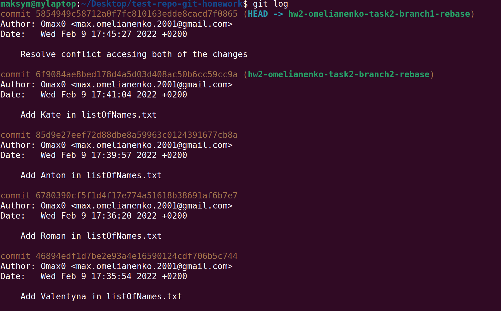
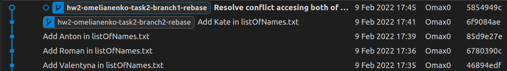

# Task 2: Merge vs Rebase

Description: we need to integrate changes from one branch into another branch using
`git merge` and `git rebase`.

## Merge

Let's create a new branch using `git checkout -b <name>` and on the first branch add three
commits using `git add .` and `git commit <message>`. Now we can see these commits in the log.

Then we create another branch and add two commits using earlier mentioned commands.

Now we add one commit on the first branch and try to merge using `git merge <name>`
second branch into. Certainly, we have conflicts, that can be solved like in the previous
task and then merged. Now we can see how the log looks after merging.

## Rebase

For this task we just repeat the process described earlier but instead of using `git merge`, 
we'll use `git rebase`, and after resolving conflict use `git rebase --continue` to continue
rebasing. Now we can see how the log looks after rebasing.

## Questions: 

1. Which command did you like the most?

My short answer is `git merge` is the most convenient because after using it we and someone else
can see all the changes in the log.

2. In which cases it is better to use `git merge` and when `git rebase`?

If you want to keep clean and readable git history, it's better to use `git rebase`.
However, if for example date of commit is important for some reason, then you should
use `git merge`, because `git rebase` technically move commits and lose the initial commit time.

Conclusions: `git merge` and `git rebase` are basic git commands that do the same action
but in a different way. Everyone chooses what the most appropriate for them and when.
