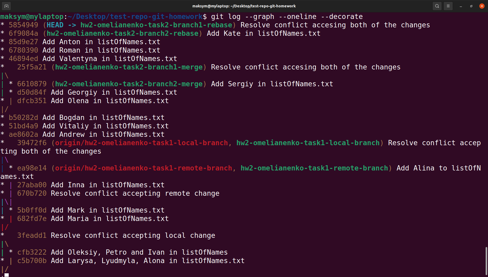
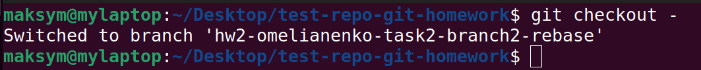
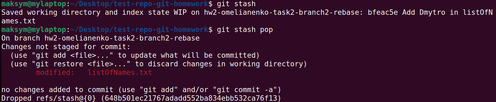
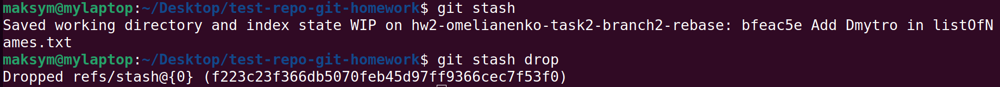

# Task 3: Use your imagination

Description: for this task I've done some search and found a bit of useful and easy-to-use things.
The first trick is about improving the `git log` command look. If we'll try to use
`git log --graph --oneline --decorate`, our log looks prettier and more readable.

Another trick is so simple command `git checkout -` that lets you come back to the previous branch,
which was checked. I didn't know about it and just typed the name of the branch again and again,
but this command very helped me.

And the last trick is stashing uncommitted changes using `git stash`. This command hides change
that you don't want to commit (for example unfinished feature) and give us a clear working tree
and let us switch to another branch. Then we can use `git stash pop` if we need to return the changes
or we can use `git stash drop` if we want to clear stash stack.

Conclusions: these commands are useful and easy to use. It helps to improve your workflow.
