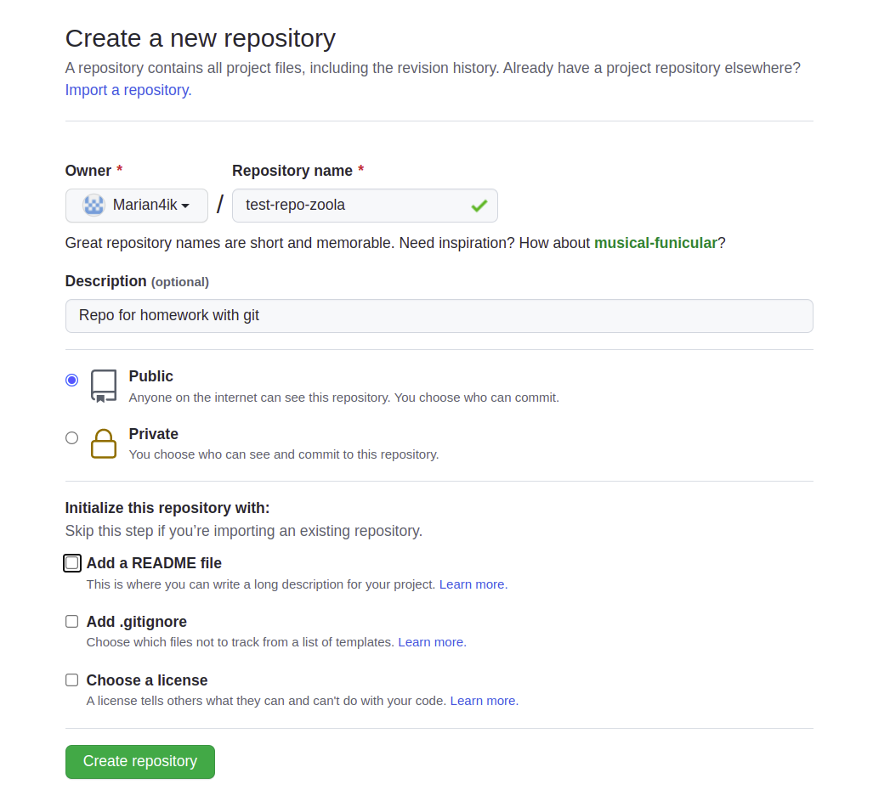
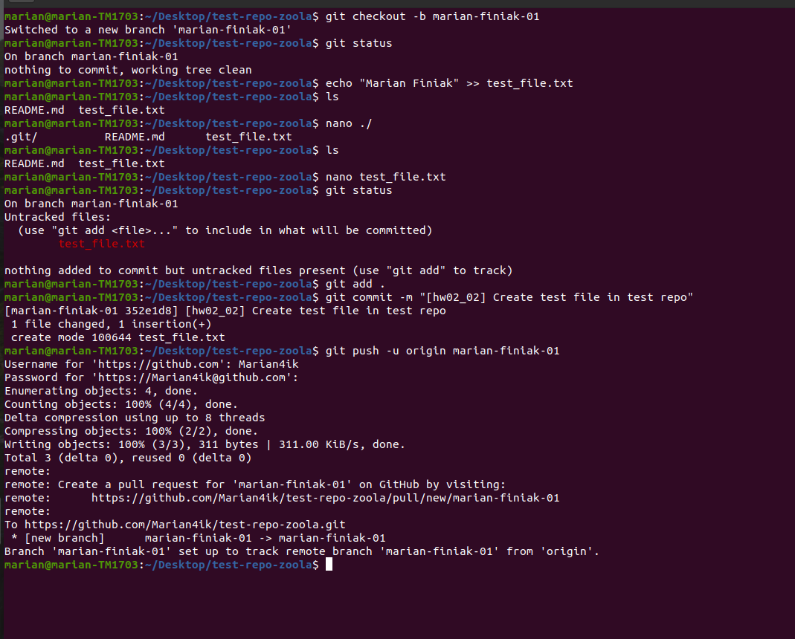
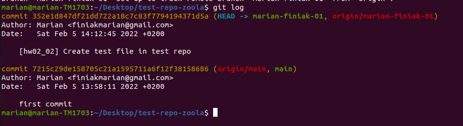

# Task 0

####<https://github.com/Marian4ik/test-repo-zoola>

###Create test repo for task-0

After use:
>git init

to initialize the git in our directory\
After I connected the local repository to the remote.

##Use git commands

Use:
>git checkout -b marian-finiak-01

to creat new branch name: "_marian-finiak-01_"

Use:
>git status

to check which branch I am on, and check track/untracked files

Use:
>git add .

to track your untracked files

Use:
>git commit -m "_name_commit_"

to commit my added files and changes

Use:
>git push -u origin marian-finiak-01

to create a remote brunch "_marian-finiak-01_" and connect it to my local branch "_marian-finiak-01_", and push my changes there

Use:
>git log

to see all the action

