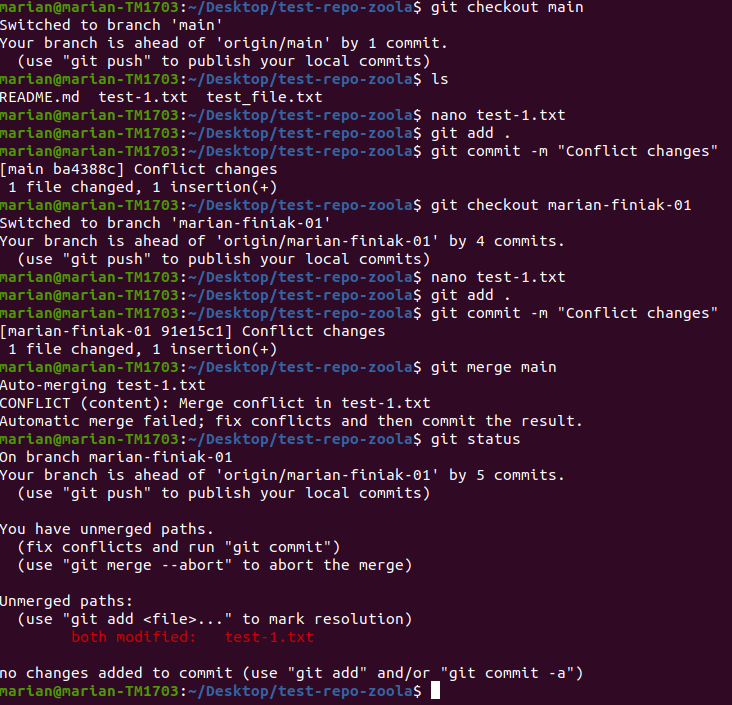
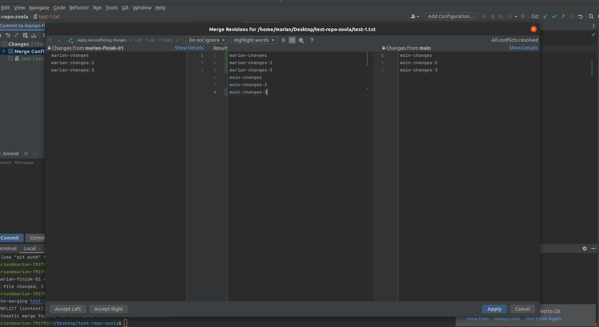
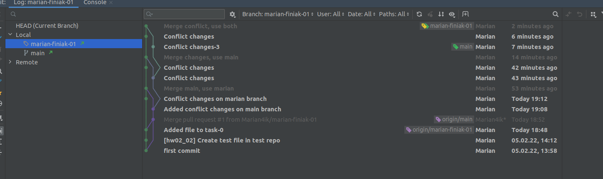

#Task-1

Create conflict:

In this screenshot you can see that if we make the same changes on two different branches\
and then want to merge them, we will get conflict

I use RubyMine, so I have a user-friendly interface for resolving conflicts\

And I have 3 options
1. Use main changes
2. Use head(used branch) changes
3. Use both

Resolve conflicts:

\
Git log:

\
Also, i can use terminal to resolve conflicts manually

