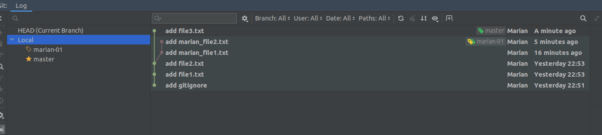
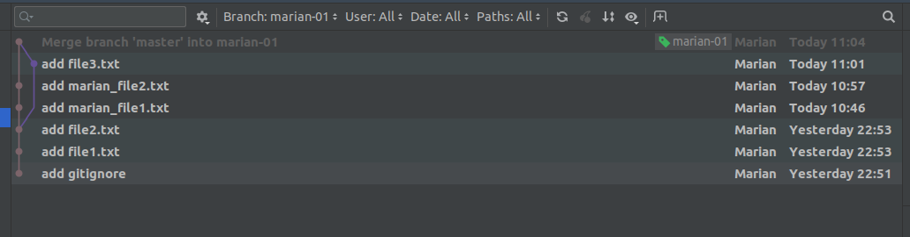
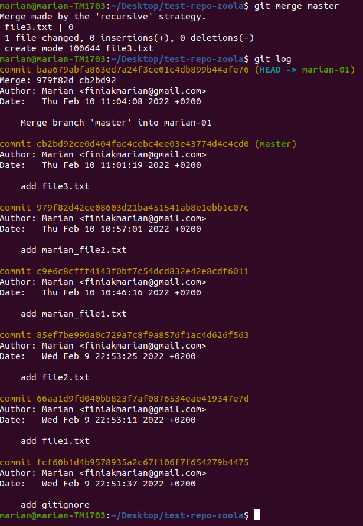
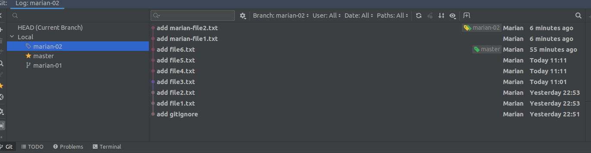
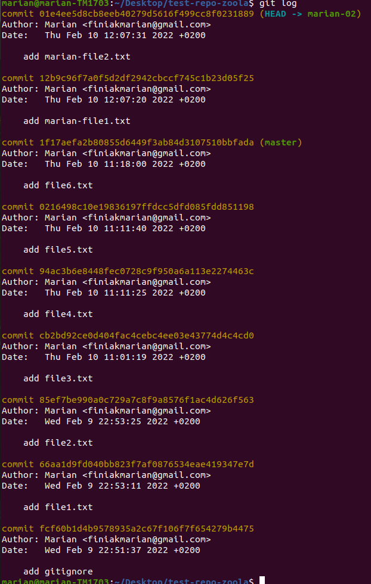

#Task-2

Create repo, and add some commits to master branch

After i create new branch and add some commits on it

I use:
>git merge master

after i can see that my commits are written immediately after creating the branch

Also I can look at the history of the commits in the terminal

\
If I use:
>git rebase master

all commits on my new branch will be saved until the last commit on the master branch

Also I can look at the history of the commits in the terminal

\
\
\
\
Which command did you like the most?
> I liked more merge because it creates a new commits and in my opinion it is easier to control the flow of versions.

In which cases it is better to use git merge and when git rebase?
>Rebase better when all my changes on master branch not related on changes head branch.\
\
>In other cases it is better to use merge because that way we control the versions better.