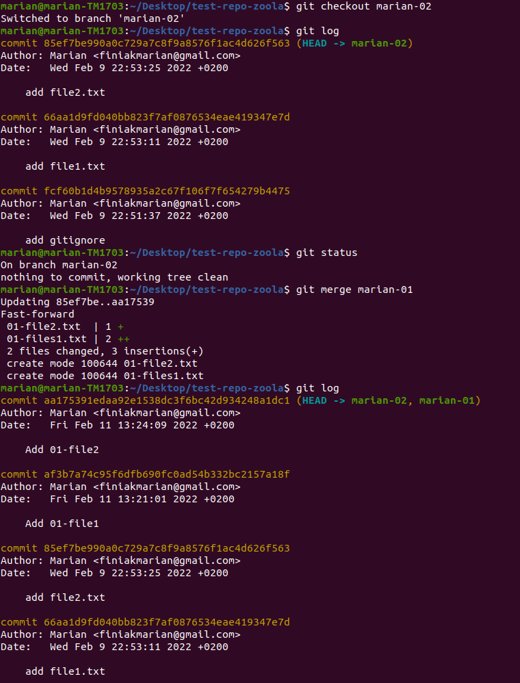
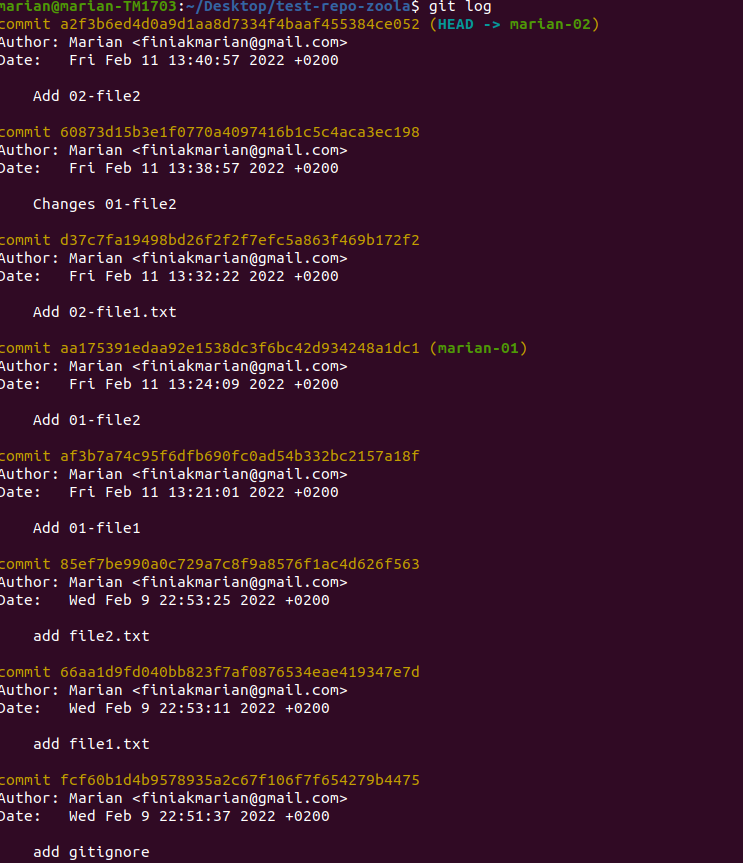
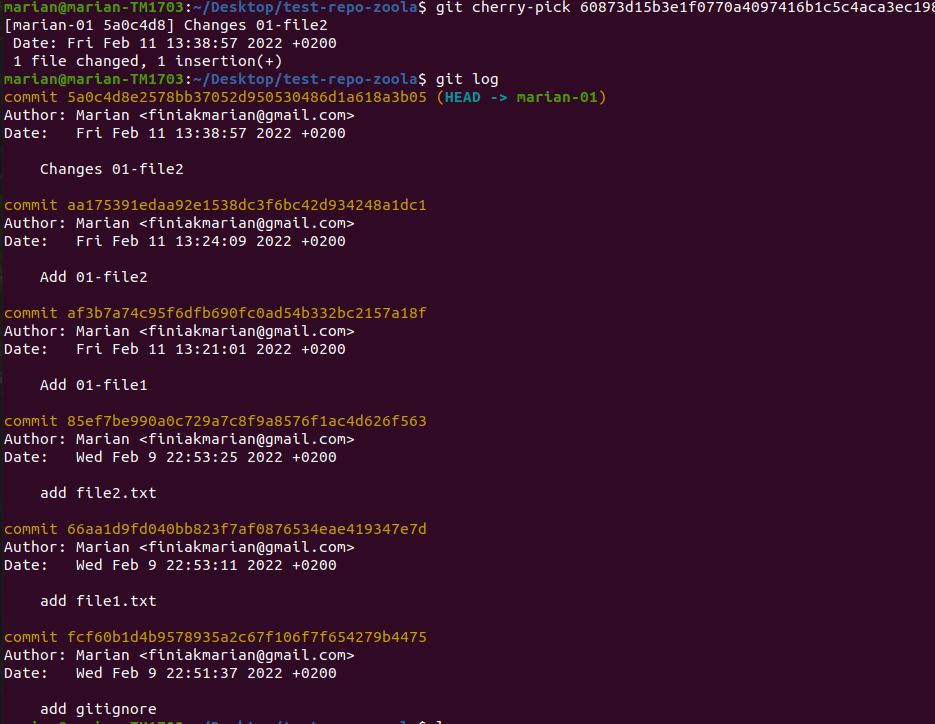

#Task-3

##Git Cherry-Pick
git cherry-pick is a powerful command that enables arbitrary Git commits to be picked by reference and appended to the current working HEAD. Cherry picking is the act of picking a commit from a branch and applying it to another.
#

####To demonstrate it in action, I first created two branches for different tasks

#
####After that, I added several committees to one branch, and then realized that one of them related to another task

\
\
\
but i have:
> git cheery-pick commitSha

####And after executing this command on another branch, I added this commit to this branch without adding all the others

\
\
\
I think this is a really useful command and it may often be needed