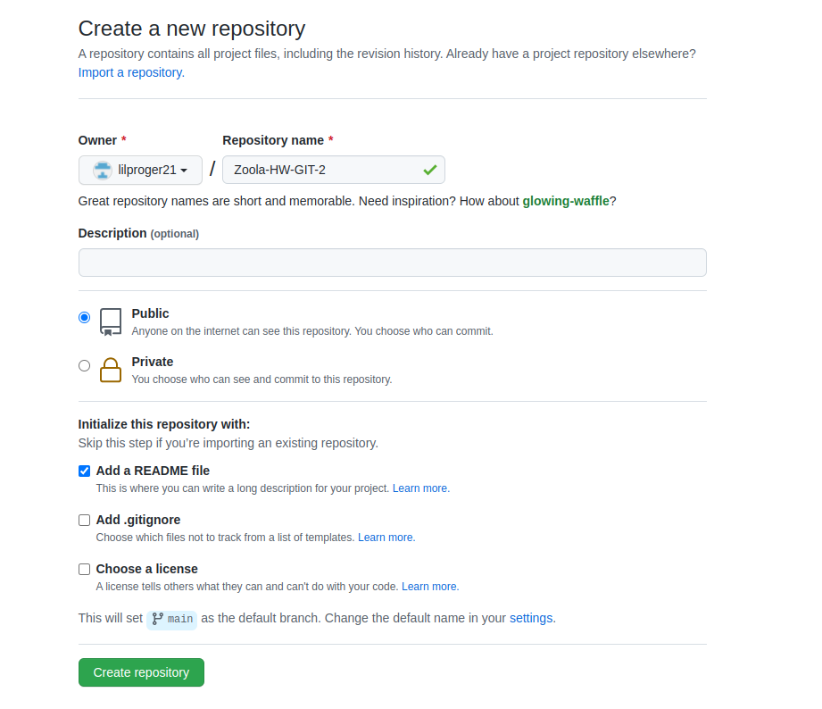
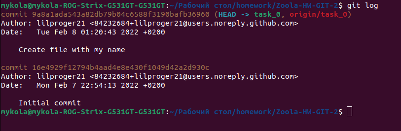

# Task 0
### Creating Github repository
In my github account I create a new repository

### Setting it up both on remote and local
All we have to do is copy the https link 

and go to terminal and use "git clone" command to clone this repository locally

### Create a new branch
To create a new branch, use the "git branch" command and use "git checkout" to switch to that branch

### Create text file with your name and surname, commit it and push

### Show your git logs
Use "git log"

### Link to your repository
https://github.com/lilproger21/Zoola-HW-GIT-2

