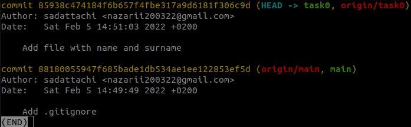

### Task 0

Public repo: https://github.com/sadattachi/zoola-git-2-homework

1. Created public repo, setted up, created new branch and pushed new file into it.
2. Used git commands:
    a. git init
    b. git add
    c. git commit
    d. git status
    e. git checkout
    f. git remote add
    g. git push
3. Screenshots:
    a. 
    b. 
4. Conclusion: some easy and basic work, but that is why this is task0.