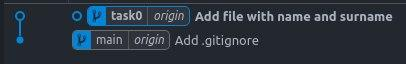

### Task 0

Public repo: https://github.com/sadattachi/zoola-git-2-homework

1. Created public repo, setted up, created new branch and pushed new file into it.
2. Used git commands:
    1. git init
    2. git add
    3. git commit
    4. git status
    5. git checkout
    6. git remote add
    7. git push
3. Screenshots:
    1. 
    2. 
4. Conclusion: some easy and basic work, but that is why this is task0.