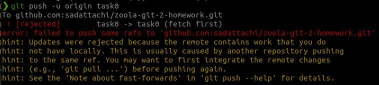

### Task 1

1. Description:
    1. First conflict
        1. Modified "name" remotely and localy
        2. Tried to push into conflict (see 3.1)
        3. Modified file name (see 3.2) to accept local changes
        4. Pushed changes back to repo (see 3.3)
    2. Second conflict
        1. Created second conflict the same way as first one
        2. Solved conflict in VSCode by pressing "Accept Incoming Change" button (see 3.4)
        3. Checked log after push (see 3.5)
    3. Third conflict
        1. Repeated previous actions to create conflict
        2. Solved conflict in VSCode by pressing "Accept Both Changes" button (see 3.4)
        3. Checked log after third conflict (see 3.6)
    4. Checked full log after all conflicts on github.com (see 3.7)
2. Used git commands:
    1. git push
    2. git pull
    3. git log
    4. git commit
    5. git add
3. Screenshots:
    1. 
    2. 
    3. 
    4. 
    5. 
    6. 
    7. 