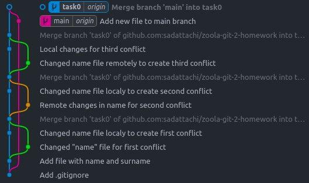

### Task 2

1. Description: made changes in main branch and than merged them into another branch with `git merge`. Then did the same thing with `git rebase`
2. Used git commands:
    1. git push
    2. git merge
    3. git log
    4. git commit
    5. git add
    6. git rebase
3. Screenshots:
   1. Since my branch is 1 commit behind main I can `git merge` main into task0 
   2. 
   3. 
   4. Graph after 3 conflicts from task1 (see Task1.md) and after `git merge` 
   5. Graph before rebase 
   6. `git rebase` 
   7. Result of rebase 
4. Conclusion: `git merge` is much easier and more convenient than `git rebase`, so I liked merging more. It is better to use `git merge` when you had some conflicts on your branch in past and if you are not so interested it having beautiful history. `git rebase` can be used when you need to have perfect history of commits.