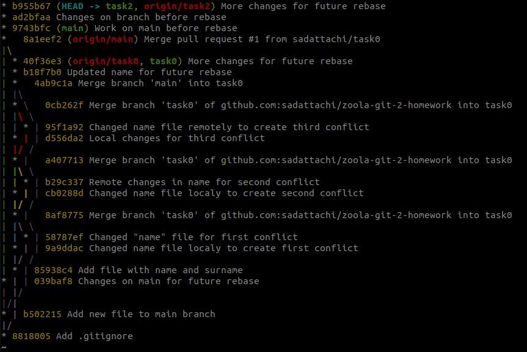

### Task 3

1. Description: not really so complex or great thing, but we are not competing here, so I am going to show something beautiful and elegant. Are you also tired of ugly and dirty `git log`? Well, there is and easy solution. By using special flags we can make logs look fabulous.
2. Used git commands:
    1. git log --graph --oneline --decorate
3. Screenshots:
    1. 
4. Conclusion: you can experiment with `git log` command and it's flags to make output better. For example flag `--oneline` can be used by itself (ex. `git log --oneline`). It will make log shorter and you will be able to see more previous commits.