Task 0: Setting up remote repo.

1. Create new public repo in GitHub.

1.1. Press "New" button in "Your repositories" section:

1.2. Set "Repository name" in corresponding field. Following this pattern <"projectKey/team">-<"tech">-<"maturity"> is recommended: 

1.3. Select repository visibility as "Public" and click "Create repository":

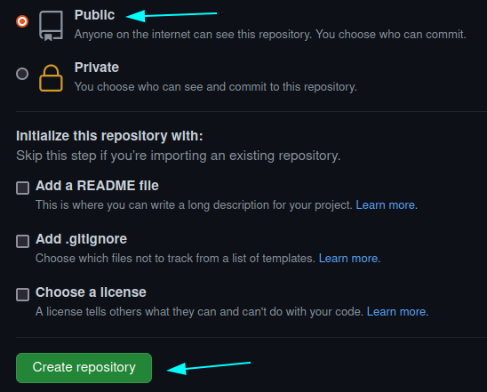

2. Set it up both remote and local.

2.1. Open terminal, select local directory for project and "cd" in it.

2.2. Create README.md and write there information about your project:

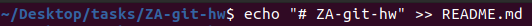

2.3. Use git init command to initialize current directory and create ".git" file in it:

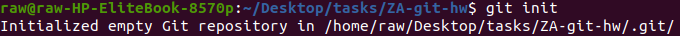

2.4. Add README.md in index and then commit it in local repository. Use "-m" flag to write commit message directly in command line:

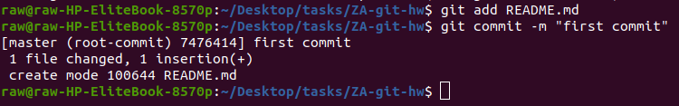

2.5. Creates a new remote called "origin" located at your remote repository: 

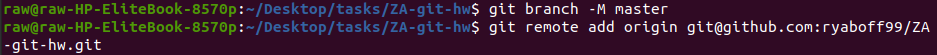

2.6. Push the commits from the local branch "master" to the remote "origin" "master":

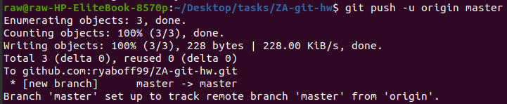

2.7. Create ".gitignore", add there all unnecessary files, make separate commit for ".gitignore" only due to "best practice" recommendations and push it to remote repository:

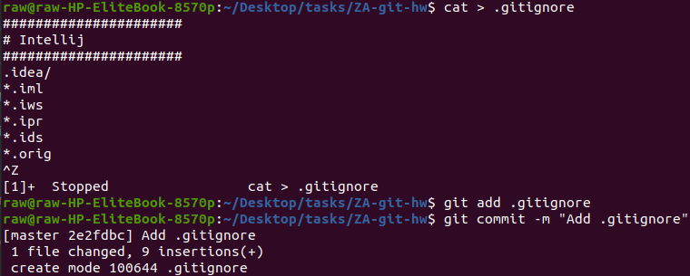

3. Create new branch and checkout on it with "-b" flag for "checkout" command. Following this pattern <"taskID">-<"short-actionable-description-of-what-the-task-is-about-with-hyphens-as-separators"> for brunch creation is recommended:

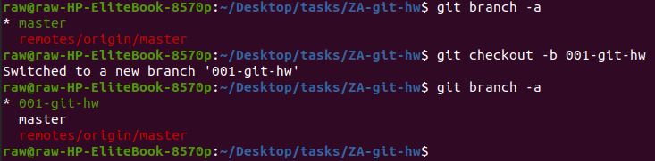

4. Create text file with your name and surname:

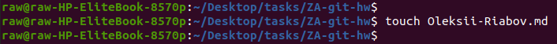

5. Add it to index and then commit:

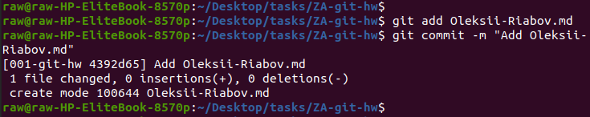

6. Create remote branch with same name as in you local branch and push your commit to it: 

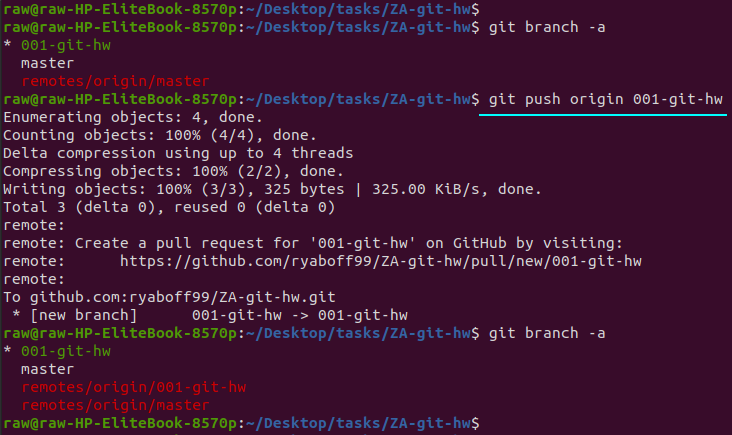

7. Make sure your .gitignore file exists, and you did not push any unnecessary files:

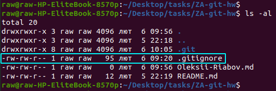

8. Show the git logs:

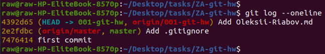

9. Attach a link to your repo in results:
   https://github.com/ryaboff99/ZA-git-hw/tree/001-git-hw

