0. Create conflict. Use the same remote GitHub repo from previous task.  Steps 0-0.6 are similar for all three conflict tasks.

0.1. Open file created in Task 0 ('Oleksii-Riabov.md' in current example) located on remote branch created in Task 0 ('001-git-hw' in current example):

0.2. Click "Edit this file" to edit file:

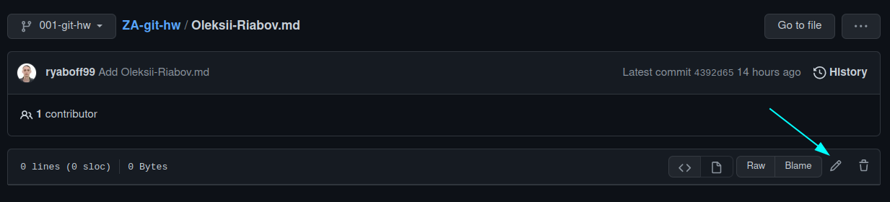

0.3. Make some changes in remote variant of the file:

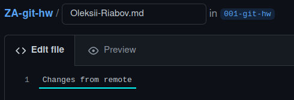

0.4. Add commit message and commit change on remote:

0.5. Edit same file ('Oleksii-Riabov.md' in current example) in same branch ('001-git-hw' in current example) on local repo and commit that changes:

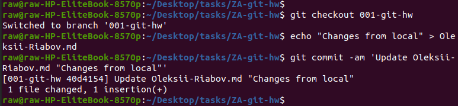

0.6. Pull remote branch to local to consolidate the changes. When you pull the changes, you’ll see an error message. Open conflict file with text editor ('$ nano Oleksii-Riablov.md' in current example) to resolve conflict:

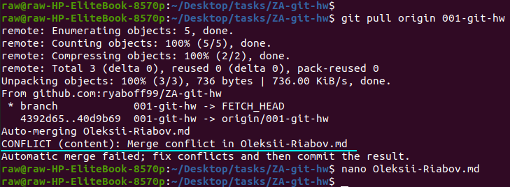

The code between <<<<<< HEAD and === is the code in our local repository.
   The code between === and >>>>>> is the code from the remote repository.

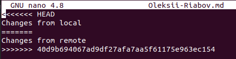

1. First time – accept local changes instead of remote.

1.1. Apply changes from local branch by simply deleting everything from file except content of local branch:

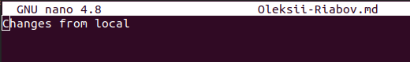

Or close file editor and use command '$ git checkout --ours .':

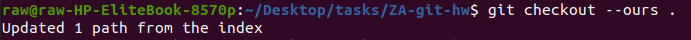

1.2. Check whether local changes applied and commit merge changes:

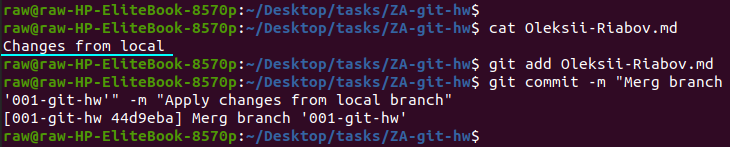

2. Second time – accept remote changes instead of local.

2.1. Reset changes in local repository to "pre-merge" commit by command '$ git reset --hard @~' or create new local & remote branches and do 0-0.6 steps:

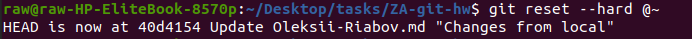

2.2. Pull remote branch to local to consolidate the changes. When you pull the changes, you’ll see an error message. Open conflict file with text editor ('$ nano Oleksii-Riablov.md' in current example) to resolve conflict: 

The code between <<<<<< HEAD and === is the code in our local repository. The code between === and >>>>>> is the code from the remote repository.

2.3. Apply changes from remote branch by simply deleting everything from file except content of remote branch:

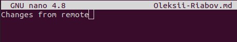

Or close file editor and use command '$ git checkout --theirs .':

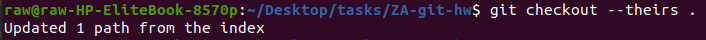

2.4. Check whether remote changes applied and commit merge changes:

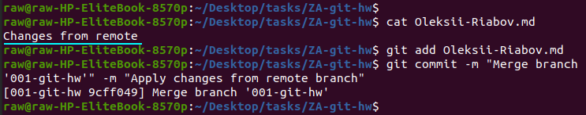

3. Third time – accept both.

3.1. Reset changes in local repository to "pre-merge" commit by command '$ git reset --hard @~' or create new local & remote branches and do 0-0.6 steps:

3.2. Pull remote branch to local to consolidate the changes. When you pull the changes, you’ll see an error message. Open conflict file with text editor ('$ nano Oleksii-Riablov.md' in current example) to resolve conflict:

The code between <<<<<< HEAD and === is the code in our local repository. The code between === and >>>>>> is the code from the remote repository.

3.3. Apply changes from local and remote branch by simply deleting conflict text, numbers and signs (<<<, HEAD, ====, >>>>, 40d9):

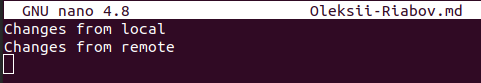

3.4. Check whether both remote and local changes applied and commit merge changes:

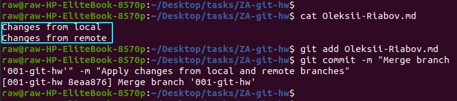

