Questions:
1. Which command did you like the most (merge or rebase)?

I don't have preferences among them, they are both good but for their own purpose.

2. In which cases it is better to use git merge and when git rebase?

With merge changes in every file of both branches analyzed and combined in the new merge commit. So merge commit (if it is not a "fast-forward" merge) will have two parents - two merged branches with their commit history. Merge is better to use on remote branches where two or more developers work because of merge commit that will not cause any problems in the future, will give other developers a clear understanding of what had happened and where to rollback in case of a bug. On the other hand, the commit history of merge becomes more complex and not so ordered as a rebase commit history.

Rebase got wide use range but is commonly used for rebasing one branch with all it's commits on top of another branch. So commit history with rebase is more ordered and easy to read but may cause problems in the future, especially when working with a remote repository with other people. So rebase is better to use in local repositories or with projects where you work on your own and when you check commits with tests.

For this two tasks I also used the same GitHub repo as in previous tasks.
1. Integrate changes from one branch into another branch using git merge. 

1.1. Checkout on local branch from previous tasks ('001-git-hw' in current example), check content of the branch and  content of the file from previous tasks ('Oleksii-Riabov.md' in current example):

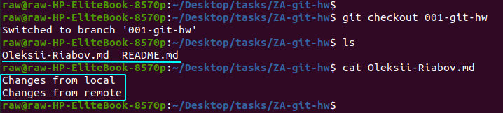

1.2. Create another branch ('002-git-hw' in current example) from 'master' branch to avoid "Fast-forward" merge:

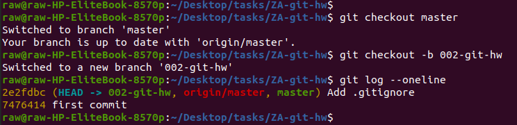

1.3. Create file that we use in previous task ('Oleksii-Riabov.md' in current example), edit it to create conflict and then commit changes:

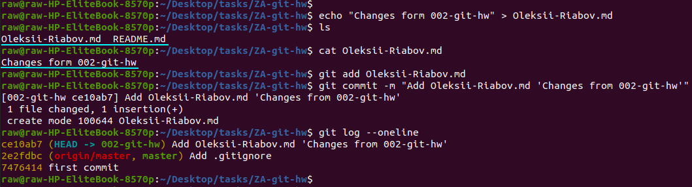

1.4. Create another file that is unique for '002-git-hw' branch only to see whether it will be merged, commit changes:

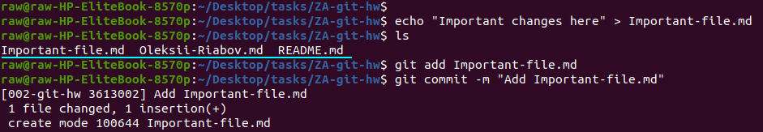

1.5. Check logs of branches that we want to merge (001-git-hw and 002-git-hw):

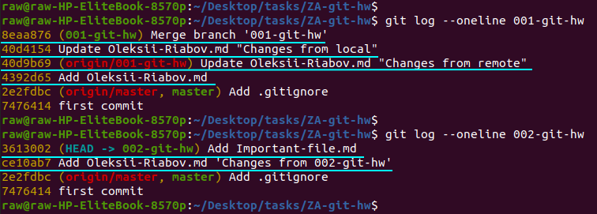

1.6. Checkout on '001-git-hw' and merge '002-git-hw' branch into '001-git-hw'. When you try to merge branches, you’ll see message about merge fail because of conflict in 'Oleksii-Riabov.md' file:

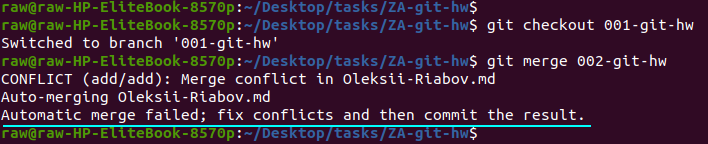

1.7. Accept desired changes (changes from '002-git-hw branch in current example), add them to index and continue merge with 'git merge --continue' command:

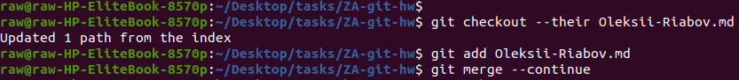

1.8. Write your own commit message or accept default one in Commit message window: 

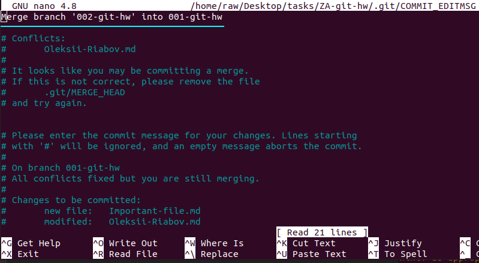

You will see message about successful merge. You can also use 'git log' to see that merge was successful and all commits from 002-git-hw' apply to '001-git-hw' branch: 

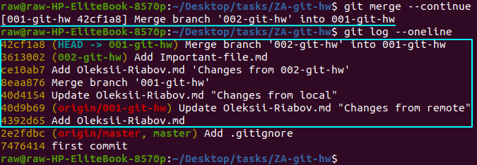

1.9. Use 'ls' and 'cat' commands to check whether all files and changes from '002-git-hw' branch are successfully merged into '001-git-hw' branch:

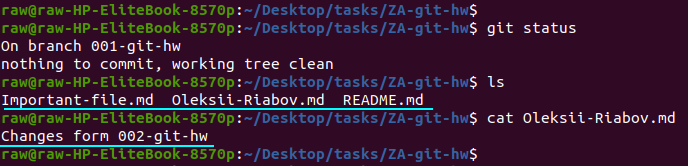

1.10. In addition, we can see that '002-git-hw' branch stay same:

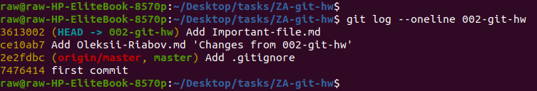

2. Integrate changes from one branch into another branch using git rebase.

2.1. Reset '001-git-hw' branch to "pre-merge" commit by command '$ git reset --hard @~' or create new local branch and do 1-1.4 steps:

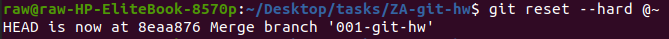

2.2. With 'git log', 'ls' and 'cat' commands we can look on commit history, files that are present on '001-git-hw' branch and content of 'Oleksii-Riabov.md':

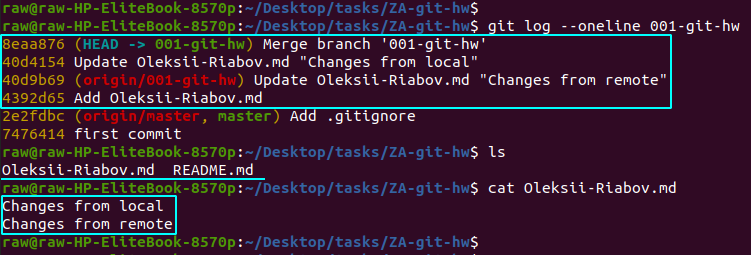

2.3. Then checkout on '002-git-hw' branch and look on commit history, files that are present on current branch and content of 'Oleksii-Riabov.md' with the same 'git log', 'ls' and 'cat' commands:

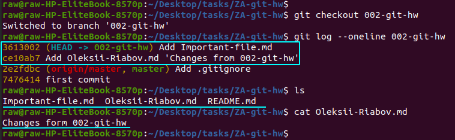

2.4. Rebase '002-git-hw' branch with its commits on the top of '001-git-hw' branch. When you try to rebase branch, you’ll see message about merge fail because of conflicts in file 'Oleksii-Riabov.md':

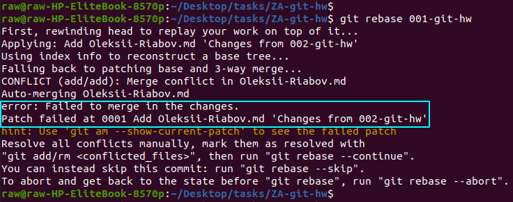

2.5. Accept desired changes (changes from 002-git-hw branch in current example), add them to index and continue rebase with 'git rebase --continue' command:

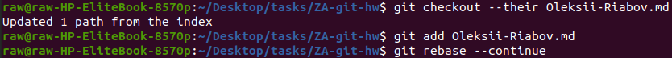

You will see message that two commits from '002-git-hw' branch are successfully rebased on the top of '001-git-hw' branch. You can check this with 'git log', 'ls' and 'cat' commands:

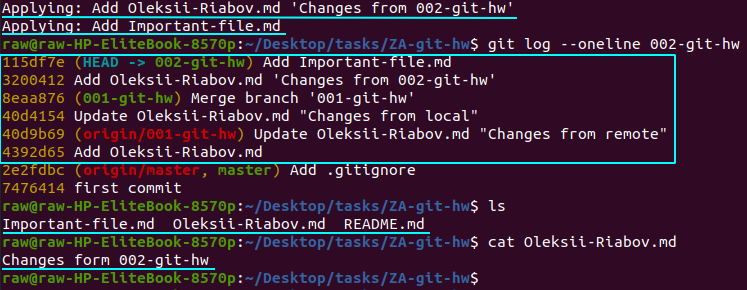

2.7. In addition, we can see that '001-git-hw' branch stay same and point to the same commit as before rebase:

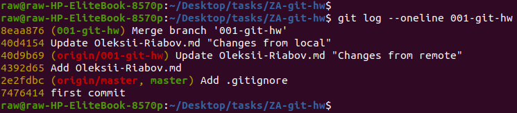
