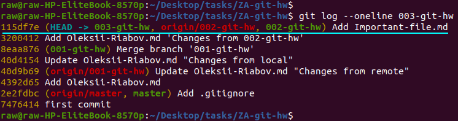
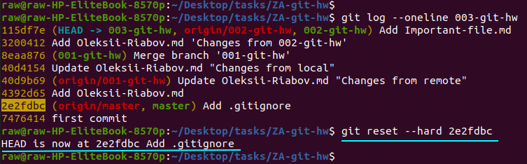
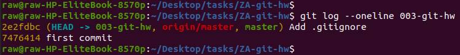
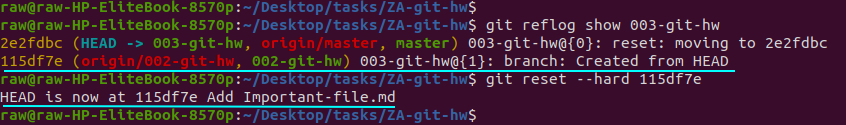

Problem:
In branch several commits where made, they were accidentally deleted with 'reset --hard' and aren't shown in 'git log' command to be restored from it.

Solution:
You can't really lose data from your repo once it's been committed. If you accidentally reset to an older commit, or rebase wrongly, or any other operation that visually "removes" commits, you can use the reflog to see where you were before and git reset --hard back to that ref to restore your previous state.

Assume we have following branch ('003-git-hw') with following commit history, where "Add Important-file.md" is the last commit:

And we accidentally reset it with 'git reset --hard' to "Add .gitignore" commit:

We can't use 'git log' command to restore commit history that is lost, because 'git log' shows the current HEAD and its ancestry. That is, it prints the commit HEAD points to, then its parent, its parent, and so on. It traverses back through the repo's ancestry, by recursively looking up each commit's parent only.

While 'git reflog' doesn't traverse HEAD's ancestry at all. The reflog is an ordered list of the commits that HEAD has pointed to: it's undo history for your repo. The reflog isn't part of the repo itself (it's stored separately to the commits themselves) and isn't included in pushes, fetches or clones; it's purely local, so we can use this command to restore our commit history (the "show" subcommand shows the log of the reference provided in the command-line): 

With 'git log' command we can check that we restore all commit history of '003-git-hw' branch:

