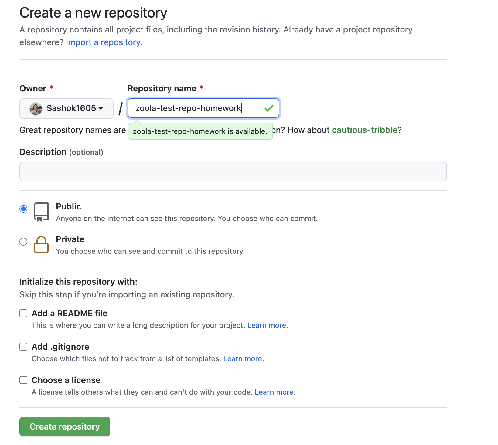
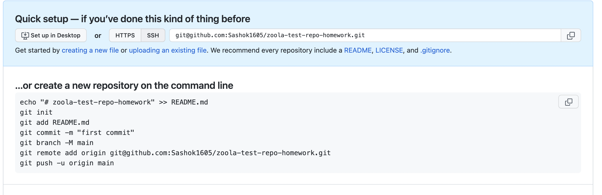
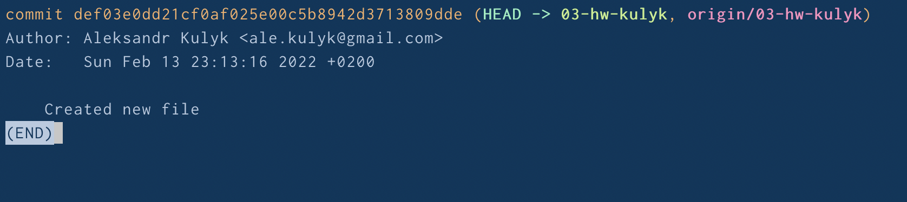
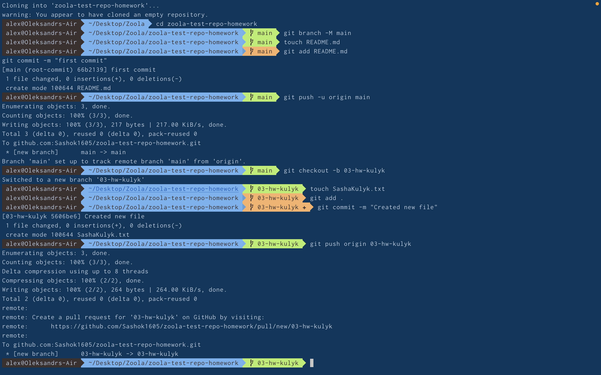

# Create new public repo in github.
  1. (https://github.com/Sashok1605) on `Repositories` click `New` to create a new Repo.
  2. 
  3. Link to my test repo (https://github.com/Sashok1605/zoola-test-repo-homework)

# Set it up both remote and local.
  1. 
  2. You should use git commands:
    `git init`
    `git add README.md`
    `git commit -m "first commit"`
    `git branch -M main`
    `git remote add origin git@github.com:Sashok1605/i.git`
    `git push -u origin main`

# Create new branch.
  1. To create a new branch you should use 
  ```
  sh
  git checkout -b <name-branch>
  ```
  2. I created a `03-homework-kulyk`

# Create text file with your name and surname.
    Screen shot under text 
# Commit it.
    Screen shot under text 
# Push your branch.
    Screen shot under text 
# Make sure your .gitignore file exists :) and you did not push any unnecessary files.
    I didn't create .gitignore because I didn't need it. Usually I create it when I make my project. The most popular dirictoria is node_module.

# Show the git logs.


# Screen



