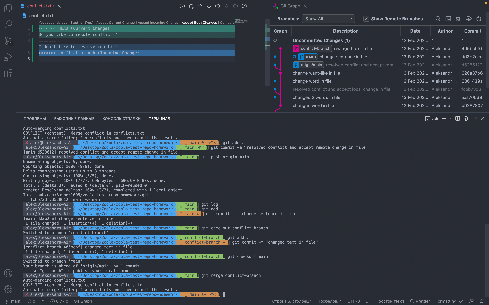

# Accept local changes instead of remote.
  1. Move to the main branch 
  ```sh 
  git checkout main
  ```
  2. I created a file `conflicts.txt` where i wanted to make conflicts.
  3. 
  ```sh
  git add
  git commit -m <text>
  ```
  4. Create a new branch 
  ```sh 
  git checkout -b <name>
  ```
  5. Created file `conflicts.txt` and changed.
  6. 
  ```sh
  git add
  git commit -m <text>
  ```
  7. Changed branch to main `git checkout main`.
  8. Edit the file.
  9. 
  ```sh
  git add
  git commit -m <text>
  ```
  10. Merge the branch `conflict-branch` into main 
   ```sh
    git merge conflict-branch
  ```
  11. And I saw conflict .
  12. You should `Accept Incoming Change`
  13. After I 
  ```sh
  git add
  git commit -m <text>
  ```
  14. If you want to see changes you should

  ```sh
  git log
  ```

  .
  15. 
   ```sh
  git push origin main
  ```
 


# Accept remote changes instead of local.
  1. At branch main I changed one more time my file.
  2. My next step was:
  ```sh
  git add
  git commit -m <text>
  ```
  3. Changed branch 
  ```sh 
  git checkout -b conflict-branch
  ```
  .
  4. Changed text.
  5. 
  ```sh
  git add
  git commit -m <text>
  ```
  6. 
  ```sh 
  git checkout main
  ```
  7. 
   ```sh
    git merge conflict-branch
  ```
  8. I had a conflict and I `Accert Current Change`
  .
  9. 
  ```sh
  git add
  git commit -m <text>
  ```
  10. 
  ```sh
  git log
  ```
  .


# Accept both Example 1.
 # Accept remote changes instead of local.
  1. At branch main I changed one more time my file.
  2. My next step was:
  ```sh
  git add
  git commit -m <text>
  ```
  3. Changed branch 
  ```sh 
  git checkout -b conflict-branch
  ```
  .
  4. Changed text.
  5. 
  ```sh
  git add
  git commit -m <text>
  ```
  6. 
  ```sh 
  git checkout main
  ```
  7. 
   ```sh
    git merge conflict-branch
  ```
  8. I had a conflict and I `Accert Both Change`
  .
  9. 
  ```sh
  git add
  git commit -m <text>
  ```
  10. 
  ```sh
  git log
  ```
  .

  # Accept both Example 2.

  1. At branch conflict-branch I should changed file.
  2. My next step:
  ```sh
  git add
  git commit -m <text>
  ```
  3. 
  ```sh 
  git pull origin main
  ```
  .
  4. You should resolve a conflict.
  .
   
  5. Click on button `Create pull request`.
  6. You will see conflicts files and you should click on button `Resolve conflicts`
  .
  7. After you should resolve all conflicts and click `Commit merge`
  .
   
 
 

