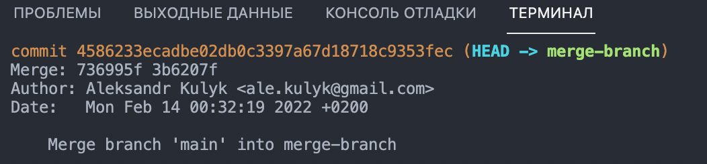
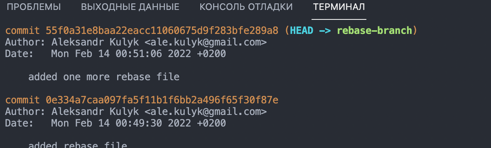

# Task 2: Merge vs Rebase

## Merge

1. Before I prepared my branch for merge. 

```sh
git fetch
git pull 

```

2. After 

```sh
git merge main
```
.


## Rebase

1. Created new branch merge-branch.
2. At this branch create 2 files.
3. 
```sh
  git add
  git commit -m <text>
  ```
4. Created new branch rebase-branch.
5. Added 2 files.
```sh
  git add
  git commit -m <text>
  ```
  6. 
```sh
  git log
  ```
.
7. ```sh
  git rebase merge-branch
  ``` 
. 

# Questions

1. To be honest, before that I used the GitHub Desktop, but still in the future it will be more comfortable for me to use `git merge` because it's command Preserves complete history and chronological order.


2. I think that `git merge` better for a big team and `git rebase` better to use if you work alone or on a small team.
