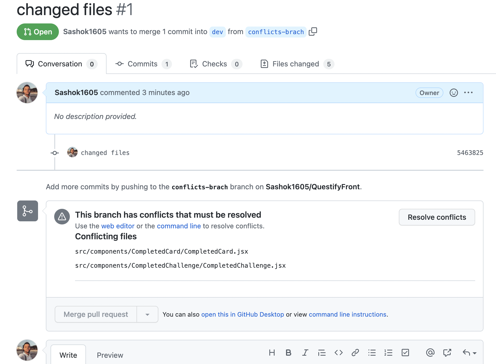
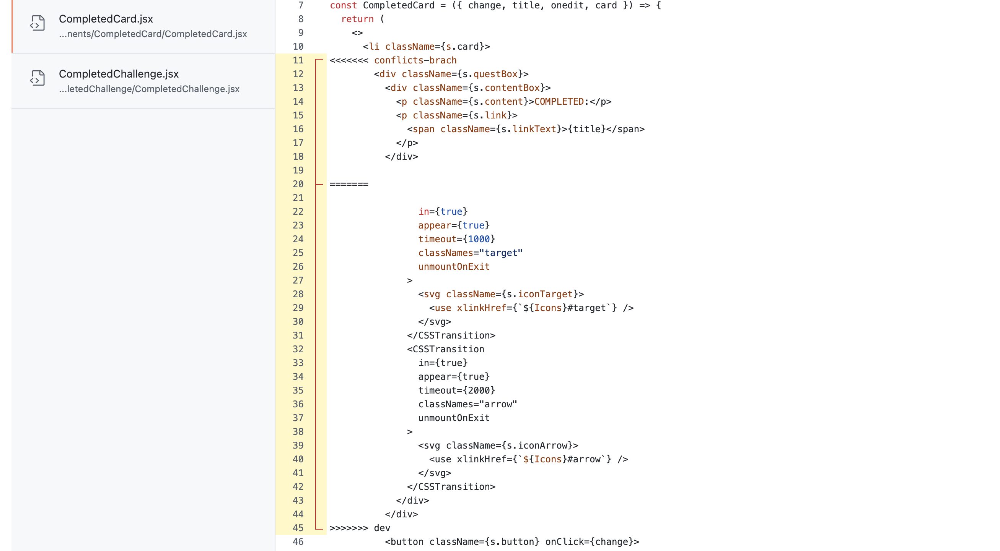
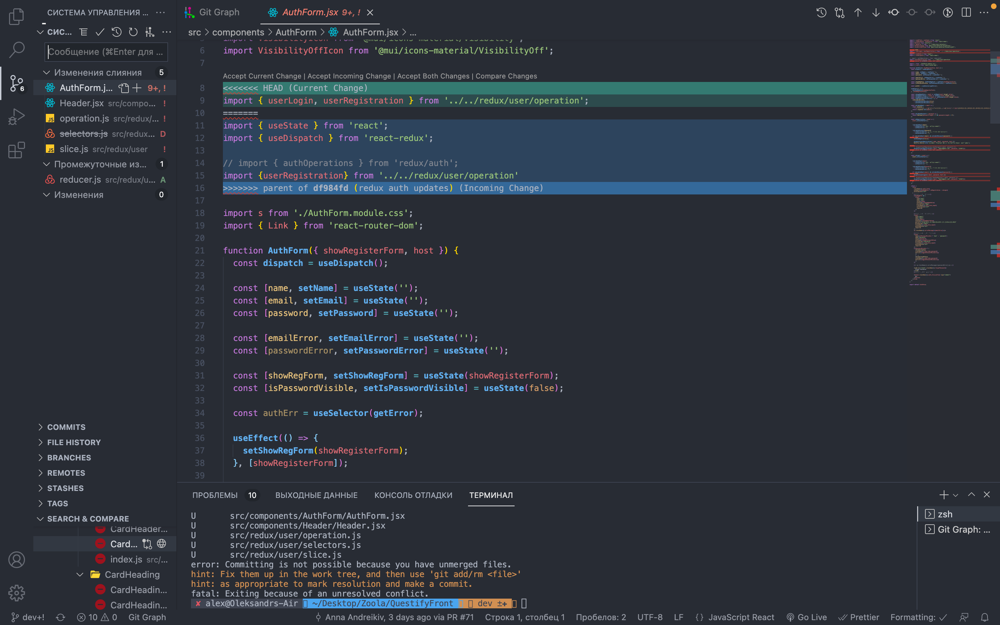
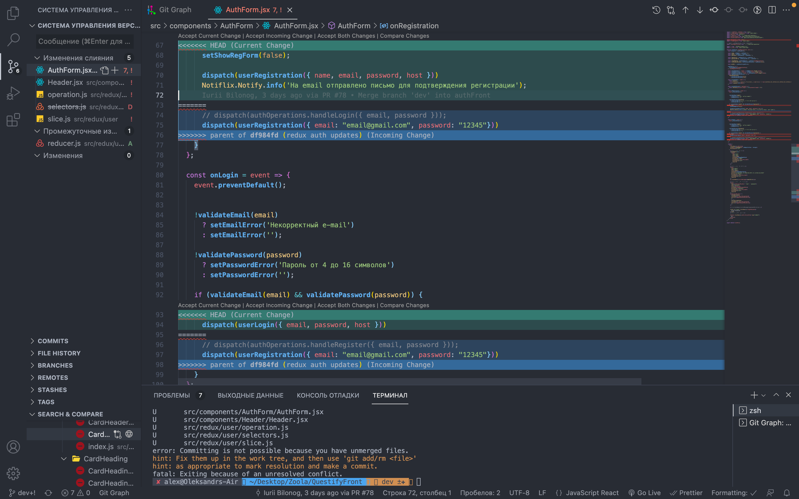
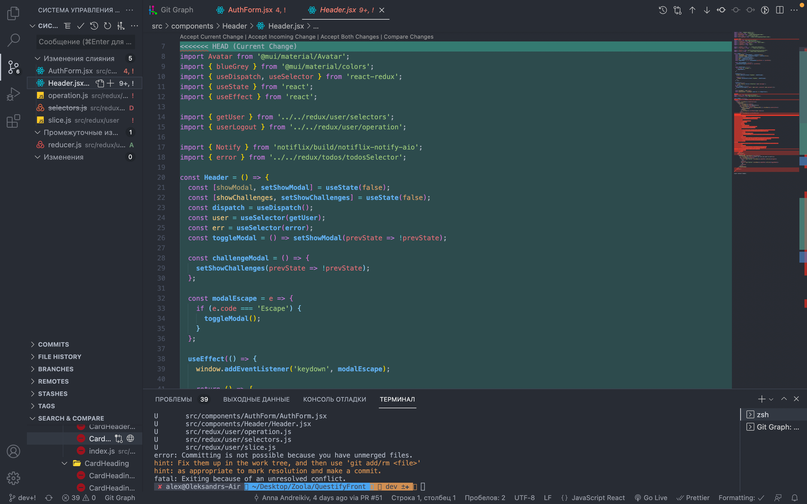
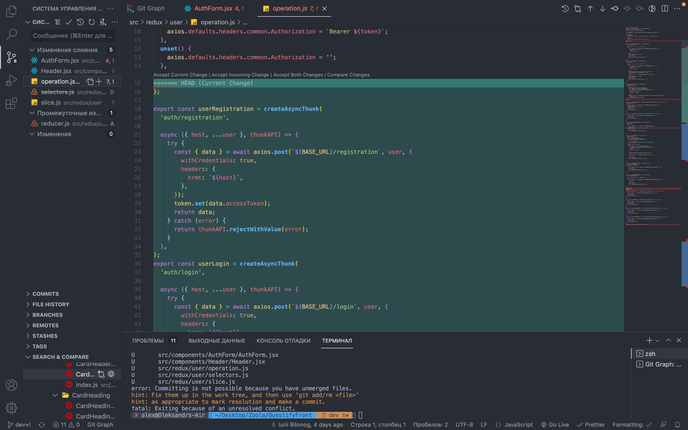
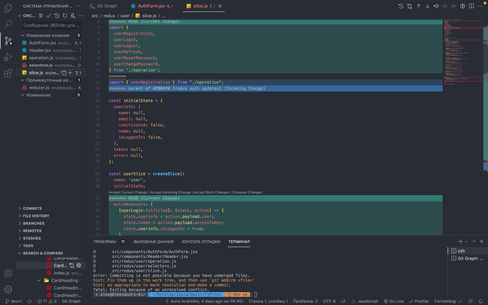

# Task 3: Use your imagination

I want to show how we make problems when we work in one dirictory.
1. I created conflicts but not small :)
. 
2. I resolved it.
. 

Sometime people are inattentive they can revert old commit and have a lot of conflicts.

. 
.
.
.
.
.

And one more interesting about git :)

(https://learngitbranching.js.org/?locale=ru_RU)
