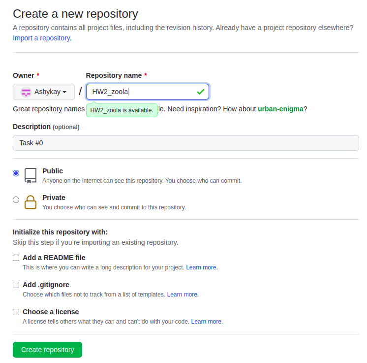
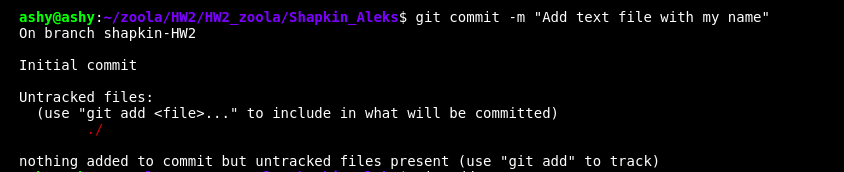
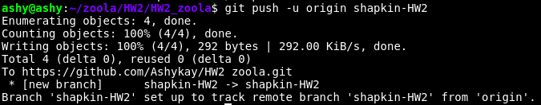
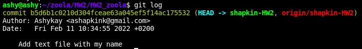

1. Create new public repo in github.
Create new repo on git hub: https://github.com/Ashykay/HW2_zoola

3. Set it up both remote and local.

It's already set up on remote, so let's make it on local: 

git clone https://github.com/Ashykay/HW2_zoola.git
4. Create new branch.

git checkout -b shapkin-HW2
5. Create text file with your name and surname.

nano Shapkin_Aleks.txt
6. Commit it.

7. Push your branch.

8. Make sure your .gitignore file exists :) and you did not push any unnecessary files.
There
9. Show the git logs.

10. Do not forget to attach a link to your repo in results.

https://github.com/Ashykay/HW2_zoola